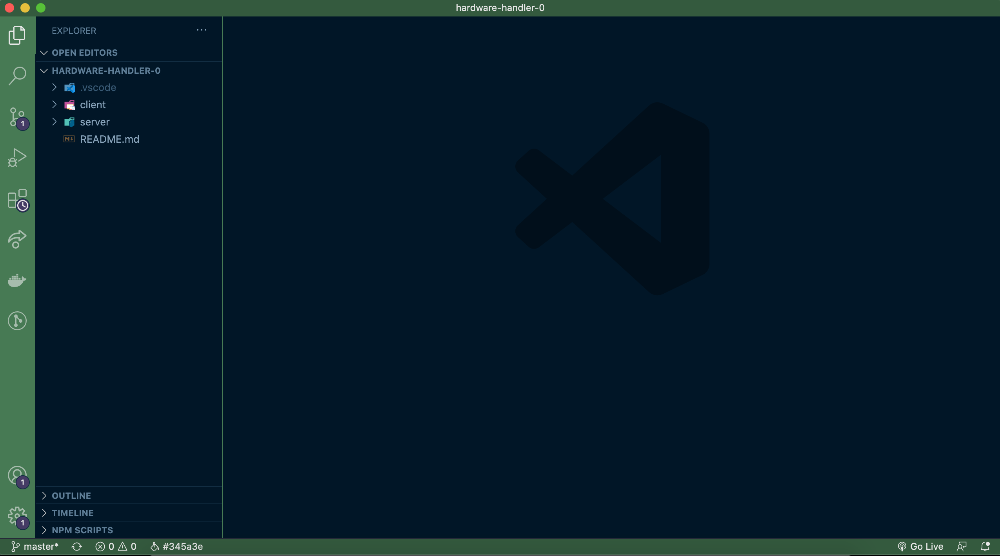
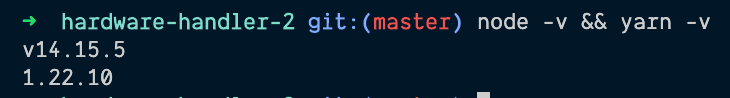

# Welcome to Modernizing an Enterprise React App

Many courses and tutorials begin building React applications from scratch using the latest and greatest features the framework has to offer from the beginning.

They also tend to gloss over things like:

- Structuring an app's source code so it can grow and be maintained in an organized fashion over time,
- How to organize and write automated unit tests,
- How to organize and write end-to-end tests,
- How to set up code standards in a project so the whole team adheres to linting and code formatting best practices,
- How to leverage component libraries to speed up development cycles.

And most importantly:

- How to upgrade an existing application to take advantage of the latest advances the framework has to offer!

### This is not that course, because that is not real life for many developers.

Many developers join development teams and are introduced to an existing React application.

- The application may have been worked on by many other developers at the point they inherit it (and none of those original developers may still be with the project),
- It may be out of date by a few versions,
- It may lack consistent structure or coding standards because it was built without an architectural design discussion early on,
- It may lack what are now considered industry standards, like automated testing.

But that's OK. That's all OK because we're here to help arm you with knowledge of all of the above to improve this app and leave it better than when you found it.

### Course prerequisites

To get the most out of this course, you'll probably want to have:

- An intermediate understanding of HTML, CSS, and modern (ES6+) JavaScript.
- Basic knowledge of the React framework (at least up until hooks were introduced).
- Some familiarity with JavaScript automated testing frameworks (unit tests, end-to-end tests).

### Module overview - What you'll learn

#### Module 1: Introduction to React Hooks

Although developers who take this course should already be fairly comfortable with React pre-Hooks, you may not have a great understanding of how hooks operate - especially the hooks that don't line up one-to-one with React class-based components' setup like useEffect or useState.

In this module we'll:

- Learn about why React Hooks were introduced.
- Walk through examples of various hooks:
  - useState Hooks
  - useEffect Hooks
  - useRef Hooks
  - useContext Hooks
  - Custom Hooks

#### Module 2: Upgrade the sample React app to the newest version of CRA & lock in project dependencies

We'll start modernizing our existing React application by updating it to use the latest stable version of React.

During this module, we'll:

- Upgrade the version of React and React Scripts the application runs on (including troubleshooting any initial upgrade issues).
- Lock in Node and Yarn versions with Volta and Node engines so that whenever any developer downloads and runs the app, they'll have the same development experience.

#### Module 3: Configure Prettier & ESLint

Nothing changed my development experience for the better like adding Prettier and ESLint to my normal development setup. I'm not sure how I got along for as long as I did before these two things existed, but I do know I never want to go back.

In this module, I'll show you how to:

- Create a .prettierrc file that will be included in the project with any personal formatting preferences you like, and configure VSCode to automatically format code on save or when switching focus.
- Set up an .eslintrc.json file using the industry-standard ESLint configurations developed by Airbnb for both React and React Hooks, and discuss how to modify the ESLint rules to suit your team's preferences.

#### Module 4: Refactor class components to use hooks

A big part of modernizing an existing React app hinges on being able to take a traditional, class-based component, maintain its current functionality, and convert it to use hooks under the hood, taking advantage of all that the upgraded dependencies have to offer.

This module will consist of:

- Going file by file through the class-based components and upgrading them to use hooks.

#### Module 5: Create custom hooks for the app

Custom hooks are a key change that comes with the React upgrade; it's time to make a few that will support the application.

For this module, we'll:

- Identify where we could add custom hooks to our application, and implement them.

#### Module 6: Use the context API and useContext Hook to make state access within the app easier

Although this app lacks the need for a separate global state management library like Redux or Recoil, there are still definite benefits to be gained from React's built-in state passing mechanism: Context.

In this module, we will:

- Gain a better understanding of what React's Context is good for and what it is not.
- Add some contexts to our application and refactor it to eliminate prop drilling — creating context providers to hold state and useContext Hooks to consume that state elsewhere.
- Pass not just state but also functions to update state in the parent component from a child component's actions.

#### Module 7: Automated integration testing with Jest & React Testing Library

Getting an application to work correctly is only half the battle when it comes to a stable, long-lasting, enterprise-level application. The other half is ensuring that it continues to work as expected; even as new features are added, new system requirements come up, and new levels of performance and scale are reached. And that's where integration testing comes into play.

This module will:

- Discuss automated testing benefits, and why React Testing Library and Jest have become the de facto unit / integration testing framework of choice.
- Share integration testing best practices and advice for organizing tests in the app, like working from the smallest components to largest ones.
- Download all the needed libraries and dependencies to test the app, and configure it to easily run tests and check code coverage.
- Learn how to set up mocks and supply test data as needed.
- Write tests for the existing components, hooks, and services.

#### Module 8: End-to-end test with Cypress

While testing individual components is definitely important, it's not the only sort of testing that needs to be done. End-to-end testing is also critical - if a user can't use the application as intended, what's the point? That's where end-to-end testing comes in: it simulates what a user would do, by interacting with the browser as a user would, and Cypress is the best of the end-to-end testing frameworks available today.

In this module, we will cover:

- Why end-to-end testing is also an important piece of the automated testing puzzle that enterprise applications need to live up to, and where it falls in the "testing hierarchy."
- An introduction to Cypress.io, the current favorite end-to-end testing framework of the JavaScript world.
- Downloading the necessary libraries for the app to run Cypress, and configuring the application to run tests.
- Setting up fake data, mocking API calls, targeting DOM elements to trigger events, and debugging misbehaving Cypress tests with the Cypress test runner.
- Explore the new Cypress Studio feature that allows users to "teach" Cypress tests by having them observe a user interacting with the browser.

#### Module 9: (Bonus) Implement the Ant Design System to speed up design & development

Ant Design is an extensive, well-made design system library that allows designers and development teams to build and iterate faster by providing flexible, attractive components that developers can plug in to their React application right out of the box. Design systems like this help reduce the amount of time development teams spend hand-coding complex functionality (like table filtering) and help designers maintain consistency within the app (by providing a library of fully built components to mix and match).

This bonus module will:

- Introduce design systems and discuss the benefits they can provide to designers, developers, and even larger organizations.
- Add Ant Design to the application, identify some components that would benefit from being switched out with Ant Design components, and do so, working from simple components up to the most complex ones and utilizing the Ant documentation to understand how.

### By the end of this course, you'll be ready to take on the world

Well, this might be a bit of an overstatement, but if you go through this whole course, by the end, you should feel much more confident about taking an existing React application, no matter how new or old, and keep maintaining and improving it.

You'll be prepared to set up project configurations, use hooks, write tests, and quickly get up to speed with any React-based codebase you encounter.

And as React is the most popular JavaScript UI framework currently out there, this will make you an asset to almost any development team.

### Course Downloads — Code examples and local development requirements

This course will focus on a fully functional React application, built using an outdated version of [Create-React-App](https://reactjs.org/docs/create-a-new-react-app.html#create-react-app).

To run the application locally, you'll need:

- A relatively recent version of [Node.js](https://nodejs.org/en/download/) installed on your machine.

  T> I would recommend any stable version of Node.js v12 or above.

- npm or its [Yarn](https://classic.yarnpkg.com/en/docs/install#mac-stable) equivalent installed to download new libraries and upgrade existing project dependencies as needed.

  T> npm is automatically installed locally when Node.js is downloaded, but I'll be using Yarn throughout this course, as it's a bit newer and faster. They're very interchangeable though, so choose whatever you feel most comfortable using.

- The project source code, which you can clone from [here](protected/source_code/hardware-handler-0.zip).
- A code editor, the integrated development editor (IDE) of your choice.

  T> [VSCode](https://code.visualstudio.com/download) aka Visual Studio Code is highly recommended and free to download and use. Periodically throughout the course, I will install plugins available in the VSCode Marketplace to make coding easier and more enjoyable, so this is what I'd encourage you to use as well to get the most out of this course.

- A command-line terminal like [iTerm 2](https://iterm2.com/downloads.html) for MacOS users, or [Windows Terminal](https://www.microsoft.com/en-us/p/windows-terminal/9n0dx20hk701?rtc=1&activetab=pivot:overviewtab) for Windows Users.

  T> VSCode has a built-in terminal that works very well, which is what I prefer to use during my own local development.

### Getting started

To start, once you've downloaded all the dependencies listed above and downloaded and unzipped the [application's source code](protected/source_code/hardware-handler-0.zip) locally, open up the `hardware-handler-0` repo in your IDE of choice.

I> If you're using VSCode as your IDE, you can [configure your setup](https://code.visualstudio.com/docs/setup/mac#_launching-from-the-command-line) so that you can open the repo directly from the command line in the terminal, which is pretty cool.

In the root of the project, you should see two folders, the `client/` folder and the `server/` folder.



Since this course focuses exclusively on modernizing a React web app on the frontend, I spun up a simple backend server filled with dummy data (see the `db.orig.json` file present in the `server/` folder) using the npm package [JSON-server](https://www.npmjs.com/package/json-server).

T> This server mimics the sort of data a full-fledged Node.js/Express server would expect to request and receive from several different microservices supporting the React UI application.

That's about all that the `server/` folder contains at initial download time, but once the app starts up, a local file named `db.json` will be created within the `server/` folder, and the data in the `db.json` file is data is changed via the app. For example, when new products are added to the app or products are removed from the checkout, the data in the `db.json` file changes accordingly.

The `client/` folder is where we'll focus the vast majority of our time and attention in this course, and I will cover the contents and structure of this folder in more detail in the next lesson.

### Install your node modules & start the server

Once you've opened the repo, open a new code terminal, and check you've got the versions of Node.js and Yarn needed.

T> If you're using VSCode, the keyboard shortcut for both Mac and Windows to open a terminal is CTRL + `

You can do this by typing

```shell
node -v && yarn -v
```

in the terminal. Ideally, you'll see something similar to these versions in the screenshot of your own terminal.



Once the Node and Yarn versions are confirmed, we're ready to install all the project dependencies locally.

While still in the command line, type:

```shell
cd server/ && yarn
```

After the `server/` folder finishes its install, install the `client/`'s npm dependencies.

In that same terminal, type:

```shell
cd ../client && yarn
```

Now, while still in the `client/` folder, type:

```shell
yarn start
```

If everything goes according to plan, you'll see both the `server/` code and the `client/` code start up in the command line, and the app will open up in the browser at `http://localhost:3000`.

This is what you should see in the browser.


If you see "Welcome to Hardware Handler" and links to the various pages, congratulations! You're up and running and ready for the next lesson.

In the following lesson, we'll walk through what Hardware Handler can do, and how it's structured under the hood.

---
