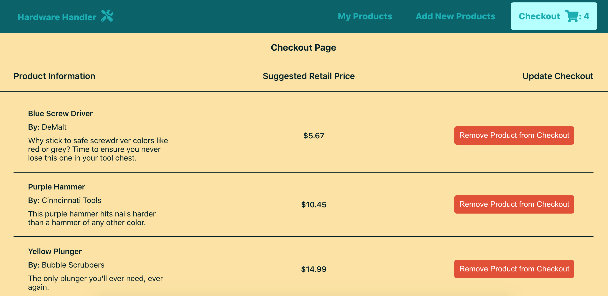

# Welcome to Hardware Handler — A product management application

### What is Hardware Handler, what can it do & what is outside the scope of this application (and course)

Before diving into how Hardware Handler is built, let's take a quick tour through the application itself.

**This application is a sample React application built to help product managers within retail companies manage their product assortments, which are sent to retail stores to sell to customers.**

### The home page

When Hardware Handler is running, the first page a user will see is the home page, which links to all the other pages of the app and displays any items already present in the checkout.


These pages are where a product manager will actually go about the business of reviewing products, adding new products to the ones they manage, and reviewing the list of products they intend to ship to stores.

### The My Products page

Clicking the link for **"My Products"** on the homepage of the app or in the navigation bar, will bring the user to their products page.


Here, users can view products they already manage, filter products displayed by department or by brand, and add those items to the checkout.

Unlike a typical e-commerce site, though, where a customer could purchase multiples of a single product, these products can only be added to the checkout once.

I> **The reasoning behind that decision is this:**
I>
I> Typically more than one connected system, which is outside the scope of this course, would be responsible for coordinating all the details to get products shipped to stores. Another application, further downstream in the deliver-to-store process, would give the product manager the ability to decide how much product to send to stores and exactly when to send them.

### The Add Products page

The **"Add New Products"** page is a form where product managers can add new products to the list of products they manage.


They can select from a pre-determined list of departments and add a product name, brand, description, and retail price.

Once all the required fields are filled in, the **"Submit"** button at the bottom of the form is enabled and the product can be added. After being added, the product will then show up on the **"My Products"** page and be selectable for checkout in the future.

### The Checkout page

**"Checkout"** is what it sounds like. It's a summary of all the products the product manager has added to their checkout. It displays all the relevant product information, the suggested retail price of an individual product, and the ability to remove that product from the checkout.



I> In a real world scenario, a product manager would send this summary of products to another system further downstream in the ordering / product-replenishment process.
I>
I> Within that system, a product manager might determine exactly how many units of each product to deliver to retail stores, as well as assign exact dates to ship to the stores.

But as I mentioned above, all that is outside the scope of this course, so the checkout page and summary is where this application's functionality concludes.

### Toasts

In addition to the main pages and their functionality, there are also disappearing messages known as "toasts" present throughout the application. These messages alert the product manager when actions they try to perform, like adding new products to the system or removing items from the checkout, are successful or not.


### How the project is currently structured (what's included)

Now that we have established the application's functionality from a user's perspective, it's time to take a peek at how its code works.

Since this course is focused on modernizing an enterprise-style React application, it's built in the style of a full-stack React application (a root folder that holds both the `client/` folder in charge of the React application code and a `server/` folder containing the Node.js/Express API application code).

Here is a simplified snapshot of what the current folder structure looks like:

```
.
└── hardware-handler-0/
    ├── client/
    │   ├── public/
    │   ├── package.json
    │   └── src/
    │       ├── components/
    │       ├── constants/
    │       ├── containers/
    │       ├── helpers/
    │       ├── services/
    │       ├── index.css
    │       └── index.js
    │
    └── server/
        ├── db.orig.json
        └── package.json
```

### The "simplified" `server` folder

You'll notice when you look in this app's `server/` folder that the only files present are a `package.json` and `db.orig.json` file.

This `server/` folder exists entirely to provide data (courtesy of the [JSON Server npm package](https://www.npmjs.com/package/json-server)) to simulate the CRUD (Create, Read, Update, Delete) functionality that would be present if the application was connecting to multiple REST API microservices.

The JSON Server provides a quick backend for prototyping or mocking (or in this case, powering a sample app). Once the `server/` folder's JSON Server starts up, the `db.orig.json` file populates initial data into the app, and a new local database file is created (`db.json`) that keeps track of any updates made to the data via REST endpoints while the app is running.

Once the application shuts down and the server turns off, the `db.json` file is no longer referenced. When the application starts again, the original state of the data will be restored from the `db.orig.json` file again, and a fresh `db.json` file will be spun up again to track new changes.

### The `client` folder

The `client/` folder is where the bulk of this course focuses.

The frontend is built off an older version of [Create React App](https://github.com/facebook/create-react-app), the popular, quick-start way to get a React app up and running in no time. The `react-scripts` for this app are set all the way back to v1.1.4, and the `react / react-dom` are v16.4.1. All of these versions are pre-React Hooks, which were introduced with the release of [React v16.8.0](https://reactjs.org/blog/2019/02/06/react-v16.8.0.html).

The code structure, which is described below, provides an example of how a larger React application **could** (not must, but could) be structured for code maintainability and scalability as the application grows. The `src/` folder inside the `client/` folder is the main star, but let's look at the folders contained within `src/` because this is how I like to divide up the various components in a React application.

#### State lives in class components in `src/containers`

For now, the application components that depend on state are built as class-based components using traditional React lifecycle methods. The majority of such stateful components are filed in the `src/containers/` folder.

I> This line of delineation becomes much less clear with the introduction of React Hooks (and the ability to have state almost anywhere within the application). Regardless, I'm still a fan of larger, page-style components living in some sort of `pages/` or `containers/` folder and smaller components being injected into these larger components living in another folder.

#### View-based functional components are in `src/components`

The components that only display views via data passed to them are in the `src/components/` folder.

I> The same comment I made in the class-based components section applies here too, but like I said, I like the idea of smaller components that might be useful to reuse in multiple container components being stored in a `components/` folder, less tied to a specific page of the application.

#### API calls are in the `src/services` folder

The data-fetching calls, utilizing the popular, promise-based HTTP library [Axios](https://www.npmjs.com/package/axios), are all stored in the `src/services/` folder.

T> Keeping all the data-fetching calls together makes it easier to keep track of and update these functions. For example, even if two or three or more components are calling the same API endpoint, by having only one API call that all the components rely on, you can easily change that one API call and know that the data supplied to all the components will change in the same way.

#### Utility functions are in the `src/helpers` folder and constants are in `src/constants` folder

There are a few helper functions and constants stored in their respective folders that are invoked throughout the app. The `helpers/` folder has plain JS functions that have no JSX or React-specific data. An example might be: a function that takes in a number and formats it to be displayed like a USD price.

Constants serve a similar purpose. They are typically strings to indicate something like a message that might be referenced or checked in multiple places throughout the application. Instead of re-typing (and potentially mis-typing) the same string in multiple locations (like to check if a particular error message is returned from an API call), the constant for that API call can be subbed in, ensuring it will be exactly the same in any and all locations it's used.

I> As we go through the process of refactoring this app and upgrading it, I'll go into more detail for each particular folder and the files housed within it. We'll also add more folders to organize new things like custom hooks, contexts, tests and more.

### What's not included

#### No Redux (it's overkill here)

[Redux](https://www.npmjs.com/package/react-redux) is not included, as it was unnecessary for this application (and you could make the argument that it is unnecessary for many React applications it's introduced to).

Furthermore, trying to keep track of both React and Redux can muddy the waters of what's being supplied by React versus Redux, which introduces a level of complexity that won't enhance this course.

#### No SASS or LESS

Because the application is written with such an old version of Create React App (a version so old SASS can't be easily set up), the styling is written with vanilla CSS.

In a true production app, this would almost certainly be supplemented with [LESS](http://lesscss.org/), [SASS](https://sass-lang.com/), or [CSS-in-JS](https://cssinjs.org/). For simplicity, and to focus on the "React" part of modernizing this app, vanilla CSS suffices and separates the JavaScript code's logic from the app's styling, which should make understanding and refactoring things a little easier.

#### No TypeScript

TypeScript is a superset of the JavaScript language, and while it is gaining popularity and widespread adoption amongst the JavaScript community for its type-checking capabilities, it will not be included in this course.

For this course to be accessible to the widest amount of developers, I'll be using vanilla JavaScript. If you'd like to learn more about using TypeScript, newline offers many other courses to help you get started.

### So what's next? React Hooks

A big piece of this course is about how to upgrade a React application to use the latest the React framework has to offer, and that means [React Hooks](https://reactjs.org/docs/hooks-intro.html), so that's what we'll get familiar with next.

Before we start upgrading the sample app's files though, I'll introduce hooks and give some simpler examples of how they work for anyone who wants a refresher.

Then, we'll dive into our project and start refactoring file by file to transform the class-based components into functional, hooks-based components.

---
