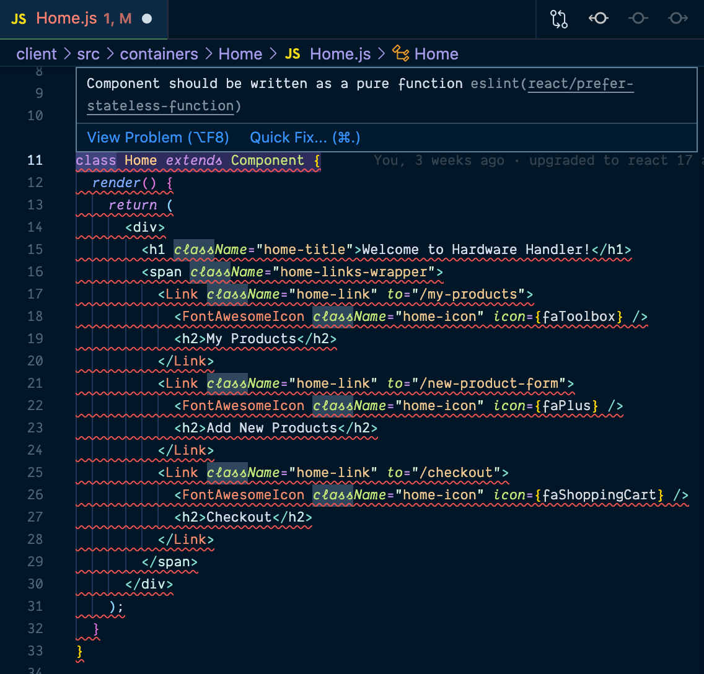

# The `Home.js` file doesn't actually need to be a class component

I realized as I was looking over the code (and my ESLint config was working overtime) that although I made the `<Home>` component a class-based component, it doesn't really need to be.

Why, you ask? This component's got no state of its own. It doesn't even accept any props.

Oops. I bet you'll notice when looking through your own React code bases that you've got class components that really don't need to be that way either.

T> **How to know: class component or functional component?**
T>
T> Prior to hooks, an easy way to tell if a component could be functional or not was to check if it had any of its own state or if it just accepted props.
T>
T> If it did, class-based was the way to go. If it didn't, it could be a functional component.

But that's fine. It's not a big deal at all. This should make converting this component to be a functional version an easy win for us. It's a great way to get started on our journey to refactoring our app to use just hooks.

**In this lesson, I'll teach you my recipe for converting class components to use hooks, giving us a roadmap to follow for every component we encounter.**

So, open up your project in your IDE, and let's get to work.

I> **Sample code zip file**
I>
I> If you need a fresh copy of the sample app _before_ we start refactoring, it's available **[here](protected/source_code/hardware-handler-4.zip)**.

### My "recipe" for refactoring components

As I've converted more and more class components to functional components in React applications, I've come up with a sort of "recipe" I like to follow that I want to share with you now.

1. **Class to function**

   Convert the class to a function and remove the `render` method.

2. **this.state to useState**

   Replace `this.state` object with `useState` Hooks and update props.

3. **Refactor lifecycle methods**

   Update the component lifecycle methods to use `useEffect` or custom hooks.

4. **Class methods become regular functions**

   Fix any local functions present in the component.

5. **Fix the JSX**

   Tidy up the JSX so that it works with the component's newly functional state.

6. **Regression test**

   Test the app's functionality to ensure it still works.

7. **Fix ESLint errors**

   Address any remaining ESLint errors to improve the code's quality.

8. **Rinse and repeat**

   For however many components you need to convert, follow these steps to get it done.

Feel free to adjust this as you get more comfortable with React Hooks, but this works well for me, and it's the way I'll go through updating each of these components in these lessons.

### Convert home from a class to a function

As I just outlined above, when I'm converting class components to functional ones, I like to start by changing the class declaration to an [ES6 arrow function](https://developer.mozilla.org/en-US/docs/Web/JavaScript/Reference/Functions/Arrow_functions) of the same name and removing the (now unnecessary) `render` method.

T> **Side note:** This should also fix the giant ESLint error that's currently present.

Start up the application locally. That way, if we break something along the way, we'll get quicker feedback it's broken thanks to React's hot reloading functionality.

In your IDE, navigate to the `<Home>` component in the `client/src/Home/Home.js`.

If the ESLint plugin is running, the angry red squiggly under the entire component should make you a little nervous (it gives me anxiety when I see it, anyway).

In VSCode however, if you hover over the error in the editor, you'll see the issue ESLint is upset about is titled [`react/prefer-stateless-function`](https://github.com/yannickcr/eslint-plugin-react/blob/HEAD/docs/rules/prefer-stateless-function.md) and the accompanying explanation is "Component should be written as a pure function."

It just so happens that's the first thing we're tackling, so this error should disappear when we're done with this step.

Here's the way our `<Home>` component looks before we touch it. It's just a component with icons and links to the other pages in our application.

{lang=javascript,crop-start-line=11,crop-end-line=33}
<<[src/containers/Home/Home.js](./protected/source_code/hardware-handler-4-begin/client/src/containers/Home/Home.js)

Focus on the component declaration on lines 11 - 13, and delete all of it.

{lang=javascript,crop-start-line=11,crop-end-line=13}
<<[src/containers/Home/Home.js](./protected/source_code/hardware-handler-4-begin/client/src/containers/Home/Home.js)

Replace the deleted code with:

{lang=javascript,crop-start-line=10,crop-end-line=10}
<<[src/containers/Home/Home.js](./protected/source_code/hardware-handler-4-ending/client/src/containers/Home/Home.js)

Delete the last two semicolons at the end of the component (they're no longer needed). Save, and watch your component reformat (thanks, Prettier!) and your ESLint error disappear.

Now, the whole functional component should look like this:

{lang=javascript,crop-start-line=10,crop-end-line=28}
<<[src/containers/Home/Home.js](./protected/source_code/hardware-handler-4-ending/client/src/containers/Home/Home.js)

I> **Where'd the `return` go?**
I>
I> You may be wondering why the new `Home` functional component doesn't have a return statement. That's because this particular function can have an implicit return since it doesn't receive any props nor does it do any data transformation or manipulation before the component's rendered in the browser.
I>
I> If it did, the curly braces and return statement would be required, but in this case, they can be omitted.

### Delete the `React` import

There's one more thing we can do to clean up this file before we declare it done: delete the very first line of the file importing React.

{lang=javascript,crop-start-line=1,crop-end-line=1}
<<[src/containers/Home/Home.js](./protected/source_code/hardware-handler-4-begin/client/src/containers/Home/Home.js)

Since we're using React v17, the `import React from 'react'` line at the top of the component is no longer required for components only rendering JSX. Nice!

It feels good when I end up deleting more lines of code from a file than I add.

And with that, we should be done with this particular file and ready to move on.

Check the browser one more time, click around, and make sure the links still work and take you to different pages. Everything still seems to be in order.

That wasn't terrible, right? It was a good warmup to refresh us on how functional components look, and it gives us a taste of what to expect as we refactor our other class-based components.

The next file we'll cover is the `<App>` component at the root of our project.

---
