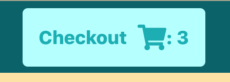
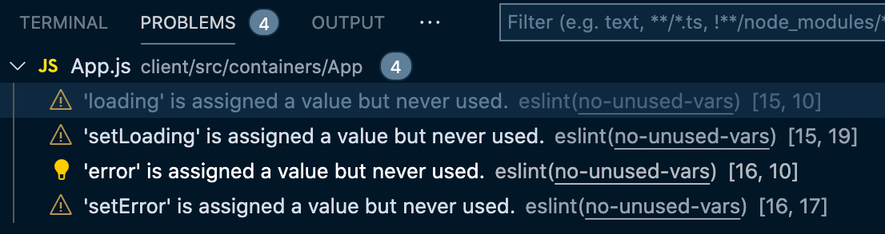
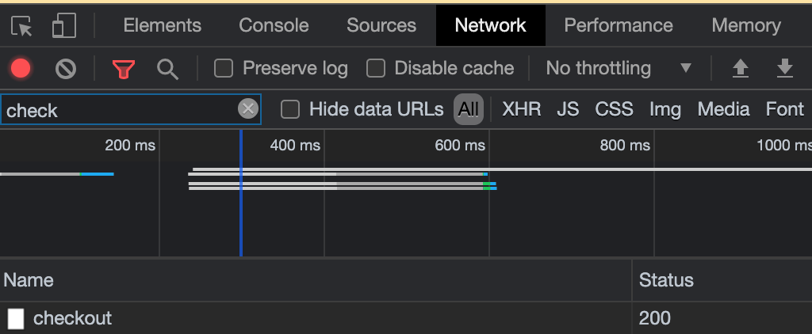
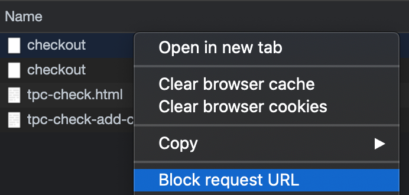
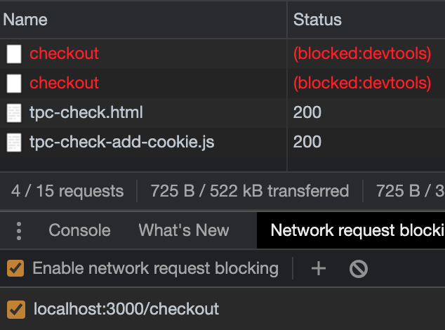

# `App.js` has State We'll Need to Recreate with Hooks

The `<App>` component is where our whole React app begins, and while it is a fairly straightforward component to change from a class to a function, there's the little matter of the `<Navbar>` component's `checkoutCount` prop, which displays the number of items currently in the checkout.



This state should get updated each time a user adds or removes an item from the checkout, so we'll have to account for this functionality during our refactor to make sure it stays the same.

**In this lesson, we'll learn to sub in `useState` and `useEffect` Hooks to recreate the functionality of class components.**

To get started, let's change `<App>` from a class to a function.

### Convert App to a function component

In your IDE, open up the `App.js` file in `client/src/containers/App/` and replace the class constructor on line 13 with a function declaration.

{lang=javascript,crop-start-line=13,crop-end-line=13}
<<[client/src/containers/App/App.js](../lesson_04.01/protected/source_code/hardware-handler-4-begin/client/src/containers/App/App.js)

This now becomes:

{lang=javascript,crop-start-line=14,crop-end-line=14}
<<[src/containers/App/App.js](../lesson_04.01/protected/source_code/hardware-handler-4-ending/client/src/containers/App/App.js)

And as it's now a functional component, we can remove the `render`, the object destructuring before it's passed to the JSX, and the additional curly brace at the end of the `return` statement. Thanks to functional components, that `return` is all we need to render the component's JSX.

Delete the code below.

{lang=javascript,crop-start-line=50,crop-end-line=52}
<<[client/src/containers/App/App.js](../lesson_04.01/protected/source_code/hardware-handler-4-begin/client/src/containers/App/App.js)

Great, easy enough so far.

### Remove the constructor and add functional state

Next up (following our refactoring recipe), we're going to replace the class's constructor and state with functional `useState` declarations.

The current state looks like this.

{lang=javascript,crop-start-line=14,crop-end-line=22}
<<[client/src/containers/App/App.js](../lesson_04.01/protected/source_code/hardware-handler-4-begin/client/src/containers/App/App.js)

To convert it, import `useState` at the top of the file:

```javascript
import { useState } from 'react';
```

Then replace the class state for `checkoutCount`, `error`, and `loading` with their own individual `useState` constructors. Set the initial states for each declaration with the same values we used in the original state object.

```javascript
const [checkoutCount, setCheckoutCount] = useState(0);
const [loading, setLoading] = useState(true);
const [error, setError] = useState(false);
```

This replicates the same state in the class component but actually makes it _more flexible_ by making each piece of state independent of the other pieces. So, if we need to alter one piece of state, all other state can remain the same.

### Condense the lifecycle functions into one `useEffect`

If you notice in this file, there's actually duplicate code because we need to call the `getCheckoutCount` function both when the component first mounts and then every time an item is added or removed from the checkout.

For this to work in the class-based component, we need to call the same code from both the `componentDidMount` and the `updateCheckoutCount` functions.

Here's the current code.

{lang=javascript,crop-start-line=24,crop-end-line=48}
<<[client/src/containers/App/App.js](../lesson_04.01/protected/source_code/hardware-handler-4-begin/client/src/containers/App/App.js)

But with the React `useEffect` Hook, we can combine those two functions into one and just add the `checkoutCount` state variable to the `useEffect`'s dependency array so that every time that value is updated, the `useEffect` will be called again.

Import the `useEffect` at the top of the file next to our `useState` import.

{lang=javascript,crop-start-line=1,crop-end-line=1}
<<[src/containers/App/App.js](../lesson_04.01/protected/source_code/hardware-handler-4-ending/client/src/containers/App/App.js)

Then, replace the `componentDidMount` and `updateCheckoutCount` function with this single `useEffect` Hook. This `fetchCheckoutItems` function gets the `checkoutItemsCount` from the checkout API and sets the `checkoutCount` state for the component each time the function's called (this extra function `fetchCheckoutItems` is necessary because we're making an asynchronous call, and you can't use the async/await syntax directly inside a `useEffect`).

```javascript
useEffect(() => {
  const fetchCheckoutItems = async () => {
    const checkoutItemsCount = await checkoutApi.getCheckoutCount();
    if (Number(checkoutItemsCount) || checkoutItemsCount === 0) {
      setCheckoutCount(checkoutItemsCount);
    }
  };

  fetchCheckoutItems();
}, [checkoutCount]);
```

T> **useEffect Hook best practice:** Define the [asynchronous function to be called inside of the `useEffect` function](https://www.robinwieruch.de/react-hooks-fetch-data) instead of outside of it.
T>
T> I prefer to follow this practice as well because it makes it easier to find the function in the code (it's not declared somewhere else in the component) and determine exactly what's happening in that `useEffect`.

This function takes the place of both functions calling `getCheckoutCount` from this component, which is a big improvement, but we still have a need for the second function. We'll explore why in the next section.

### Simplify `updateCheckoutCount` function

If you were to check your locally running app in the browser now, you would see a reference error in the Chrome DevTools console: "updateCheckoutCount is not defined."

`updateCheckoutCount` was the function passed to our `<ProductList>` and `<Checkout>` components, so when either component adds or removes a product from the checkout, it alerted the `<App>` to check the new count of items in the checkout.

Turns out, we still need that function, but we can simplify it now that we've got the `useEffect` function in here.

Instead of duplicating the API call in `getCheckoutCount`, we'll create a new boolean called `cartUpdated` that will keep track of if our checkout has been updated by either child component.

Right underneath our state declaration for `checkoutCount`, add the new `cartUpdated` state.

{lang=javascript,crop-start-line=16,crop-end-line=g}
<<[src/containers/App/App.js](../lesson_04.01/protected/source_code/hardware-handler-4-ending/client/src/containers/App/App.js)

We'll update that `cartUpdated` boolean inside the `updateCheckoutCount` function and set its value to `true` in there.

{lang=javascript,crop-start-line=34,crop-end-line=36}
<<[src/containers/App/App.js](../lesson_04.01/protected/source_code/hardware-handler-4-ending/client/src/containers/App/App.js)

And here's the final step to tie this all together: add the `cartUpdated` boolean to the `useEffect`'s dependency array.

Every time this state variable gets updated by the `<ProductList>` or `<Checkout>` components calling `updateCheckoutCount`, it will re-trigger the `useEffect` function to run and update our `checkoutCount` state variable.

T> Don't forget to set the `cartUpdated` boolean back to `false` when the `useEffect` runs.
T>
T> When the boolean is set to `true` again by one of the child components, `useEffect` recognizes that one of the dependencies it's watching has changed value and it needs to update.

Here's what the current `useEffect` code will look like with all our dependencies, API calls, and state variables.

```javascript
useEffect(() => {
  const fetchCheckoutItems = async () => {
    const checkoutItemsCount = await checkoutApi.getCheckoutCount();
    if (Number(checkoutItemsCount) || checkoutItemsCount === 0) {
      setCartUpdated(false);
      setCheckoutCount(checkoutItemsCount);
    }
  };

  fetchCheckoutItems();
}, [checkoutCount, cartUpdated]);
```

Not too bad. We weren't able to completely remove this second function, but at least we were able to DRY up the code and remove the duplicate calls to the checkout API.

This code is simpler and easier to understand now; I hope you agree. Here's the code we've been discussing all together.

```javascript
const [checkoutCount, setCheckoutCount] = useState(0);
const [loading, setLoading] = useState(true);
const [error, setError] = useState(false);
const [cartUpdated, setCartUpdated] = useState(false);

useEffect(() => {
  const fetchCheckoutItems = async () => {
    const checkoutItemsCount = await checkoutApi.getCheckoutCount();
    if (Number(checkoutItemsCount) || checkoutItemsCount === 0) {
      setCartUpdated(false);
      setCheckoutCount(checkoutItemsCount);
    }
  };

  fetchCheckoutItems();
}, [checkoutCount, cartUpdated]);

const updateCheckoutCount = () => {
  setCartUpdated(true);
};
```

### Test app's functionality

With that taken care of, let's do a quick check that the functionality is the same. Go ahead and open up a browser tab of your locally running app if you haven't already, navigate over to the product page, and add a handful of products to the checkout. Has the count of checkout items updated correctly in the nav bar? Yep.

Go to the checkout page next and remove some items. Did the checkout count update again? Sure did. Great.

### Resolve ESLint issues

Last step for this component: check for ESLint errors.

If you're using VSCode, checking this is as simple as opening up the "Problems" tab in your built-in terminal. Looks like we've got a few unused variables.



#### Remove `error` and `loading` states

It turns out the `error` and `loading` variables aren't currently being used in this component. They were added because there's an API call happening here, and if it took a while to return or failed for any reason, these variables might be needed.

When I consider if these states are needed, though, I don't think they are.

Let's talk through this scenario: when the count of current checkout items is loading, the navbar count doesn't need to display anything like a loading circle to users. Likewise, if there's an error fetching the count of checkout items, I think I'd prefer not to show anything next to the checkout icon instead of a specific error icon of some sort.

Therefore, let's get rid of these two variables from the app's code.

```javascript
const [loading, setLoading] = useState(true);
const [error, setError] = useState(false);
```

That takes care of those ESLint errors.

#### Handle if `getCheckoutCount` throws an error

In case there is an error when fetching checkout count from the API, however (because in production, this will happen at some point), we'll add one more check to the `if` statement of the `useEffect` to handle this. If the `getCheckoutCount` endpoint throws an error, it returns this error constant `FETCH_CHECKOUT_COUNT_ERROR`.

Add the following code to the component: import the `FETCH_CHECKOUT_COUNT_ERROR` error constant from the `client/src/constants/constants.js` file at the top of the `App.js` file.

{lang=javascript,crop-start-line=10,crop-end-line=10}
<<[src/containers/App/App.js](../lesson_04.01/protected/source_code/hardware-handler-4-ending/client/src/containers/App/App.js)

Then update the `useEffect` function to check if the `checkoutItemsCount` is equal to this error in addition to the other checks.

{lang=javascript,crop-start-line=21,crop-end-line=25}
<<[src/containers/App/App.js](../lesson_04.01/protected/source_code/hardware-handler-4-ending/client/src/containers/App/App.js)

And that should cover us for error states.

#### Test the error state in Chrome DevTools

Ready to test that this error state works correctly? We can test this in Chrome by blocking the network request.

Go to the app in the browser, pop open the Chrome DevTools (`CTRL + Shift + J` for Windows or `CMD + Option + J` for Mac), and open up the **Network** tab. Then, refresh the page and filter down in the network search box to the checkout calls.



Right click on the **checkout** call and select the **Block request URL** option.



Refresh the page one more time while keeping the Network tab open. We should see the checkout API call in red, and the checkout icon should not show a number next to it, even if there are products present. But the app shouldn't break when that error happens, which is what matters.



Unblock the network request by clicking the checkbox next to the checkout URL, refresh the app once more, and the count should come back successfully next to the checkout icon.

If we check the "Problems" tab now in VSCode, it should be empty. Excellent!

I'd say this component's done. Next up is the `<Checkout>` component. That component displays all the items a product manager plans to send to stores to sell.

---
