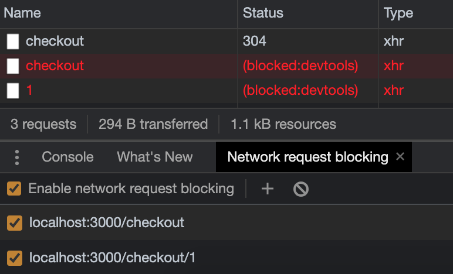

# Refactor the `Checkout.js` file

As we progress through this module's lesson, each component we touch takes the refactoring complexity up a notch, and the `<Checkout>` component is no different.

Whereas the `<App>` component had just one lifecycle method and API call, this component has multiple API calls being triggered in different ways. We'll need to account for all of them.

**We will learn how to handle converting multiple API calls and functions in this lesson while we convert `Checkout.js`.**

But we can handle this. We'll follow the recipe and knock it out, no sweat.

### Convert checkout to a functional component, and remove its render method

In what should be becoming a familiar refrain to you, we'll start by converting this class-based `<Checkout>` component into a function-based component.

This class declaration on line 14 of the `Checkout.js` file located on the file path `client/src/containers/Checkout/` is the first thing to focus on.

{lang=javascript,crop-start-line=14,crop-end-line=14}
<<[client/src/containers/Checkout/Checkout.js](../lesson_04.01/protected/source_code/hardware-handler-4-begin/client/src/containers/Checkout/Checkout.js)

Update that line to be:

```javascript
const Checkout = () => {
```

And then delete the `render` method and object destructuring right before the JSX rendering — they're unnecessary.

{lang=javascript,crop-start-line=52,crop-end-line=54}
<<[client/src/containers/Checkout/Checkout.js](../lesson_04.01/protected/source_code/hardware-handler-4-begin/client/src/containers/Checkout/Checkout.js)

Don't forget the curly brace at the end of the JSX statement as well.

It's safe now to delete the `React` and destructured `Component` imports on line 1 of this file.

{lang=javascript,crop-start-line=1,crop-end-line=1}
<<[client/src/containers/Checkout/Checkout.js](../lesson_04.01/protected/source_code/hardware-handler-4-begin/client/src/containers/Checkout/Checkout.js)

They'll be replaced with `useState` and `useEffect` in this first import instead.

{lang=javascript,crop-start-line=1,crop-end-line=1}
<<[client/src/containers/Checkout/Checkout.js](../lesson_04.01/protected/source_code/hardware-handler-4-ending/client/src/containers/Checkout/Checkout.js)

### Replace the component's class state with `useState` Hooks

Our next move is to update the state for this component. Since `<Checkout>` has both state and props, we'll be replacing the state with `useState` variables and destructuring the props in this section.

Our component starts out with this state:

{lang=javascript,crop-start-line=15,crop-end-line=23}
<<[client/src/containers/Checkout/Checkout.js](../lesson_04.01/protected/source_code/hardware-handler-4-begin/client/src/containers/Checkout/Checkout.js)

And this prop from its parent `<App>` component.

{lang=javascript,crop-start-line=44,crop-end-line=44}
<<[client/src/containers/Checkout/Checkout.js](../lesson_04.01/protected/source_code/hardware-handler-4-begin/client/src/containers/Checkout/Checkout.js)

Those two pieces of code will become:

{lang=javascript,crop-start-line=15,crop-end-line=18}
<<[src/containers/Checkout/Checkout.js](../lesson_04.01/protected/source_code/hardware-handler-4-ending/client/src/containers/Checkout/Checkout.js)

Now we've got our individually declared pieces of state, and we've brought the `updateCheckoutCount` function being passed as a prop from the `<App>` parent component into this functional component with object destructuring.

And we'll update where this function is called in the code, too.

{lang=javascript,crop-start-line=40,crop-end-line=40}
<<[src/containers/Checkout/Checkout.js](../lesson_04.01/protected/source_code/hardware-handler-4-ending/client/src/containers/Checkout/Checkout.js)

Nice. Time to start updating the lifecycle methods in this component.

> **Prop destructuring is not mandatory**
>
> Throughout this course, you'll see me [destructuring nested objects](https://developer.mozilla.org/en-US/docs/Web/JavaScript/Reference/Operators/Destructuring_assignment) being passed as props. I do this not only because it's an ESLint error but also because I think it makes the code cleaner and easier to read.
>
> If you, however, prefer to import all the props and then access the values inside of the component, that's fine too.
>
> Your function's import and access to those props will look very similar to any other functional component you've ever worked with.
>
> ```javascript
> const Checkout = (props) => {
>   // some code
>   props.updateCheckoutCount();
> };
> ```

### Fetch checkout items with `useEffect`

`<Checkout>` component's got a `componentDidMount` function to fetch any products in the checkout when it first mounts in the DOM via the checkout API.

Our `componentDidMount` method looks like this:

{lang=javascript,crop-start-line=25,crop-end-line=32}
<<[client/src/containers/Checkout/Checkout.js](../lesson_04.01/protected/source_code/hardware-handler-4-begin/client/src/containers/Checkout/Checkout.js)

The `useEffect` that will replace this functionality will look something like this. We'll declare a `fetchCheckoutItems` function inside of a `useEffect` to make the asynchronous call to the checkout API's `getAllCheckoutItems` function.

Once the function's promise resolves, we'll check the result for errors and set the appropriate state variable accordingly.

Finally, still inside the `useEffect`, we'll actually call the `fetchCheckoutItems` function we just defined above.

This function only needs to run on component mount, so we give it an empty dependency array to ensure that happens.

{lang=javascript,crop-start-line=20,crop-end-line=32}
<<[src/containers/Checkout/Checkout.js](../lesson_04.01/protected/source_code/hardware-handler-4-ending/client/src/containers/Checkout/Checkout.js)

Very good! We're ready to move on to the other function in this component.

### Update the `removeItemFromCheckout` function

The `removeItemFromCheckout` function in the `<Checkout>` component serves to update the items displayed in the cart (and trigger the `useEffect` in `App.js` that updates the count of items shown in the nav bar) when a user clicks the **Remove Product from Checkout** button on an item.

The current function looks like this:

{lang=javascript,crop-start-line=34,crop-end-line=50}
<<[client/src/containers/Checkout/Checkout.js](../lesson_04.01/protected/source_code/hardware-handler-4-begin/client/src/containers/Checkout/Checkout.js)

This function really doesn't require all that much in terms of code updates to work again. We'll make it an inline arrow function by adding `const` in front of the function name and change the state setters to set each piece of state individually via the `useState` Hooks.

```javascript
const removeItemFromCheckout = async (id) => {
  const remainingCheckoutItems = await checkoutApi.removeProductFromCheckout(
    id,
  );
  if (remainingCheckoutItems !== REMOVE_PRODUCT_FROM_CHECKOUT_ERROR) {
    setCheckoutItems(remainingCheckoutItems);
    await updateCheckoutCount();
    toast.success(PRODUCT_REMOVED_FROM_CHECKOUT_SUCCESS);
  } else {
    toast.error(remainingCheckoutItems);
    setError(true);
  }
  setLoading(false);
};
```

Okay, we should be ready to retest this component's functionality.

### Test checkout still works

This wasn't so bad to refactor. If it's not already running, start the app up, and run the `<Checkout>` component through its paces.

Add two or three products to the checkout from the products page, then visit the checkout. You should see whatever products were added displayed there. Now remove those products, and confirm items disappear until the checkout is empty and the empty checkout message is present.

As long as this is as expected, we're good to move on and put the finishing touches on this component: errors.

### Fix ESLint errors

There is just one ESLint error that's not already been fixed with our refactoring of this component. Looks like our `updateCheckoutCount` prop is causing an error.


Not to worry, though. We got this.

#### Add `updateCheckoutCount` PropTypes

The ESLint error present is a fairly common PropTypes error: ["updateCheckoutCount is missing in props validation"](https://github.com/yannickcr/eslint-plugin-react/blob/master/docs/rules/prop-types.md).

This is a good linting error to have and heed. Defining types for component props improves reusability of your components by validating received data. It can warn other developers if they make a mistake while reusing a component with an improper data type as well.

To fix this error, we'll need to add a new npm library to the project: [prop-types](https://www.npmjs.com/package/prop-types).

Run the following shell script in your terminal inside the `client/` folder.

```shell
yarn add prop-types
```

Once it's installed, import the PropTypes package at the top of the component.

{lang=javascript,crop-start-line=2,crop-end-line=2}
<<[src/containers/Checkout/Checkout.js](../lesson_04.01/protected/source_code/hardware-handler-4-ending/client/src/containers/Checkout/Checkout.js)

And at the bottom of the component, after the `export`, add the following lines to cover the `updateCheckoutCount` prop passed in from the parent component.

{lang=javascript,crop-start-line=93,crop-end-line=95}
<<[src/containers/Checkout/Checkout.js](../lesson_04.01/protected/source_code/hardware-handler-4-ending/client/src/containers/Checkout/Checkout.js)

At this point, that PropTypes error should have disappeared from the ESLint "Problems" tab.

I> **PropTypes are not TypeScript, but they do provide some built-in type checking**
I>
I> While PropTypes are not as strict as using something like TypeScript in our app, they exist to document the intended types of properties passed to components and warn developers if they don't match.
I>
I> It's a good extra gut check to have during development.
I>
I> They also used to be included as part of the React package itself but have been broken out since React v15.5.
I>
I> PropTypes can also get pretty complicated depending on what data shapes are being supplied by parent components. If you want to learn more about PropTypes, I encourage you to check out the [React documentation](https://reactjs.org/docs/typechecking-with-proptypes.html).

Very good! Our errors are resolved, and we've got one last thing to do: check the error states in this component.

### Test checkout errors via Chrome DevTools

We've got two error states to test in this component: if the initial call to load items in the checkout fails, and if the call to remove an item from the list of products in checkout fails.

As we did in the previous lesson, open up the Chrome DevTools **Network** tab, refresh the page to see the checkout API calls, and block the requests.

T> **A tip to block network requests**
T>
T> The easiest way to block our second API call is to block the `getAllCheckoutItems` API call first. This second call, `removeProductFromCheckout`, takes a product ID in order to remove a specific item from the list of products, but when it fails, it won't actually remove the item from the list.
T>
T> Blocking this `getAllCheckoutItems` call will make the `removeProductFromCheckout` call fail when you try to remove a particular item, and then you've got a record of the exact checkout URL with item ID included, so you can block it exactly.
T>
T> From here, we'll be able to then disable each error individually and test they work as expected.

Here's what the **Network** tab should look like when we're ready to test.



First error to check: failure to load items in the checkout. So, uncheck the second blocked network call (the one with the item ID number), and refresh the checkout page in the browser.


This looks good. If items can't be fetched to display in the checkout, this is what we'd expect to see.

Now, test the second error only when a checkout item fails to be removed from the cart.

Hmm. The previous error saying something went wrong fetching the product shows up again. That's not right.


This is not a great user experience because it's not telling a user what the true problem is. I think if a checkout item fails to be removed, the list of items should just remain unchanged (but still visible) in the cart.

Especially since we also show an error message in the top right to let the user know something went wrong. That should be indication enough if this call to remove items fails.

To fix this, we can remove the line in the code where we set the `error` variable to `true` in the `removeItemFromCheckout` function.

Delete `setError(true);` from the function, and the final function should look like this. Focus on lines 42 - 44 for the code change I made.

{lang=javascript,crop-start-line=34,crop-end-line=46}
<<[src/containers/Checkout/Checkout.js](../lesson_04.01/protected/source_code/hardware-handler-4-ending/client/src/containers/Checkout/Checkout.js)

Test this function again by refreshing the page once more, and you should see an error toast, but the items should remain visible in the checkout.


I think this component refactor is finished. Much better.

In our next lesson, we'll deal with updating our `<ProductForm>` component to use hooks. Forms are always a challenge in React, so this should be an interesting one.

---
