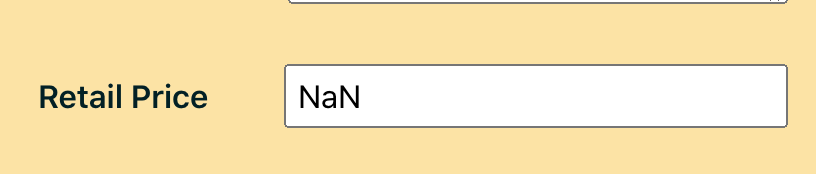
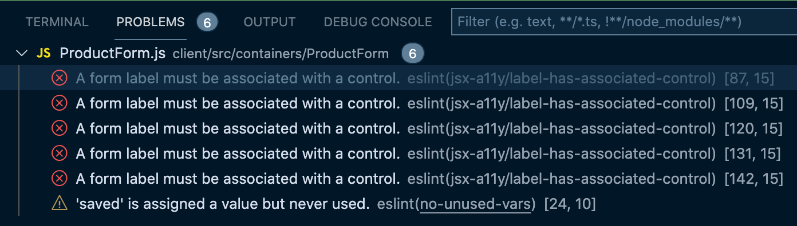
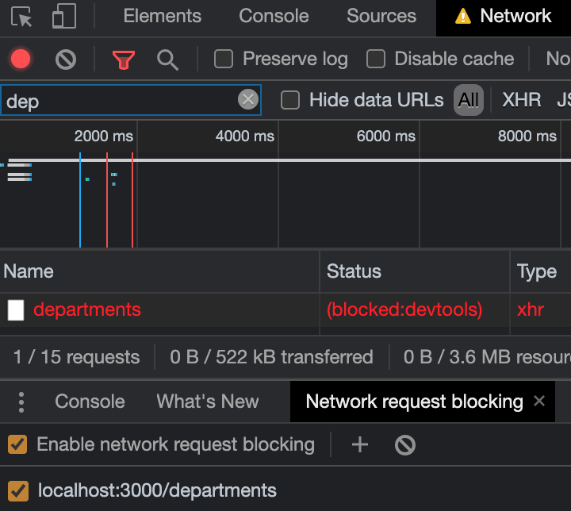
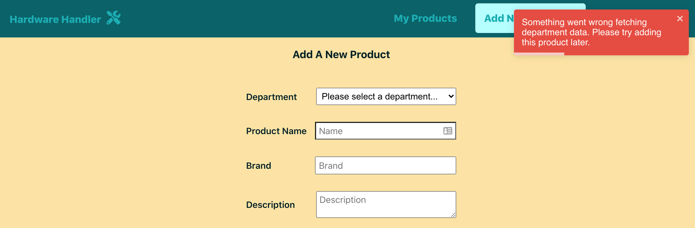

# `ProductForm.js` isn't as complicated as its many inputs make it seem

`<ProductForm>` is unique in that it's a form component, and form components with multiple inputs have traditionally been difficult in React; more difficult than other JavaScript frameworks might make them.

**This lesson will walk through converting a React form to use hooks when saving new product info to our local database.**

I think this refactor might pleasantly surprise you, though. With the previous lessons under our belt, we have this well in hand.

Let's start where we've traditionally been starting each of these lessons: converting this class component to a function.

### Convert ProductForm to a functional component and remove the render method

As you can now guess, we'll take line 20 of the `ProductForm.js` component and make it into an inline arrow function.

Our `<ProductForm>` class component declaration starts off like this:

{lang=javascript,crop-start-line=20,crop-end-line=20}
<<[client/src/containers/ProductForm/ProductForm.js](../lesson_04.01/protected/source_code/hardware-handler-4-begin/client/src/containers/ProductForm/ProductForm.js)

And now becomes:

{lang=javascript,crop-start-line=20,crop-end-line=20}
<<[src/containers/ProductForm/ProductForm.js](../lesson_04.01/protected/source_code/hardware-handler-4-ending/client/src/containers/ProductForm/ProductForm.js)

Then, remove the `render` function and object destructuring before the JSX is rendered in the browser. Don't forget to delete the orphaned `}` at the end of the component's JSX, too.

{lang=javascript,crop-start-line=90,crop-end-line=92}
<<[client/src/containers/ProductForm/ProductForm.js](../lesson_04.01/protected/source_code/hardware-handler-4-begin/client/src/containers/ProductForm/ProductForm.js)

### Replace class state with `useState` Hooks

The `<ProductForm>` component has a decent amount of state variables, so next, it's time to swap all of these out for separate `useState` variables.

Our single, large state object currently in the component before we convert it looks like this.

{lang=javascript,crop-start-line=21,crop-end-line=31}
<<[client/src/containers/ProductForm/ProductForm.js](../lesson_04.01/protected/source_code/hardware-handler-4-begin/client/src/containers/ProductForm/ProductForm.js)

Then, we import `useState` at the top of the component and replace this state with individual state variables and their setters.

```javascript
const [newProduct, setNewProduct] = useState(defaultsForNewProduct);
const [loading, setLoading] = useState(true);
const [error, setError] = useState(false);
const [saved, setSaved] = useState(false);
const [departments, setDepartments] = useState([]);
```

Note that we can still take the same `defaultsForNewProduct` variable we define above the component initialization, but we don't have to spread it into an object anymore when we set the state in the component. It's a small change but worth taking notice of.

After this, we'll replace our lifecycle method.

### Switch out the `componentDidMount` fetching departments for a `useEffect`

Okay, now let's look at the lifecycle `componentDidMount` method that fetches the departments for the user to choose from the dropdown list in the form. This shouldn't be too bad to recreate within a `useEffect`.

Let's target this `componentDidMount` function beginning on line 33.

{lang=javascript,crop-start-line=33,crop-end-line=48}
<<[client/src/containers/ProductForm/ProductForm.js](../lesson_04.01/protected/source_code/hardware-handler-4-begin/client/src/containers/ProductForm/ProductForm.js)

And we'll replace it with this `useEffect` code.

```javascript
useEffect(() => {
    const fetchDepartments = async () => {
      const allDepartments = await departmentApi.getAllDepartments();
      if (allDepartments === FETCH_DEPARTMENT_DATA_ERROR) {
        toast.error(`${departments} Please try adding this product later.`);
        setError(true);
      } else {
        setDepartments(allDepartments);
      }
      setLoading(false);
    };

    fetchDepartments();
  }, []);
```

It's nice to see how this function can be condensed slightly because each variable is separate, like how we can only have one `setLoading(false);` declaration at the end of the `fetchDepartments` function regardless of if the API call succeeds or fails.

This is a big benefit to React Hooks' `useState` variables: it cuts down on the amount of duplicate code resulting from the state variables in a single, large state object all having to be updated at once. Instead, each piece of state can be updated independently and only when it really needs to be updated.

This should handle our `fetchDepartments` API call for now. Time to move on to the other functions in this component.

### Update our other class functions into arrow functions

`<ProductForm>` has a number of functions because it is a form component to add new products to the Product List page, and we have to handle multiple data inputs for new products. We'll handle converting these functions one a time.

#### Refactor `onChange` to an arrow function

The `onChange` function only needs slight modifications to work again as an arrow function.

Currently, we take the `propName` of whichever input is being updated and set that value in the `newProduct` object until all the properties have been updated.

{lang=javascript,crop-start-line=50,crop-end-line=54}
<<[client/src/containers/ProductForm/ProductForm.js](../lesson_04.01/protected/source_code/hardware-handler-4-begin/client/src/containers/ProductForm/ProductForm.js)

With hooks, here's how we update `onChange` to achieve the same outcome:

{lang=javascript,crop-start-line=40,crop-end-line=44}
<<[src/containers/ProductForm/ProductForm.js](../lesson_04.01/protected/source_code/hardware-handler-4-ending/client/src/containers/ProductForm/ProductForm.js)

Declare `onChange` as an inline arrow function, and make a local duplicate copy of the existing `newProduct` object by spreading it into a variable named `updatedProduct`. This variable will only live inside of the `onChange` function; the rest of the component won't know about its existence at all.

Replace the `updatedProduct` property that matches the `propName` of the input with the `val` from said input. Finally, set this newly updated local object, `updatedProduct`, into the component's state with the `setNewProduct` function.

So now, if you were to call `console.log(newProduct);` somewhere in our component, you'd see the `newProduct` object with its newly updated property for whichever input was interacted with.

T> **Don't forget the spread operator when copying newProduct**
T>
T> If you omit the spread operator when making the local copy of the `newProduct` object inside of `onChange`, none of the values in the `updatedProduct` variable will register as users interact with the inputs in the DOM, so don't leave it out.

#### Update the `isValid` function as well

The `isValid` function is an easy one to update. It checks each input of the product form to ensure it's been filled out, and if it has not, it keeps the **Submit** button at the bottom of the form from enabling.

Before we touch this function, here's how it looks in the class component:

{lang=javascript,crop-start-line=56,crop-end-line=70}
<<[client/src/containers/ProductForm/ProductForm.js](../lesson_04.01/protected/source_code/hardware-handler-4-begin/client/src/containers/ProductForm/ProductForm.js)

All we have to do to make this function work in our new version of `<ProductForm>` is throw a `const` in front of `isValid` and remove all the `this.state` pieces of code.

{lang=javascript,crop-start-line=46,crop-end-line=60}
<<[src/containers/ProductForm/ProductForm.js](../lesson_04.01/protected/source_code/hardware-handler-4-ending/client/src/containers/ProductForm/ProductForm.js)

With those removed, this should work again. Done!

#### Rewrite `onSubmit` for a new product

And our last function to update: `onSubmit`.

In this function, our `newProduct` state is sent to the product API, and if it succeeds in saving a new product to the database or fails, a toast pops to alert the user what's happened.

Additionally, if it succeeds, the `newProduct` object is reset with the empty defaults so that the user can add another product quickly. If it fails, the `newProduct` object is not reset in case the user wants to try saving the item again.

The class-based `onSubmit` code currently looks like this:

{lang=javascript,crop-start-line=72,crop-end-line=88}
<<[client/src/containers/ProductForm/ProductForm.js](../lesson_04.01/protected/source_code/hardware-handler-4-begin/client/src/containers/ProductForm/ProductForm.js)

Replace the current `onSubmit` with the following code.

```javascript
const onSubmit = async () => {
  const addProduct = await productApi.addNewProduct(newProduct);
  if (addProduct !== ADD_NEW_PRODUCT_ERROR) {
    setNewProduct(defaultsForNewProduct);
    setSaved(true);
    toast.success(ADD_NEW_PRODUCT_SUCCESS);
  } else {
    setError(true);
    toast.error(`${addProduct} Please refresh the page and try again.`);
  }
  setLoading(false);
};
```

Once again, with the introduction of hooks, we can condense our function. Instead of having to set the `loading` variable in both instances of whatever the `addNewProduct` function returns, we just set it to `false` at the end of the function.

Cool. In this particular component, the JSX doesn't even need updating, so I think we're ready to test the functionality of our newly refactored component.

### Retest the app's functionality

To test our app is working, start it locally and navigate to the **Add New Products** page. Add a couple products to the `<ProductForm>` component, check that the **Submit** button is disabled until all the form inputs are filled out, and make sure that the newly added products appear on the **Product List** page.

That all seems to be in working order.

While I was testing, though, I did notice an error I hadn't accounted for previously.

### Fix the `NaN` number input error

To recreate this error I noticed, try entering a character instead of a number into the **Retail Price** input.



The input displays a `NaN` error in the input itself. We can fix this, though, We just need to update the input's type from `"text"` to `"number"` and add a `"min"` value of `"0"` so a user can't set a price below $0.

This is what the **Retail Price**'s input code should look like now.

{lang=javascript,crop-start-line=142,crop-end-line=152}
<<[src/containers/ProductForm/ProductForm.js](../lesson_04.01/protected/source_code/hardware-handler-4-ending/client/src/containers/ProductForm/ProductForm.js)

With this change, a user should not be able to enter any value besides a number in the input box. `NaN` problem solved.

### Address any remaining ESLint errors

We've got just a few ESLint errors that weren't resolved during the initial component refactor.



Most of them are one particular error, just repeated multiple times within the component. We'll fix this one first.

#### Fix the form label control error

The majority of our errors center around an ESLint error defined as [`label-has-associated-control`](https://github.com/jsx-eslint/eslint-plugin-jsx-a11y/blob/master/docs/rules/label-has-associated-control.md).

If you look at the error description online, it says this shouldn't be an issue because the `<label>` component we're associating with each `<input>` on the form has an `htmlFor` property that matches the `<input>`'s `id` property.

And we're doing that, so what's going on? Well, it looks like we need to add a new ESLint rule to allow for form inputs that are not nested within their `<label>`.

Open the `.eslintrc.json` file in the project and add the following snippet to it.

{lang=json,crop-start-line=27,crop-end-line=36}
<<[.eslintrc.json](../lesson_04.01/protected/source_code/hardware-handler-4-ending/client/.eslintrc.json)

This should resolve almost all of our ESLint errors as soon as it's saved and takes effect within our IDE.

#### Remove the `saved` variables

So, the other ESLint error to resolve is the `saved` unused variable.

When we look at where `saved` was being set, it was when a new product was successfully added to the database.

But because we're using the `react-toastify` library to alert users when a product's been saved, we don't actually need the `saved` variable for anything in this particular component. It's not actually doing anything within this component's JSX.

Let's delete it completely.

Delete the state declaration at the top of the component where we defined state.

```javascript
const [saved, setSaved] = useState(false);
```

And delete its usage within the `onSubmit` function.

```javascript
setSaved(true);
```

ESLint errors handled.

### Test `<ProductForm>`'s error states

And last but never least, let's test the API error states in this component, just like we've done for the other components.

In the browser, while on the **Add New Products** page, navigate to the **Network** tab, find the department API call, and block it by right-clicking on it and selecting **Block request URL**, then refresh the page.



Currently, when there's an error fetching the department data, an error toast pops, but the form is still present on the page, _even though_ a user won't be able to submit the new product because they cannot select a department to classify it under.



This is a mission-critical error for this page: we shouldn't let users waste their time filling out the rest of the form if we can't load departments. Let's fix this in the code so they can't.

#### Update the department error API

First, remove the toast error being triggered in the `useEffect` function. We shouldn't use this any longer. Remove the following toast error line.

```javascript
toast.error(`${departments} Please try adding this product later.`);
```

Next, in the JSX, under the `loading` ternary code, let's add the following `error` ternary code and a small update to the line right below it that renders the form inputs.

{lang=javascript,crop-start-line=77,crop-end-line=82}
<<[src/containers/ProductForm/ProductForm.js](../lesson_04.01/protected/source_code/hardware-handler-4-ending/client/src/containers/ProductForm/ProductForm.js)

Now, if we can't fetch department data, we'll alert the user something went wrong and tell them to try refreshing the page to fix the issue. This makes a lot more sense.

As long as there's no `error` or `loading` state variables set to `true`, the form will render correctly. Otherwise, it won't.


All right, here's our final API error test: check the error if a user can't submit a new product to the product list.

Submit a test product with the **Network** tab open the block the product API request.

Then, fill out the form with another product and try to submit it. Uh-oh, the same error message about "Something went wrong..." is showing up when the new product submission fails. This isn't the right message to send.

No problem. Let's think through this: we've got the error toast popping when the call fails. Do we really _need_ to set the `error` state variable to `true`, too? For what purpose? It doesn't trigger the error toast — that's called separately.

I don't think we need to set `error` to `true` when that API call fails. Let's delete that line from the `onSubmit` function. Delete this line.

```javascript
setError(true);
```

Refresh the browser to give this error another try. Now the error toast appears, but the form stays on the screen, and the inputs stay too, in case a user wants to try again.

Yes, this makes much more sense now.

And with that, after a quick check of the ESLint errors one last time and testing the functionality's still all good, we can say this component's done with its refactoring. We're almost done with the initial conversion of our class components to hooks! Just one more to go.

The last component we'll be converting in this module is the `<ProductList>` component. See you in the next lesson!

---
