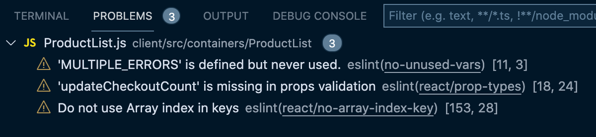

# `ProductList.js` is Complicated with its Product Display and Filtering Capabilities

The `<ProductList>` component can be intimidating at first glance, because it displays all the products currently available _and_ provides the ability to filter them by department and/or brand.

But it's really not that bad once we break it down using our recipe and refactor it step-by-step. We got this.

**In this lesson we'll employ all the Hooks experience we've gained up to this point, and all the best practices we've learned to convert a pretty complex app from classes to Hooks.**

### Convert ProductList to a Functional Component and Remove the Render Method

First step (as we've done with every other component): change `<ProductList>` to a function from a class.

We'll take this class declaration on line 17:

{lang=javascript,crop-start-line=17,crop-end-line=17}
<<[client/src/containers/ProductList/ProductList.js](../lesson_04.01/protected/source_code/hardware-handler-4-begin/client/src/containers/ProductList/ProductList.js)

And make it into this:

```javascript
const ProductList = () => {
```

You can also remove the `import React, { Component } from 'react';` statement on line 1. Neither of the imports here are required any longer. We'll bring in some new Hooks soon to replace them.

Delete this code:

{lang=javascript,crop-start-line=1,crop-end-line=1}
<<[client/src/containers/ProductList/ProductList.js](../lesson_04.01/protected/source_code/hardware-handler-4-begin/client/src/containers/ProductList/ProductList.js)

Also remove the `render()` method and the destructured state we previously injected into the JSX below.

{lang=javascript,crop-start-line=116,crop-end-line=118}
<<[client/src/containers/ProductList/ProductList.js](../lesson_04.01/protected/source_code/hardware-handler-4-begin/client/src/containers/ProductList/ProductList.js)

Don't forget to remove the curly brace at the end of the component that gets orphaned on the `render` is deleted before moving on.

### Change up our State Variables to use Hooks

Ok, the next step is swap out the class-based state for Hooks state instead.

Starting on line 18, we'll turn this:

{lang=javascript,crop-start-line=18,crop-end-line=30}
<<[client/src/containers/ProductList/ProductList.js](../lesson_04.01/protected/source_code/hardware-handler-4-begin/client/src/containers/ProductList/ProductList.js)

Into all these `useState` Hooks.

{lang=javascript,crop-start-line=19,crop-end-line=25}
<<[src/containers/ProductList/ProductList.js](../lesson_04.01/protected/source_code/hardware-handler-4-ending/client/src/containers/ProductList/ProductList.js)

And import `useState` at the top of the component.

```javascript
import { useState } from 'react';
```

That's a decent amount of state variables, but there's one more variable we need to add. On line 88 of our current component, we call the `updateCheckoutCount` prop, which lets its parent component `<App>` know to update the `checkoutCount`.

Since that's the only prop this component uses, we can destructure it and pass it to this component, just the same as we'd do in any other functional component accepting props.

Update the component declaration's arguments on line 17.

{lang=javascript,crop-start-line=18,crop-end-line=18}
<<[src/containers/ProductList/ProductList.js](../lesson_04.01/protected/source_code/hardware-handler-4-ending/client/src/containers/ProductList/ProductList.js)

And adjust where it's used inside the `addItemToCheckout` as well.

{lang=javascript,crop-start-line=90,crop-end-line=90}
<<[src/containers/ProductList/ProductList.js](../lesson_04.01/protected/source_code/hardware-handler-4-ending/client/src/containers/ProductList/ProductList.js)

We'll come back to fix the remainder of this function soon. But let's try to be methodical and keep moving down the component as we refactor.

### Split up our Large `componentDidMount` for Smaller `useEffect` Hooks

After updating state, we'll replace our lifecycle methods with `useEffect`.

And this is a good opportunity to split up our single, large `componentDidMount` lifecycle method into two smaller `useEffect` Hooks because if you look closely the `componentDidMount` is currently making two unrelated API calls.

It's calling the product API to get all the products to display on the page, and the department API to make filtering products by departments possible.

Previously, these calls all had to be together because the lifecycle component dictated it (even though they _are_ unrelated), but now we don't have to.

Now, we can group these calls into separate Hooks and only trigger and update their state when the variables they depend on change.

Here's our current `componentDidMount` function that we're going to break up.

{lang=javascript,crop-start-line=32,crop-end-line=85}
<<[client/src/containers/ProductList/ProductList.js](../lesson_04.01/protected/source_code/hardware-handler-4-begin/client/src/containers/ProductList/ProductList.js)

That's a lot of code in one function.

#### Product API's `useEffect` First

Let's refactor the `getAllProducts` API call first as it's a little more complicated.

Import `useEffect` at the top of this component next to our `useState` import.

{lang=javascript,crop-start-line=1,crop-end-line=1}
<<[src/containers/ProductList/ProductList.js](../lesson_04.01/protected/source_code/hardware-handler-4-ending/client/src/containers/ProductList/ProductList.js)

Then, we'll declare a new `useEffect` function, and extract the `productApi.getAllProducts` call into a function contained within it, which we'll name `fetchProducts`.

Inside of `fetchProducts`, if the call returns an error, we'll set the `error` boolean to `true` and the `errMsg` to the product error message: `FETCH_PRODUCT_DATA_ERROR`.

If the API call returns the products, we'll set the `products` variable, and then use those products to generate the `filtersByBrand` variables.

Lucky for us, we can take the `formatFilters` function exactly as it is and pop it in right under the `setProducts` line on line 36. Just replace the `products` argument being passed to it with `allProducts`.

Once the products are successfully fetched, the filters by brand name can be generated and set into the component's state with `setFiltersByBrand`. Finally, regardless of what the product API call returns, we set the `loading` variable to `false`.

And to make sure this function only runs on component mount, we pass an empty dependency array to the `useEffect`.

What this code is doing isn't too complicated - it just looks intimidating because of the `formatFilters` function that pulls brand names to add as filters after the products are fetched.

Here's the new `useEffect` code to replace part of our `componentDidMount`.

{lang=javascript,crop-start-line=27,crop-end-line=55}
<<[src/containers/ProductList/ProductList.js](../lesson_04.01/protected/source_code/hardware-handler-4-ending/client/src/containers/ProductList/ProductList.js)

#### Department API's useEffect

This second `useEffect` for getting all the departments these products live in should actually be the easier function to extract from our `componentDidMount`.

As with the previous section, we create another new `useEffect` function, and new function inside it called `fetchFilters` to make the asynchronous API call `getAllDepartments`.

Within the `fetchFilters` function, if the department API call throws an error, we'll set the `error` state to `true` and the `errMsg` to the error string returned. When the `getAllDepartments` function successfully returns the department data, we set the `filtersByDepartment` variable equal to it, and we set `loading` to `false` regardless.

The last step to running the async function we've just defined is to call `fetchFilters` at the end of the `useEffect`, and its dependency array is also empty, because these departments only need to be fetched once on component load.

```javascript
useEffect(() => {
  const fetchFilters = async () => {
    const filtersByDept = await departmentApi.getAllDepartments();
    if (filtersByDept === FETCH_DEPARTMENT_DATA_ERROR) {
      setError(true);
      setErrMsg(filtersByDept);
    } else {
      setFiltersByDepartment(filtersByDept);
    }
    setLoading(false);
  };

  fetchFilters();
}, []);
```

T> **Put a pin in the scenario where both API calls fail.**
T>
T> You may have noticed we didn't actually handle the error scenario when both API calls throw errors.
T>
T> Don't sweat it for now - we'll handle this particular error scenario later in the lesson.

Very nice, we've refactored our `componentDidMount` method into two separate `useEffect` functions that better reflect the two unrelated API calls they make.

This is the very type of scenario Hooks was aiming to solve and it did. Simpler, cleaner, clearer code.

### Make our Class Methods into Traditional Arrow Functions

As we continue refactoring our component, the next thing to tackle is the other functions in `ProductList`: the `addItemToCheckout` function and the `onFilterChange` function.

#### Modify `addItemToCheckout`

The class-based method of `addItemToCheckout` won't require too much rework to become a regular arrow function. Here is what the function currently looks like.

{lang=javascript,crop-start-line=87,crop-end-line=103}
<<[client/src/containers/ProductList/ProductList.js](../lesson_04.01/protected/source_code/hardware-handler-4-begin/client/src/containers/ProductList/ProductList.js)

And to change this to a function that will work in a functional component, we'll add a `const` in front of the function name, remove the two `setState`s in the `if/else` statement, and set both the `loading` and `error` variables to false at the end of the function. We've already updated the prop `updateCheckoutCount` so that's taken care of.

{lang=javascript,crop-start-line=87,crop-end-line=97}
<<[src/containers/ProductList/ProductList.js](../lesson_04.01/protected/source_code/hardware-handler-4-ending/client/src/containers/ProductList/ProductList.js)

That should knock this function out.

#### Update `onFilterChange`

The `onFilterChange` function takes in a filter option that the user has selected (either a department or a brand name), and checks if the current `activeFilter` array has filter in it.

If it is already present, it means the user has unchecked the filter checkbox, so we must remove that filter value from the array of things to filter by. This is why we find the `index` of the filter variable, spread the existing state of the `activeFilter` array, `splice` out the filter value in the array at that index, then finally update the `activeFilter` state with the newly altered array.

If the array does not currently contain the filter value, it adds the new value to the `activeFilter` array by spreading the existing `activeFilter` values into a new array with the new `filter` value.

The current `onFilterChange` looks like this:

{lang=javascript,crop-start-line=105,crop-end-line=114}
<<[client/src/containers/ProductList/ProductList.js](../lesson_04.01/protected/source_code/hardware-handler-4-begin/client/src/containers/ProductList/ProductList.js)

Here's how we'll refactoring this filter function. Add a `const` to the front of the function, locate the `this.state` pieces code inside of this function and remove them, and where we set the `activeFilter` state, refactor it to update the individual variable with the `setActiveFilter` function.

{lang=javascript,crop-start-line=99,crop-end-line=108}
<<[src/containers/ProductList/ProductList.js](../lesson_04.01/protected/source_code/hardware-handler-4-ending/client/src/containers/ProductList/ProductList.js)

Not bad, right? Personally, I think this is easier to read than the previous way we set the state.

### Fix the Filtering Logic and JSX for a Functional Component

All right, we're getting towards the end of the initial refactor of this component: we're down to the filtering logic that determines which products are displayed on the page and the JSX display itself.

#### Adjust the Product Filtering Logic

This filtering logic checks the `activeFilter` array and if it's either empty or it's equal to all the of the brand name and department checkboxes being checked, then the local `filteredList` variable will be set equal to all the products fetched from the `getAllProducts` API call.

If neither of those conditions are met, the `products` array will be filtered down by whatever `activeFilters` are present in the array, and the results are set to the `filteredList` variable.

Regardless, the `filteredList` variable is what actually gets rendered by the JSX, and it gets updated every time the `activeFilters` array changes, but the `products` array is never mutated after it is initially fetched from the API.

Now that we've talked about how this filter works, the logic should be quick to update.

{lang=javascript,crop-start-line=120,crop-end-line=131}
<<[client/src/containers/ProductList/ProductList.js](../lesson_04.01/protected/source_code/hardware-handler-4-begin/client/src/containers/ProductList/ProductList.js)

All we have to do is remove the `this.state` code in our filter. That should be about all that needs doing here - we'll test it shortly to make sure.

{lang=javascript,crop-start-line=110,crop-end-line=123}
<<[src/containers/ProductList/ProductList.js](../lesson_04.01/protected/source_code/hardware-handler-4-ending/client/src/containers/ProductList/ProductList.js)

Ok, on to the JSX for this component.

#### Update the JSX

We've finally made it to the JSX, this too shouldn't give us much trouble. To make it work, we'll go through the JSX, find all the instances where the `this` keyword is being used (either for component state or functions), and remove it.

The first two JSX instances require almost exactly the same refactoring: they're the filters that filter products by department and / or brand name.

Here's the original JSX that filters by department:

{lang=javascript,crop-start-line=139,crop-end-line=152}
<<[client/src/containers/ProductList/ProductList.js](../lesson_04.01/protected/source_code/hardware-handler-4-begin/client/src/containers/ProductList/ProductList.js)

And here's the original JSX that filters by product name:

{lang=javascript,crop-start-line=157,crop-end-line=170}
<<[client/src/containers/ProductList/ProductList.js](../lesson_04.01/protected/source_code/hardware-handler-4-begin/client/src/containers/ProductList/ProductList.js)

See the references to `this.state` or `this.[FUNCTION_NAME]`? Remove them all. Now our two filters' JSX should look like the following.

Refactored filters by department:

{lang=javascript,crop-start-line=131,crop-end-line=144}
<<[src/containers/ProductList/ProductList.js](../lesson_04.01/protected/source_code/hardware-handler-4-ending/client/src/containers/ProductList/ProductList.js)

And refactored filters by product:

```javascript
{
  !error && filtersByBrand.length
    ? filtersByBrand.map((filter, index) => (
        <span key={index} className="filter-item">
          <label htmlFor={index}>{filter.name}</label>
          <input
            className="filter-checkbox"
            id={index}
            type="checkbox"
            checked={activeFilter.includes(filter.value)}
            onChange={() => onFilterChange(filter.value)}
          />
        </span>
      ))
    : null;
}
```

There's one last piece of JSX to refactor. The `<Product>` component, rendered in our `<ProductList>`'s JSX takes in our `addItemToCheckout` function.

Our original `<Product>` component looks like this:

{lang=javascript,crop-start-line=184,crop-end-line=188}
<<[client/src/containers/ProductList/ProductList.js](../lesson_04.01/protected/source_code/hardware-handler-4-begin/client/src/containers/ProductList/ProductList.js)

Replace the `this.addItemToCheckout` function with just `addItemToCheckout`, and we're done refactoring `<ProductList>`. Well done!

{lang=javascript,crop-start-line=176,crop-end-line=180}
<<[src/containers/ProductList/ProductList.js](../lesson_04.01/protected/source_code/hardware-handler-4-ending/client/src/containers/ProductList/ProductList.js)

### Test the App's Functionality

Great, now that we've finished updating this component, let's make sure it still works correctly. If you haven't already, start the application up locally.

Navigate to the "My Products" page and add a couple of items to the checkout, check some of the filter checkboxes and make sure the products displayed filter correctly.

### Fix Lingering ESLint Errors

It looks like things are working as expected, so let's go after any remaining ESLint errors. We've still got a few to resolve.



#### Resolve the No Array Index in Keys Error

The first ESLint error we'll tackle is the one at the bottom of the list: [`Do not use Array index in keys`](https://github.com/yannickcr/eslint-plugin-react/blob/master/docs/rules/no-array-index-key.md).

If you check the ESLint error, the reasoning behind it is that using an array index doesn't uniquely identify the item if it were to be sorted and re-rendered. While this particular linting error doesn't really apply to this list of brands (we'll never filter or sort them in any other order), it'll be a simple enough matter to resolve.

We'll remove the `index` value from the JSX where we map over `filtersByBrand`, and use `filter.value` as the unique key for each checkbox in the list.

The current filter code here:

```javascript
{
  !error && filtersByBrand.length
    ? filtersByBrand.map((filter, index) => (
        <span key={index} className="filter-item">
          <label htmlFor={index}>{filter.name}</label>
          <input
            className="filter-checkbox"
            id={index}
            type="checkbox"
            checked={activeFilter.includes(filter.value)}
            onChange={() => onFilterChange(filter.value)}
          />
        </span>
      ))
    : null;
}
```

Is modified to become:

{lang=javascript,crop-start-line=149,crop-end-line=162}
<<[src/containers/ProductList/ProductList.js](../lesson_04.01/protected/source_code/hardware-handler-4-ending/client/src/containers/ProductList/ProductList.js)

That's one error down, just a couple more to go.

#### Add `updateCheckoutCount` PropTypes

Our next ESLint error to resolve is the PropTypes error: [`updateCheckoutCount is missing in props validation`](https://github.com/yannickcr/eslint-plugin-react/blob/master/docs/rules/prop-types.md).

We've seen this error before in the `<ProductList>` component. So we know how to fix this, and since we've already installed the prop-types npm library into our app, the solution is even simpler than before.

Import the PropTypes package at the top of the component.

{lang=javascript,crop-start-line=2,crop-end-line=2}
<<[src/containers/ProductList/ProductList.js](../lesson_04.01/protected/source_code/hardware-handler-4-ending/client/src/containers/ProductList/ProductList.js)

Add the prop-type for the `updateCheckoutCount` prop at the bottom of the component.

{lang=javascript,crop-start-line=197,crop-end-line=199}
<<[src/containers/ProductList/ProductList.js](../lesson_04.01/protected/source_code/hardware-handler-4-ending/client/src/containers/ProductList/ProductList.js)

At this point, that error should have disappeared from the ESLint "Problems" tab.

All right, we'll resolve the last ESLint error in the next section when we test our error states in the browser.

### Test the Error States in Chrome DevTools

There's still one ESLint error present, and it alerts us to [unused variables](https://eslint.org/docs/rules/no-unused-vars): in the `MULTIPLE_ERRORS` constant.

This is actually a good thing, because it tells us that previously used code hasn't been included in our refactor. Since one of the unused variables is the `MULTIPLE_ERRORS` constant, this is a good indicator we should test the error states in the browser from our API calls.

Just like in previous lessons, we'll find the API calls in the Chrome DevTools Network tab, and block them, then check to see what happens in the browser.

If either the products or the departments API call fails, the error messages in the browser show up as expected, however if both API calls fail, the `MULTIPLE_ERRORS` error message isn't displayed. It's still the "Something went wrong fetching department data." error message instead.


This is happening because now we've separated the `componentDidMount` that did both API calls together into two separate `useEffect` functions. So how can we fix this? Why, with one more `useEffect`, of course.

### `useEffect` to Handle Multiple API Errors

To fix our component in the case that both API calls in `<ProductList>` fail, we'll create a new `useEffect` function.

In order for this to work, we'll also need to adjust our existing `useEffect`s. Instead of setting the `errMsg` variable in each `useEffect` if an API call fails, we'll set the `products` and `filtersByDepartment` variables to the error messages.

The first `useEffect`'s code fetching product data will go from:

```javascript
 if (allProducts === FETCH_PRODUCT_DATA_ERROR) {
        setError(true);
        setErrMsg(allProducts);
      } else {
```

To:

{lang=javascript,crop-start-line=30,crop-end-line=33}
<<[src/containers/ProductList/ProductList.js](../lesson_04.01/protected/source_code/hardware-handler-4-ending/client/src/containers/ProductList/ProductList.js)

Likewise, the second `useEffect` fetching department data will go from:

```javascript
 if (departments === FETCH_DEPARTMENT_DATA_ERROR) {
        setError(true);
        setErrMsg(departments);
      } else {
```

To:

{lang=javascript,crop-start-line=60,crop-end-line=63}
<<[src/containers/ProductList/ProductList.js](../lesson_04.01/protected/source_code/hardware-handler-4-ending/client/src/containers/ProductList/ProductList.js)

Now we can create a new `useEffect` that will be triggered to run every time the `products`, `filtersByDepartment` or `error` variables change state. When one of these states updates, the `useEffect` will check if `error` is `true`, then set the appropriate error message based on what `products` and `filtersByDepartment`'s states are.

The new `useEffect` function's code can be placed in our component right under the second `useEffect` in the code.

{lang=javascript,crop-start-line=72,crop-end-line=85}
<<[src/containers/ProductList/ProductList.js](../lesson_04.01/protected/source_code/hardware-handler-4-ending/client/src/containers/ProductList/ProductList.js)

Ok, let's test these error states in the browser once again. Give the page a refresh after adding the new `useEffect` while still blocking both API calls in the DevTools "Network" tab.


That looks much more appropriate. Oh, and that ESLint error about unused variables? It's gone.

Sweet! I think this component refactor is finished.

I know this was a long lesson, but not only did we make it to the end of the lesson, but we've also made it to the end of the module. Great job!

I hope you feel more confident now about updating existing class components with Hooks. And if you still feel a little shaky or unsure, don't worry, we've got custom Hooks coming up in the next module.

---
