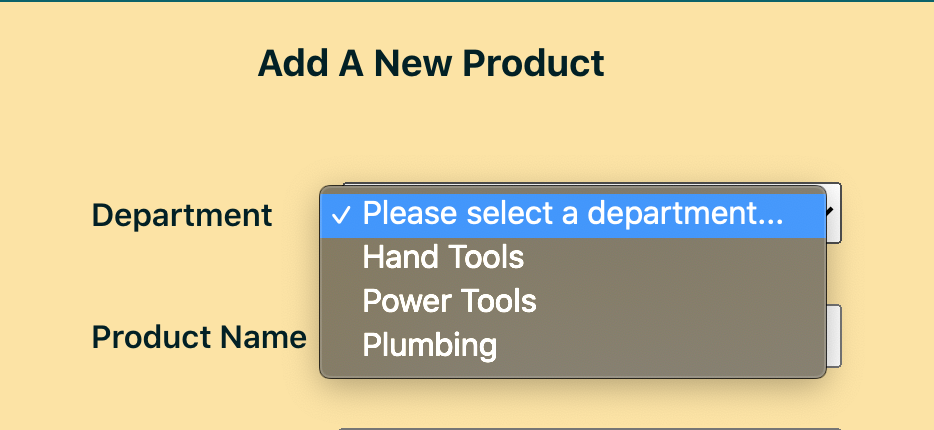
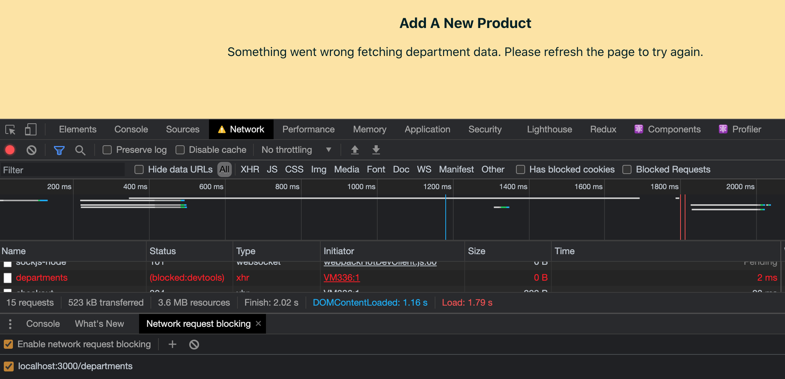
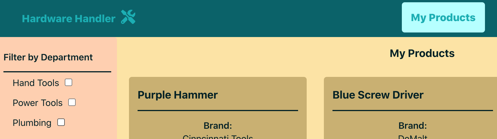
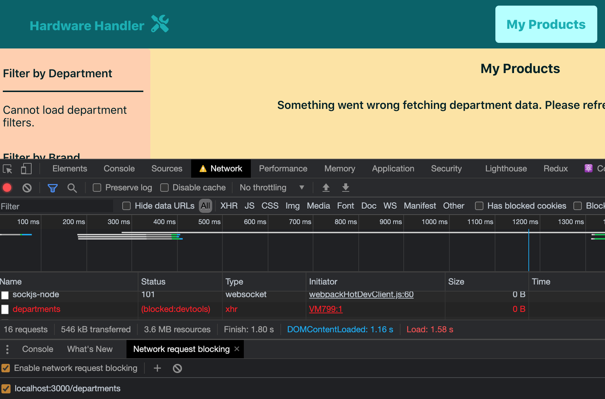

# Custom hooks may sound intimidating at first, but `useDepartments` should change your mind

If you look through our code, one thing you might notice while checking out the various components is that there are duplicate API calls happening: multiple components call the same API endpoints in our app to retrieve information.

Situations like this are a perfect opportunity to refactor some code into a custom hook and simplify the code contained in our components in the process.

**In this lesson, we'll make our first custom hook. We'll learn how to extract code from one component and recreate it in a centralized and reusable hook.**

Just like with our previous module lessons, we'll start with a simpler custom hook and work our way up to the more complex ones in future lessons.

I> **Sample code zip file**
I>
I> If you need a copy of the sample app _before_ we begin adding custom hooks, you can download it **[here](protected/source_code/hardware-handler-5.zip)**.

### We make duplicate calls to the department API

The first duplicate API call that stood out to me is the `getAllDepartments` call. It's called in both the `<ProductList>` and the `<ProductForm>` components after our updates to these components in the last module.

This seems like as good a place to start as any — let's make this call into a custom hook that we can share with all the components that need it.

### Create a new `hooks` folder

To keep our project organized, let's make a new folder inside the `client/src` folder named `hooks/`.

This is where we'll hold all the shared React Custom Hooks that our app will utilize.

### Make a new `useDepartments.js` file

Once the `hooks/` folder exists, we can create a new file inside of it called `useDepartments.js`.

Following the "Rules of Hooks", which we covered in the module introducing hooks, we name all custom hook files by starting with the word `useXyz.js`, and since this hook is about fetching departments, we'll name it `useDepartments.js`.

Okay, we're ready to start adding code to this hook now.

### Review the code currently fetching departments

As I said before, there are two components in our app that are calling the department API: the `<ProductForm>` and the `<ProductList>` components.

The `useEffect` in `<ProductForm>` calling the `getAllDepartments` API call currently looks like this.

{lang=javascript,crop-start-line=22,crop-end-line=38}
<<[src/containers/ProductForm/ProductForm.js](./protected/source_code/hardware-handler-5-begin/client/src/containers/ProductForm/ProductForm.js)

And the `useEffect` in `<ProductList>` calling the same API endpoint currently looks like this.

First, a snapshot of the component's state (this one has quite a few more state variables):

{lang=javascript,crop-start-line=19,crop-end-line=25}
<<[src/containers/ProductList/ProductList.js](./protected/source_code/hardware-handler-5-begin/client/src/containers/ProductList/ProductList.js)

And the actual `useEffect` fetching the departments.

{lang=javascript,crop-start-line=57,crop-end-line=70}
<<[src/containers/ProductList/ProductList.js](./protected/source_code/hardware-handler-5-begin/client/src/containers/ProductList/ProductList.js)

There are some differences between these two components, but not so many we can't make a hook that can work for both situations. We'll just take it step by step.

### Compose the hook

Looking at the code above, we can see both API calls have a few state variables in common, in addition to the API call itself: they both share the `departments` and `error` state variables.

So let's define our hook function, import the `useState` Hook into our file, and add those two state variables inside of it.

```javascript
import { useState } from 'react';

const useDepartments = () => {
  const [departments, setDepartments] = useState([]);
  const [error, setError] = useState(false);
};

export { useDepartments };
```

So far, so good.

### Move the `fetchDepartments` function into the hook

After that, the next piece of code to add is the `fetchDepartments` call inside of the `useEffect` Hook.

You can lift and shift the entire `useEffect` out of the existing `<ProductForm>` with almost no changes and paste it into the hook.

Pop this code into the hook underneath where we just defined the variables. That code should look like this inside of `useDepartments.js`:

```javascript
useEffect(() => {
  const fetchDepartments = async () => {
    const allDepartments = await departmentApi.getAllDepartments();
    if (allDepartments === FETCH_DEPARTMENT_DATA_ERROR) {
      setError(true);
    } else {
      setDepartments(allDepartments);
    }
    setLoading(false);
  };

  fetchDepartments();
}, []);
```

Okay, we're making good progress.

### Remove `setLoading` and return `departments` and `errors` from the hook

The next thing we're going to need to do is remove the `setLoading` state in this function. When you look at the two components calling the department API, both have a `loading` variable that displays some sort of loading spinner until the data's been fetched and transformed.

Once the data's returned, the loader state is set to `false`, which allows the component to render with the data it retrieves (or the error message it displays if it's failed).

Now, you may be thinking, "Why don't we just declare a `loading` state variable inside of this hook as well?" We could. That could work, but in each component, that same `loading` state is used in multiple places inside the component — not just for this API call.

In this case, it makes more sense to remove the `setLoading` variable from this hook and let the `loading` state be handled in the components themselves.

And finally, we need to return either the `departments` data we've fetched or the `error` that's occurred. So right after the `useEffect` has made the API call, we'll return both state variables to the component as a destructured pair.

Here's how our whole custom hook should look now.

{lang=javascript}
<<[src/containers/hooks/useDepartments.js](./protected/source_code/hardware-handler-5-ending/client/src/hooks/useDepartments.js)

Great. Next, we can start integrating this custom hook into our components and removing their unique department API calls.

### Replace the custom hook in the components

Let's replace the API call in our `<ProductForm>` component first — it should be the easier of the two.

#### Refactor `<ProductForm>`

If we look once more at `<ProductForm>`'s `useEffect` to fetch departments, it currently looks like this:

{lang=javascript,crop-start-line=26,crop-end-line=38}
<<[src/containers/ProductForm/ProductForm.js](./protected/source_code/hardware-handler-5-begin/client/src/containers/ProductForm/ProductForm.js)

To replace this `useEffect` with our hook, we'll take the following steps.

First, we'll import the `useDepartments` Hook at the top of this file.

{lang=javascript,crop-start-line=10,crop-end-line=10}
<<[src/containers/ProductForm/ProductForm.js](./protected/source_code/hardware-handler-5-ending/client/src/containers/ProductForm/ProductForm.js)

Then, in the code where we declared the `departments` and `error` variables separately, replace those two lines with the following line of destructured variables from the `useDepartments` Hook.

{lang=javascript,crop-start-line=23,crop-end-line=23}
<<[src/containers/ProductForm/ProductForm.js](./protected/source_code/hardware-handler-5-ending/client/src/containers/ProductForm/ProductForm.js)

In this way, our custom hook will now be responsible for the `departments` and `error` states. And we can now refactor our `useEffect` like so:

{lang=javascript,crop-start-line=25,crop-end-line=29}
<<[src/containers/ProductForm/ProductForm.js](./protected/source_code/hardware-handler-5-ending/client/src/containers/ProductForm/ProductForm.js)

All the `useEffect` inside of our `<ProductForm>` needs to do now is check if either the `departments` variable is an array or the `error` variable is `true`. If either of those conditions is met, the `loading` variable in the component gets set to `false`.

The `useEffect` gets triggered anytime the variables in the dependency array change — in this case, when either the `departments` or `error` variables change.

At this point, we can also remove the `departmentApi` import at the top of the file too; it's no longer needed in here.

This component's code looks much cleaner now, right? We'll test the functionality after we've refactored the other component to use our new hook, too.

#### Refactor `<ProductList>`

The `<ProductList>` component's department API call is slightly more complex than the one in `<ProductForm>`, but it's nothing we can't handle.

To refresh our memory, here's the current code in the `<ProductList>` component.

{lang=javascript,crop-start-line=57,crop-end-line=70}
<<[src/containers/ProductList/ProductList.js](./protected/source_code/hardware-handler-5-begin/client/src/containers/ProductList/ProductList.js)

Just like with the previous component, import the hook at the top of the component.

{lang=javascript,crop-start-line=13,crop-end-line=13}
<<[src/containers/ProductList/ProductList.js](./protected/source_code/hardware-handler-5-ending/client/src/containers/ProductList/ProductList.js)

Then, underneath where all our other local state variables are declared, instantiate our hook and the variables it's responsible for.

{lang=javascript,crop-start-line=24,crop-end-line=24}
<<[src/containers/ProductList/ProductList.js](./protected/source_code/hardware-handler-5-ending/client/src/containers/ProductList/ProductList.js)

Notice that we need to rename the `error` coming from the hook because we've already got an `error` state variable present in the component. Luckily, we can rename the error to `departmentError` on import, and then we'll be able to set the component's local `error` state to `true` manually in our refactored `useEffect` Hook below.

Finally, we'll move on down to the `useEffect` and simplify this code:

{lang=javascript,crop-start-line=37,crop-end-line=48}
<<[src/containers/ProductList/ProductList.js](./protected/source_code/hardware-handler-5-ending/client/src/containers/ProductList/ProductList.js)

We can't condense it quite as much as in the other component because if there's an error in the API call, in addition to setting the local `error` boolean, we set an error message to display in the browser while still taking into account if the _other_ API call to fetch products in this component fails.

But that's okay. This code is still clearer to read and understand than it was previously. And we may be able to further simplify it when we write a custom hook for the product API call (in our next lesson).

Once again, remove the `departmentApi` import at the top of this component.

Cool. We've got both components using our new custom hook. It's time to test that the app still works as expected.

### Retest the app functionality

If your app isn't already running locally, it's time to fire it back up. In a local terminal instance, run:

```shell
cd client/ && yarn start
```

#### Test `<ProductForm>`

Let's head first to the **Add New Products** page rendered from the `<ProductForm>` component.

When the page loads, everything should be fine. We should be able to open the **Department** dropdown and see all the available departments we can choose from when adding a new product (just like before).



This is the beauty of true refactoring: previous functionality is maintained — only the underlying code implementation that changes.

T> **Use tests as a gut check**
T>
T> If we already had integration or end-to-end tests, that would be another good indicator that our refactoring efforts were successful.
T>
T> As long as the tests continued to pass after we were done switching out the API call with our new custom hook, we could feel reasonably confident our code is doing the same thing.
T>
T> Since we haven't added tests yet, however, we'll rely on manual smoke testing for now. Just keep this in mind when modernizing your own apps.

Now let's also test the error state for this component. Like we've done many times before, open up Chrome DevTools, navigate to the **Network** tab, block the department API call, and refresh the page.

Once again, the error message shows up when the hook fails. Perfect! That's just what we want to see in this scenario.



### Test `<ProductList>`

Okay, let's test the same hook on the **My Products** page. Re-enable all API calls in the **Network** tab of the browser's DevTools, and navigate over there.

When everything's working, this is what we should see: products and their filters, including the filters by departments.



Go ahead and block that same department request URL, refresh the page, and watch the error state appear, along with the correct error message.



Excellent. Everything appears to be working in each component just as it was before.

### We just made our first custom hook

Typically, this is the part of the lesson where we'd address any remaining ESLint errors, but after touching these three files, there are actually no new errors to address.

How great is that?

So, congratulations! We just built our first custom hook and put it to work in the app.

Was that as difficult as you thought it might be? I hope not. Custom hooks really aren't as intimidating as they might sound at first.

In our next lesson, we'll build on what we've just done and tackle creating another new custom hook, this one focused on the product API.

---
