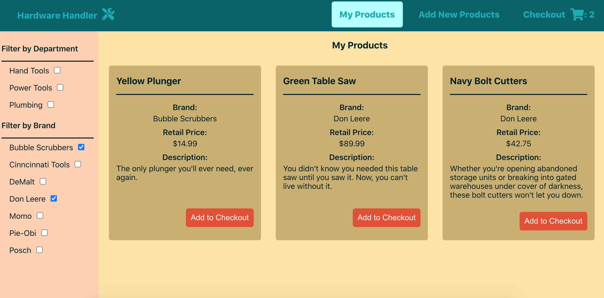
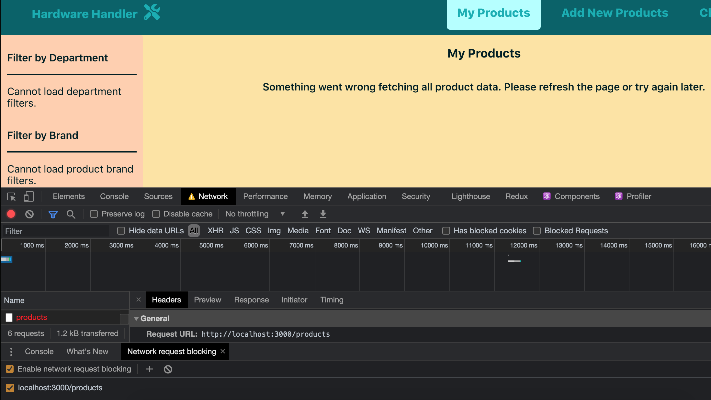

# The `useProducts` Hook will make complicated components easier to follow

In our last lesson, we took the department API call happening in multiple components in our app and reduced it down to a single custom hook that both of our components could use. And that's a great use case for a custom hook.

Here's another great use for custom hooks: simplifying complex components.

As developers, we walk a fine line to walk between too much code abstraction, which makes code hard to follow, and too little, which leads to large, unwieldy files hundreds of lines long with logic too closely tied to the component meant to display the data. But it's not an impossible task: with more practice and experience, we can only get better at toeing that line.

**This lesson will focus on simplifying a couple of our more complex components by creating a custom hook that can handle the detailed logic and data transformations outside of the components leveraging the data.**

### We do a lot of product-related data transformations in the `<ProductList>` component

A component that feels complicated and could use some simplifying is the `<ProductList>` component. There's a lot happening in there, and when we look closely at the code, calls to the product API are contributing to its complexity.

Since this is the case, I think we can do some code extraction and simplification through the use of a new custom hook responsible for calling and transforming product data for the component, so any component (now or in the future) needing that info can look to this hook to deliver it.

Let's look at how we can get started on this new hook.

### In `<ProductList>`, we fetch products and make dynamic filters based on their brand names

To create our hook focused on the functionality, we need to lift and shift out of the `<ProductList>` component.

Currently, the component calls the product API to fetch all the products to render in browser, _and_ it uses those products to make brand filters where users can filter their products by brand name.

The `useEffect` function in `<ProductList>` responsible for all this data fetching and transformation currently looks like this.

{lang=javascript,crop-start-line=27,crop-end-line=55}
<<[src/containers/ProductList/ProductList.js](../lesson_05.01/protected/source_code/hardware-handler-5-begin/client/src/containers/ProductList/ProductList.js)

This is a big function, and really, `<ProductList>` doesn't particularly care about _how_ it gets the `products` or the `filtersByBrand` — just that it gets them. So let's see about moving this function logic out of this component.

### Create a new `useProducts.js` file

Just as we started with the `useDepartments` Hook by creating a new file, we'll do the same for our new products hook.

Inside of the `hooks/` folder where our other custom hook lives, create a new file named `useProducts.js`. This is where we'll move our product API call, distancing it from the components that need the data.

We'll also go ahead and put in the shell code of this hook after defining the file. For now, just add a very basic hook outline — we'll add on to it in the next section.

```javascript
const useProducts = () => {};

export default useProducts;
```

### Add the `product`, `filtersByBrand` and `error` states to the hook

Examining what the `<ProductList>`'s `useEffect` Hook uses in terms of state from the component, it looks like the `product`, `filtersByBrand`, and `error` state variables are referenced in the `useEffect` we want to refactor out.

We'll add these same state variables to our `useProducts` Hook then.

At the top of the `useProducts` Hook file, import React's `useState` Hook, and then define those three state variables inside of the hook.

```javascript
import { useState } from 'React';

const useProducts = () => {
  const [products, setProducts] = useState([]);
  const [filtersByBrand, setFiltersByBrand] = useState([]);
  const [error, setError] = useState(false);
};
```

T> **What happened to `setLoading`?**
T>
T> If you're paying close attention, you may have noticed I didn't include the `loading` variable here even though it's set in the original `useEffect`.
T>
T> I decided to omit it (and leave it to the `<ProductList>` component to manage) because that same state variable is referenced in the component by other variables.
T>
T> If this `useEffect` was the only one using `loading`, I'd probably refactor it out into the hook as well, but since it's not, it's easier to let the `<ProductList>` keep track of `loading` instead.

Once that's taken care of, we can bring in the `useEffect` function from `<ProductList>`

### Copy the `useEffect` and bring its code to the hook

Okay, now we'll bring the whole `useEffect` responsible for fetching data from the product API into this `useProducts` Hook.

Import `useEffect` at the top of our custom hook.

{lang=javascript,crop-start-line=1,crop-end-line=1}
<<[src/hooks/useProducts.js](../lesson_05.01/protected/source_code/hardware-handler-5-ending/client/src/hooks/useProducts.js)

Go ahead and copy the whole `useEffect` and paste it into the body of the hook.

```javascript
useEffect(() => {
  const fetchProducts = async () => {
    const allProducts = await productApi.getAllProducts();
    if (allProducts === FETCH_PRODUCT_DATA_ERROR) {
      setError(true);
      setProducts(allProducts);
    } else {
      setProducts(allProducts);

      const allFiltersByBrand = formatFilters(allProducts, 'brand').sort(
        (a, b) => {
          const nameA = a.name.toUpperCase();
          const nameB = b.name.toUpperCase();
          if (nameA < nameB) {
            return -1;
          }
          if (nameA > nameB) {
            return 1;
          }
          return 0;
        },
      );
      setFiltersByBrand(allFiltersByBrand);
    }
    setLoading(false);
  };

  fetchProducts();
}, []);
```

Import the appropriate helper functions and error messages supporting the function internally. And remember to remove the `setLoading` line towards the end of the `useEffect` (since we're leaving `loading` to the component). After the end of the function, we'll set what's being returned from this hook to the components using it.

For now, we'll want to return `products`, `filtersByBrand`, and `error` from this hook.

{lang=javascript,crop-start-line=40,crop-end-line=44}
<<[src/hooks/useProducts.js](../lesson_05.01/protected/source_code/hardware-handler-5-ending/client/src/hooks/useProducts.js)

Very good. Luckily, we've only had to make very minor changes to make this `useEffect` work in our custom hook versus how it was working in the `<ProductList>` component itself. Time to turn our attention back to the container commponent and incorporate this hook into it.

### Refactor `<ProductList>` to use the new custom hook

Like we did when bringing in the `useDepartments` Hook for this component, we'll import `useProducts` at the top of the file and declare the variables it's providing underneath our other state variables.

First the import:

{lang=javascript,crop-start-line=14,crop-end-line=14}
<<[src/containers/ProductList/ProductList.js](../lesson_05.01/protected/source_code/hardware-handler-5-ending/client/src/containers/ProductList/ProductList.js)

Then comes the declaration where we destructure the variables being returned from the hook.

{lang=javascript,crop-start-line=25,crop-end-line=25}
<<[src/containers/ProductList/ProductList.js](../lesson_05.01/protected/source_code/hardware-handler-5-ending/client/src/containers/ProductList/ProductList.js)

Notice that we must rename the generic `error` the hook returns to the more specific `productError` to prevent a variable naming collision inside the component. There is still a reason to keep the original `error` state, though, which we'll get to shortly.

Next, focus on that first `useEffect`. Go ahead and delete everything inside of it. Yes, everything.

Now that our custom hook is handling fetching the `products` and formatting the `filtersByBrand`, we don't need to worry about any of that in this `useEffect`. All we still need to care about is if an error occurred while fetching products and that the `filtersByBrand` value is not an empty array.

{lang=javascript,crop-start-line=27,crop-end-line=35}
<<[src/containers/ProductList/ProductList.js](../lesson_05.01/protected/source_code/hardware-handler-5-ending/client/src/containers/ProductList/ProductList.js)

T> **Omitting a check for `filtersByBrand`**
T>
T> This `useEffect` function only has `products` and `productError` in its dependency array, and it's only checking the values of those two conditions, but we're also returning `filtersByBrand` from the hook. Why doesn't that also need to be part of the hook's dependency array?
T>
T> Well, because `filtersByBrand` can't be created without a successful API call returning `products` from the API. We know that without products, the filters can't be determined, so by checking that `products` returns an array with data, we can safely assume filters created from product data are present as well, meaning we don't have to explicitly check for them.

And since our hook is now returning `products` data and `filtersByBrand`, we can remove the state variables in the component by the same names.

Delete these two lines:

{lang=javascript,crop-start-line=19,crop-end-line=19}
<<[src/containers/ProductList/ProductList.js](../lesson_05.01/protected/source_code/hardware-handler-5-begin/client/src/containers/ProductList/ProductList.js)

And:

{lang=javascript,crop-start-line=23,crop-end-line=23}
<<[src/containers/ProductList/ProductList.js](../lesson_05.01/protected/source_code/hardware-handler-5-begin/client/src/containers/ProductList/ProductList.js)

Just look how much less code there is to try and understand in this component. We've refactored a bunch of code out and really improved the readability, and because we can have multiple `useEffect` functions only focused on what affects them, it's relatively easy to do. What a difference!

But wait, there's more we can do now that this custom hook's handling the product data.

### Retest the **My Products** functionality

I think we're ready to retest the app and make sure it still works now.

If the app's not already running, start it up.

```shell
cd client/ && yarn start
```

Navigate over to the **My Products** page, and test it out. Make sure the products load, test out the brand name filters on the left-hand side of the screen, and add a product or two to the checkout.

Looks good!



And once more, open the **Network** tab in Chrome DevTools, block the products API call and navigate away, then come back to the page.

See the error message like this and that neither of the filters load? Good deal.



And since there don't appear to be any new ESLint errors after the refactor, I think we can call it done for now.

And with that, we've written a second custom hook, which simplifies the code our `<ProductList>` is now responsible for and makes it easier for other developers to see what's going on in the component.

Great job. In the final lesson of this module, we'll add one final custom hook to really drive home how custom hooks work: this one's for our checkout API.

---
