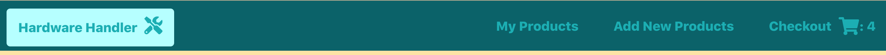
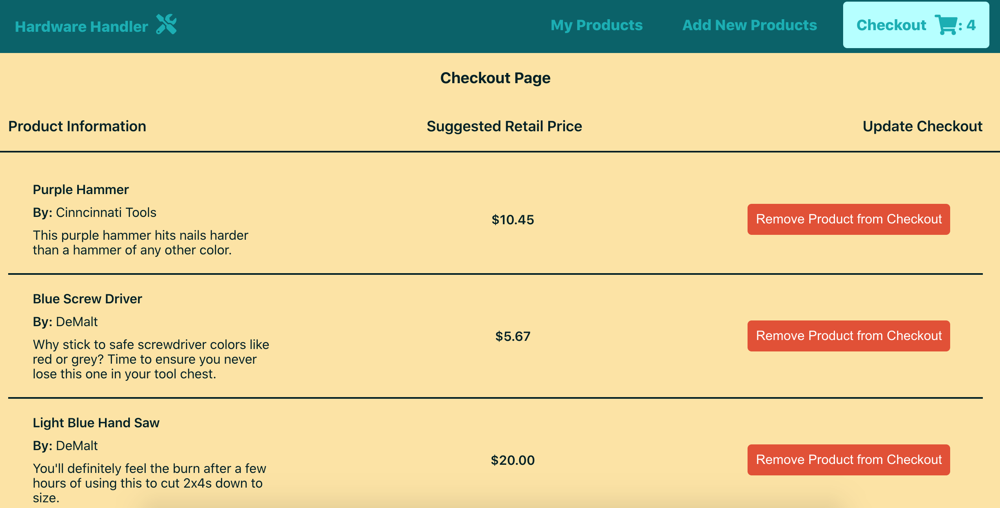
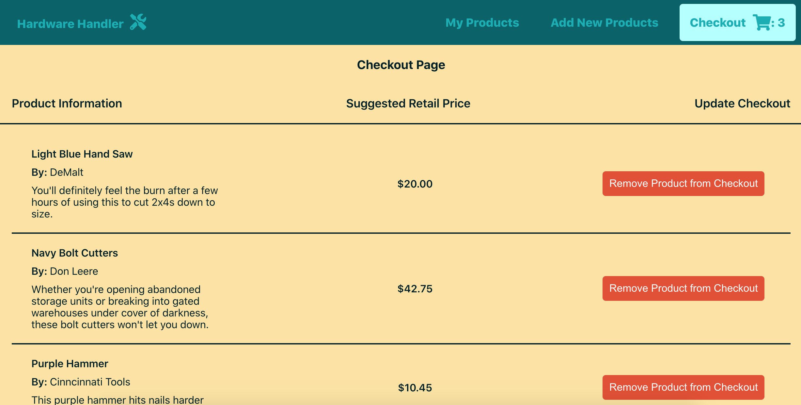
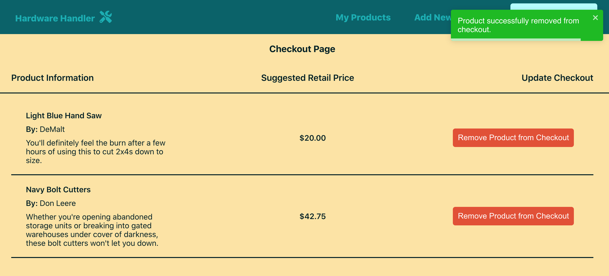
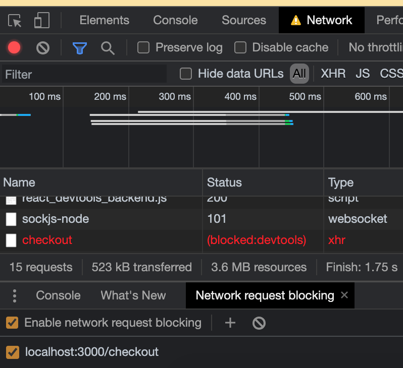
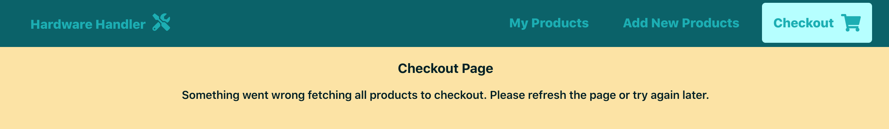
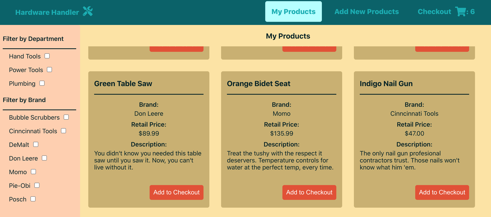
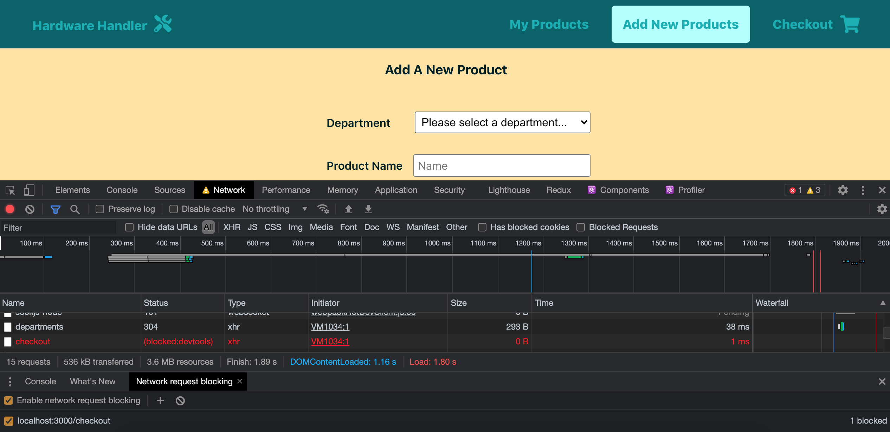
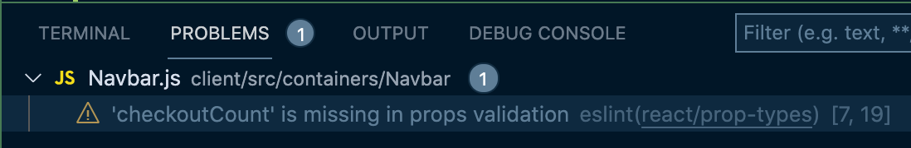

# Refactor two checkout API calls into one in `useCheckout` Hook

Alright! We're down to the last lesson in this module chock-full of custom hooks.

This should be a fun one. It's definitely going to take some twists and turns you may not see coming, but you'll be amazed where we end up when we're done with this lesson.

**This custom hook lesson will see us taking two slightly different checkout API calls and rewriting them into a single call that works for multiple components.**

### The checkout API is a popular service

I saved the best custom hook transformation for last. As I was looking over our codebase, I noticed something that intrigued me: the `<App>` component and the `<Checkout>` component have two very similar `useEffect` functions.

In `App.js` the `useEffect` is responsible for fetching and displaying the checkout count in the navigation bar next to the cart icon.



The `Checkout.js` file, on the other hand, displays all the products and their pertinent details present in the checkout at any given time.



When we examine the code for each component when it calls those checkout APIs, the similarities between them are hard to overlook.

Here's the `useEffect` for the `<App>` component:

{lang=javascript,crop-start-line=18,crop-end-line=32}
<<[src/containers/App/App.js](../lesson_05.01/protected/source_code/hardware-handler-5-begin/client/src/containers/App/App.js)

And here's the `useEffect` for the `<Checkout>` component:

{lang=javascript,crop-start-line=20,crop-end-line=32}
<<[src/containers/Checkout/Checkout.js](../lesson_05.01/protected/source_code/hardware-handler-5-begin/client/src/containers/Checkout/Checkout.js)

Count of products in the checkout and products in the checkout... Are you seeing where I'm going with this?

**I think we can combine these two calls into a single hook that can do the job for both components.**

Ready to give it a try?

### Target the `useEffect` in `<Checkout>` first

Let's refactor the `useEffect` in the `<Checkout>` component into a custom hook first (because this function is the one that I think can be used to do double duty and take the place of our two separate API calls).

Here's one last look at how the `useEffect` we're going to be moving into a custom hook looks now.

{lang=javascript,crop-start-line=20,crop-end-line=32}
<<[src/containers/Checkout/Checkout.js](../lesson_05.01/protected/source_code/hardware-handler-5-begin/client/src/containers/Checkout/Checkout.js)

The function calls the `getAllCheckoutItems` API endpoint and either sets the local variable of `checkoutItems` to the array of data returned or sets `error` to `true`. That's it.

### Create a new `useCheckout.js` custom hook file

So, as with our other custom hooks, we will create a new file to live in the `hooks/` folder named `useCheckout.js`.

Inside of the file, we'll make a new placeholder function as well.

```javascript
const useCheckout = () => {};

export { useCheckout };
```

Okay, let's add some code to this hook.

### Declare `checkoutItems` and `error` states in the hook

If we look at the state variables the `useEffect` in `<Checkout>` is using, they are `checkoutItems`, `error`, and `loading`.

Like with our other hooks, we'll leave `loading` to the `<Checkout>` component because the `removeItemFromCheckout` function still needs to access and update it as well.

So add those two other variables into our new hook. (And remember to import the destructured `useState` at the top of the hook from React.)

{lang=javascript,crop-start-line=6,crop-end-line=7}
<<[src/hooks/useCheckout.js](../lesson_05.01/protected/source_code/hardware-handler-5-ending/client/src/hooks/useCheckout.js)

T> I noticed during this refactor that although I set `loading` to `false` after the `removeItemFromCheckout` is called, I don't actually set it to `true` before the API call is completed.
T>
T> We should fix that.

Add this single line to the `Checkout.js` file right before we make the API call.

{lang=javascript,crop-start-line=26,crop-end-line=30}
<<[src/containers/Checkout/Checkout.js](../lesson_05.01/protected/source_code/hardware-handler-5-ending/client/src/containers/Checkout/Checkout.js)

And since the loading message will now show on initial component load _and_ when items are removed from the checkout, the loading message text should probably change slightly.

Instead of `"Fetching items to checkout..."`, it might read better as: `"Fetching items in checkout..."`. Not an essential change, but I think that covers both possible loading scenarios better.

{lang=javascript,crop-start-line=45,crop-end-line=45}
<<[src/containers/Checkout/Checkout.js](../lesson_05.01/protected/source_code/hardware-handler-5-ending/client/src/containers/Checkout/Checkout.js)

Now on to the main parts of this hook.

### Move the `useEffect` into `useCheckout.js`

The easiest way I've found to create a new hook is to copy / paste the `useEffect` from `Checkout.js` into the hook and then refactor it from there.

The only line we'll actually need to remove to make this function work in its new home is the line about `setLoading(false);`

Then at the end of the hook, we'll return the `checkoutItems`, `setCheckoutItems`, and `error`.

```javascript
useEffect(() => {
  const fetchCheckoutItems = async () => {
    const allCheckoutItems = await checkoutApi.getAllCheckoutItems();
    if (allCheckoutItems !== FETCH_CHECKOUT_PRODUCTS_ERROR) {
      setCheckoutItems(allCheckoutItems);
    } else {
      setError(true);
    }
  };

  fetchCheckoutItems();
}, []);

return { checkoutItems, setCheckoutItems, error };
```

I> **Why are we returning `setCheckoutItems` from the hook?**
I>
I> I'm glad you asked. This is a less-discussed fact, but since hooks are hooks anywhere in React, we can return state setters the same as we can return any other value from a custom hook.
I>
I> And because the `<Checkout>` component resets the `checkoutItems` after removing an item from the checkout, we need `setCheckoutItems` from this hook, in addition to the `checkoutItem` state variable itself.

### Import `useCheckout.js` into the `Checkout` component

Now we're getting somewhere! Time to take our new hook and its new variables and update our `<Checkout>` component.

Inside of our component, remove the `checkoutItems` and `error` state variables first, then import our `useCheckout` Hook and replace the two `useState` variables with the values from the hook right inside of our component declaration.

{lang=javascript,crop-start-line=13,crop-end-line=18}
<<[src/containers/Checkout/Checkout.js](../lesson_05.01/protected/source_code/hardware-handler-5-ending/client/src/containers/Checkout/Checkout.js)

The `useEffect` that was previously responsible for directly calling the checkout API can also be simplified like so:

{lang=javascript,crop-start-line=20,crop-end-line=24}
<<[src/containers/Checkout/Checkout.js](../lesson_05.01/protected/source_code/hardware-handler-5-ending/client/src/containers/Checkout/Checkout.js)

Since the hook is now responsible for the `checkoutItems` and `error` states, all we need the `useEffect` to do is update the local `setLoading` variable in the component once items or an error fetching those items comes back.

Nice and simple now.

### Retest App Functionality

And with that, we're ready to retest this app and make sure the "Checkout" page in the app still works — in good conditions and bad.

Fire the app up.

```shell
cd client/ && yarn start
```

Add a few items to the **Checkout** via the **My Products** page, and then navigate on over to it. You seeing items in your checkout too? Great.



Remove an item or two from the checkout now. Did they successfully disappear? Yep.



One last test of this component: the error state if fetching items in checkout fails to load.

As we've done many times before, open up your DevTools, and block the checkout API call in the **Network** tab.



Reload the page and look for the error message. Looking good.



Well done. Everything seems to be working as expected, no matter the status of the checkout API call. Now it's time to move on to our `<App>` component. Let's do it.

### Focus on `<App>` Next

Right, now we're on to `App.js` and my thinking is: we can actually replace the checkout API call we're making to get the checkout count for the `<Navbar>` component with the custom hook we made fetching all the products in the `<Checkout>` component.

As a quick refresher, here's the `useEffect` currently calling the `getCkeckoutCount` API endpoint.

{lang=javascript,crop-start-line=18,crop-end-line=32}
<<[src/containers/App/App.js](../lesson_05.01/protected/source_code/hardware-handler-5-begin/client/src/containers/App/App.js)

Unlike our other component, this API call just returns the number of items in the checkout instead of all their details, but there really aren't so many differences between this `useEffect` and the one we replaced in `<Checkout>` that we can't make this work for them both.

### Add the `checkoutCount` state variable to our custom hook

One of the main differences between the two functions is the state variable they're returning. `<Checkout>` needs the array of `checkoutItems` to render in its JSX, while `<App>` only needs the `checkoutCount`.

So let's create a new state variable inside of our `useCheckout` Hook with that `checkoutCount` state. Add the following line beneath our other two state variables in the hook.

{lang=javascript,crop-start-line=6,crop-end-line=8}
<<[src/hooks/useCheckout.js](../lesson_05.01/protected/source_code/hardware-handler-5-ending/client/src/hooks/useCheckout.js)

### Refactor the `cartUpdated` boolean to be `checkoutUpdated`

Before we continue with this hook refactor, I want to take a minor detour and rename a variable in `App.js` that is inaccurate.

It's the boolean variable `setCartUpdated`. While this does the job well enough to indicate to another developer what's happening, it's not using the same naming conventions we're using in the rest of the application to refer to the checkout, so I want to rename it here.

T> **When renaming variables, be explicit about it**
T>
T> Any developer reviewing a pull request should notice that the variable name has changed, but for devs who touch that code in the future, it sometimes makes sense to put in a comment or something where the renamed variable is just for quick reference.
T>
T> Trying to prevent confusion (for myself and others) is always a high priority in my mind.

Since everywhere else we refer to that component as the `<Checkout>` component, I think the variable signaling something has happened in the Checkout (either an item has been added to it or removed from it) should be named: `setCheckoutUpdated`.

I know this is a small change, but how a development team defines and names things that they all use is essential to ensuring that everyone is on the same page and aware of what's going on. Yes, `cartUpdated` is close, but `checkoutUpdated` is just that little bit more accurate in this scenario since we call our "cart" component `<Checkout>` everywhere in this app.

Please change all instances of `cartUpdated` and `setCartUpdated` inside of the `App.js` file to be `checkoutUpdated` and `setCheckoutUpdated` instead.

T> **VSCode variable renaming keyboard shortcut**
T>
T> If you're using VSCode as your IDE, I'll show you a cool trick to refactor variables in a jiffy. To update a particular variable name in all places in a file where it's present, select the word to rename and type `CMD + SHIFT + L` on a Mac, or `CTRL + SHIFT + L` on Windows, and then just type in the new name you'd like to use instead.
T>
T> Now all the places that the old variable was previously referenced should be updated to use the new variable name. Pretty slick, right?

### Make a new `useEffect` in the `useCheckout` Hook

Okay, sorry about the tangent above, but part of improving this app means improving already existing variables names to more accurately reflect what they're for.

But anyway, back to our original task at hand: making our new custom hook `useCheckout` work for both the `<Checkout>` and `<App>` components.

If we were to copy the `useEffect` code from `App.js` and paste it into our `useCheckout` file, this is how it would start out.

```javascript
useEffect(() => {
  const fetchCheckoutItems = async () => {
    const checkoutItemsCount = await checkoutApi.getCheckoutCount();
    if (
      Number(checkoutItemsCount) ||
      checkoutItemsCount === 0 ||
      checkoutItemsCount === FETCH_CHECKOUT_COUNT_ERROR
    ) {
      setCheckoutUpdated(false);
      setCheckoutCount(checkoutItemsCount);
    }
  };

  fetchCheckoutItems();
}, [checkoutCount, checkoutUpdated]);
```

Since we want to rely on the original `useEffect` in this hook to fetch the `checkoutItems` state, however, we don't really need to make the API call to `getCheckoutCount` any longer.

And since we don't need to make the asynchronous API call anymore, we don't need to declare a function to wrap the async call, call it at the end of the `useEffect`, or worry about an error message (that will be handled in the other `useEffect`).

Heck, all this function really needs to know now is if the value of `checkoutItems` changes and if the length of the `checkoutItems` array is 0 or greater.

We should be able to simplify the `useEffect` code above like so:

{lang=javascript,crop-start-line=23,crop-end-line=27}
<<[src/hooks/useCheckout.js](../lesson_05.01/protected/source_code/hardware-handler-5-ending/client/src/hooks/useCheckout.js)

We're not quite done yet, though. Where should the old `useEffect`'s `checkoutUpdated` dependency go? We still want the count of checkout items to update each time a product is added or removed from the checkout.

Well, it should become a dependency in the `useEffect` where we call the checkout API right above this newly declared one.

That way, any time the value of `checkoutUpdated` changes, this checkout API call will happen again, and when it refetches all the checkout items, that change to the `checkoutItems` variable will trigger the second `useEffect` to run, and that will set the `checkoutCount` state.

Nice chain reaction of events, right?

Here's the final code for everything contained within our `useCheckout` Hook now. Note that I'm also returning the `checkoutCount` variable at the end of the `return` statement now. This is how we'll give the `<App>` component the data it needs.

{lang=javascript}
<<[src/hooks/useCheckout.js](../lesson_05.01/protected/source_code/hardware-handler-5-ending/client/src/hooks/useCheckout.js)

### Replace `<App>`'s `useEffect` with our hook

Excellent, we're ready to use our `useCheckout` Hook within `<App>`.

First thing we'll do is remove the `checkoutCount` state declared in `App.js`, and we'll import our `useCheckout` Hook and destructure its `checkoutCount` variable to replace local state.

Delete this line:

{lang=javascript,crop-start-line=15,crop-end-line=15}
<<[src/containers/App/App.js](../lesson_05.01/protected/source_code/hardware-handler-5-begin/client/src/containers/App/App.js)

And replace it with this:

{lang=javascript,crop-start-line=15,crop-end-line=15}
<<[src/containers/App/App.js](../lesson_05.01/protected/source_code/hardware-handler-5-ending/client/src/containers/App/App.js)

Then, refactor our `useEffect` in `<App>` — it's about to get a lot simpler. Instead of having to call the checkout API and handle what it returns, we can simply watch the `checkoutCount` value supplied by the custom hook.

Whenever the `checkoutCount` changes — whether from items being added or removed from the checkout, or from the app initially loading, the `useEffect` will run and set the local variable of `checkoutUpdated` to `false`. Regardless of if the `checkoutUpdated` variable is changed or not, we'll make sure it's reset for whenever a user does trigger the `updateCheckoutCount` function that would change the state of `checkoutUpdated`.

Here's our new `useEffect` code.

{lang=javascript,crop-start-line=17,crop-end-line=21}
<<[src/containers/App/App.js](../lesson_05.01/protected/source_code/hardware-handler-5-ending/client/src/containers/App/App.js)

Look how much cleaner and simpler that is!

### Clean up (now unneeded) code

Refactoring this component to use this hook presents us with another opportunity to clean up some now unnecessary code.

#### Tidy up `App.js`

The only place we were using the `getCheckoutCount` function from the checkout API, and the `FETCH_CHECKOUT_COUNT_ERROR` error message was inside of the `<App>` component.

Since our hook handles getting checkout items, we no longer need to import the API call or the error constant inside of `App.js`.

Let's delete these two lines from our imports at the top of the `App.js` file.

{lang=javascript,crop-start-line=9,crop-end-line=10}
<<[src/containers/App/App.js](../lesson_05.01/protected/source_code/hardware-handler-5-begin/client/src/containers/App/App.js)

#### Delete the API function call and error constant

Next up, now that we've deleted the one place the API call was used, we can remove it from the `checkoutApi.js` file.

Open up the `checkoutApi.js` file inside of our `services/` folder and delete the `getCheckoutCount` function.

{lang=javascript,crop-start-line=23,crop-end-line=32}
<<[src/services/checkoutApi.js](../lesson_05.01/protected/source_code/hardware-handler-5-begin/client/src/services/checkoutApi.js)

Also delete the import for `FETCH_CHECKOUT_COUNT_ERROR` at the top of this file.

{lang=javascript,crop-start-line=3,crop-end-line=3}
<<[src/services/checkoutApi.js](../lesson_05.01/protected/source_code/hardware-handler-5-begin/client/src/services/checkoutApi.js)

Finally, open up the `constants.js` file inside of the `constants/` folder. Delete the `FETCH_CHECKOUT_COUNT_ERROR` declaration. We don't need it any longer.

#### Refactor `Navbar.js`

At this point, if you're running the app locally, you should be seeing an error in the console from the `Navbar.js` file. It's looking for that `FETCH_CHECKOUT_COUNT_ERROR` constant that we just deleted from the app.

This is a simple fix.

Open `Navbar.js` inside of our `components/` folder.

On line 25 of this file, we're checking if the `checkoutCount` prop being passed from the parent component is the error message.

{lang=javascript,crop-start-line=25,crop-end-line=25}
<<[src/containers/Navbar/Navbar.js](../lesson_05.01/protected/source_code/hardware-handler-5-begin/client/src/containers/Navbar/Navbar.js)

Since we refactored the component to use the hook, this error state will never occur. So now, this conditional line can be simplified, too.

Go ahead and remove the `checkoutCount !== FETCH_CHECKOUT_COUNT_ERROR` part of the JSX. With that gone, we can delete the import for the error constant on line 4 of this file as well.

{lang=javascript,crop-start-line=4,crop-end-line=4}
<<[src/containers/Navbar/Navbar.js](../lesson_05.01/protected/source_code/hardware-handler-5-begin/client/src/containers/Navbar/Navbar.js)

After this change, the app should begin compiling again, and we can test out our new refactor's functionality.

### Test, lint, and call it done

Restart the app (if it's not already running), and open it up in the browser.

Here's my running instance with some items already in the **Checkout**.


Add a few more items to the **Checkout** and make sure the count of items updates each time a new one is added. Do the same test removing items from the **Checkout** itself.



Looking good so far? Great.

Let's test our error scenario now when we can't fetch checkout items and get a count to display in the `<Navbar>` component.

Block the checkout API call in the Chrome DevTools **Network** tab. Then, refresh the page to make sure the app is still okay even when this error happens.

It doesn't break, so things are looking good for us.



One last thing: there is a single ESLint error we identified by modifying the `<Navbar>` component.

There's a missing prop type validation in `Navbar.js`. Because we opened the file to modify it, my ESLint VSCode plugin went to work and found this error in the file.



We've encountered this error many times before at this point, so you should have a good idea of how to fix it.

We'll import the PropTypes npm library at the top of this `Navbar.js` file.

{lang=javascript,crop-start-line=4,crop-end-line=4}
<<[src/containers/Navbar/Navbar.js](../lesson_05.01/protected/source_code/hardware-handler-5-ending/client/src/containers/Navbar/Navbar.js)

And then, at the very bottom of the file, we'll add the proper validations for the `checkoutCount` prop (it will only ever be a number now, so that's all we need to list).

{lang=javascript,crop-start-line=35,crop-end-line=37}
<<[src/containers/Navbar/Navbar.js](../lesson_05.01/protected/source_code/hardware-handler-5-ending/client/src/containers/Navbar/Navbar.js)

No more errors. We've tested, we've resolved ESLint errors, we're good.

Wow! This has been a long lesson, I know. But look at what we've accomplished: not only were we able to create a single custom hook that worked for more than one component, but we were also able to remove an entire API call, an error message, _and_ a couple of complex `useEffects`.

Excellent work making it through! I hope you're as proud as I am of all that we've accomplished so far.

---
