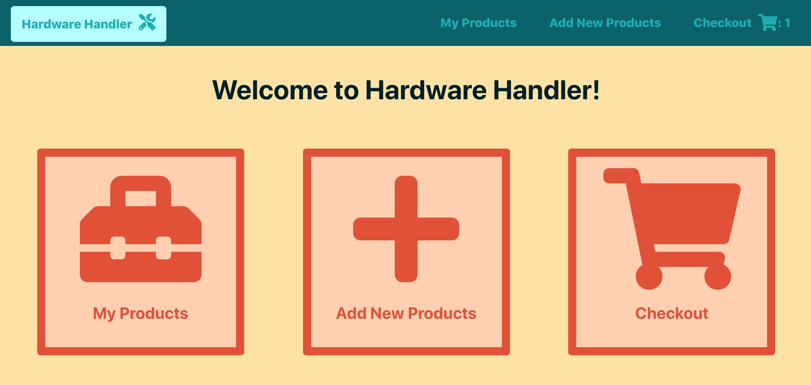
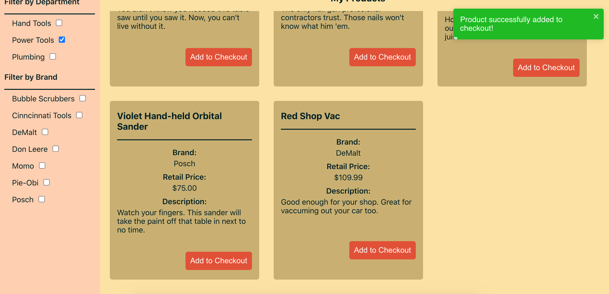
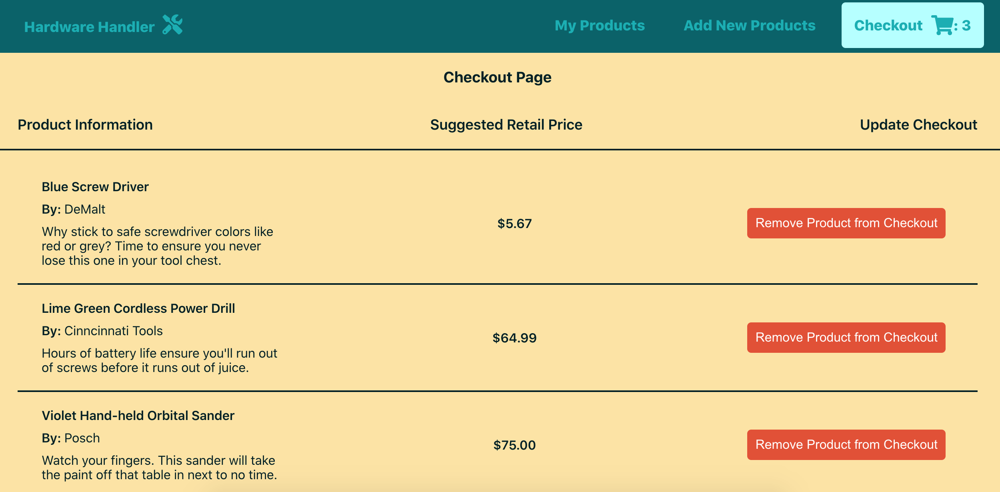

# The Context API can eliminate our need to pass props to child components for checkout

As I said when we first discussed context in the module introducing the various hooks in React, context is designed to share data that can be considered “global” for a tree of React components, such as the current authenticated user, theme, etc.

With context, instead of having to pass props from a parent component down through multiple children to reach the component that needs it (a React anti-pattern referred to as ["prop drilling"](https://kentcdodds.com/blog/prop-drilling)), we can simply wrap the parent component's state with a context Provider and call the values or functions we need in whichever child components need them with the help of the `useContext` Hook.

T> **How to know when to use context**
T>
T> You might be wondering how to know when to use context in your own apps, and it's a good question.
T>
T> Typically, when I see component props being passed through one or more components purely to reach more deeply nested children, that's a good indicator to me that context could be useful.
T>
T> If a direct descendant of a component needs state, passing it as a prop is probably fine, but much more than that, and it's worth considering context.
T>
T> Don't worry; these next few lessons will help clarify how you can employ context to good effect.

**In this lesson, we'll create our first context component and call the `useContext` Hook to handle some of the checkout state in our code.**

I> **Sample code zip file**
I>
I> If you need a fresh copy of the sample app _before_ we begin adding context, it can be downloaded **[here](protected/source_code/hardware-handler-6.zip)**.

### `App.js` passes a lot of checkout state throughout the site

When reviewing the source code for this app (especially our root component of `App.js`), it appears a lot of checkout-related state is being passed as props to various child components.

Specifically, inside of the `<App>` component, I see the `checkoutCount` variable and the `updateCheckoutCount` function being passed to multiple components.

While this is fine and works, it presents a good opportunity to employ React's Context API to make these values more globally available in the app to the components that need them _without_ having to pass them as props.

Ready to make it happen?

### First, set up a `context` folder

As with our other new additions to the app, like custom hooks, we want to keep our contexts organized. My preference for this (especially as some contexts can be used all over an application) is to have a top-level folder inside of the main `src/` folder just for context files.

So the first thing I'll do for our new checkout-focused context is make a folder inside of `src/` named `context`.

### Make a new `CheckoutItemContext.js` file

Once the `context` folder's there, go ahead and create a new file called `CheckoutItemContext.js` inside of the folder.

This file is where we'll instantiate our context instance and define all the default values this context will be responsible for.

I> **Why set default context values?**
I>
I> If you recall from earlier modules, default values are only used when a component does not have a matching context `Provider` above it in the tree. (Personally, I've not encountered this scenario in real-world application development, but it's worth keeping in mind.)
I>
I> I like to define these values inside the file so that it's easier for me to quickly check a context file and know at a glance what values should be available to me.
I>
I> Feel free to include or exclude it from your own context files as you get more comfortable.

Inside of our new file, add the following code:

```javascript
import { createContext } from 'react';

const CheckoutItemContext = createContext({});

export default CheckoutItemContext;
```

This `CheckoutItemContext` variable is the context object that we'll inject into our code where we define the state variables this context will keep track of (the `<App>` component, in this case).

And as I said before, we can already see that the `checkoutCount` and `updateCheckoutCount` functions are being passed around inside of `<App>` to its children, so let's add these two values to our new context file within the `CheckoutItemContext` variable.

```javascript
const CheckoutItemContext = createContext({
  checkoutCount: 0,
  updateCheckoutCount: () => {},
});
```

With that, we're ready to put this new context component into action.

### Add `CheckoutItemContext` to the `<App>`

Head over to the `App.js` file in your code editor. This is where our new `CheckoutItemContext` Provider will live, so we have to add it next.

#### Import the context

Naturally, the first thing we'll want to do is import the context into this component. Add it up at the top of this component along with all our other imports.

{lang=javascript,crop-start-line=9,crop-end-line=11}
<<[src/containers/App/App.js](./protected/source_code/hardware-handler-6-ending/client/src/containers/App/App.js)

T> **Best practice: keep CSS file imports at the bottom of a component's imports**
T>
T> Just as an aside, it's considered a best practice to keep any CSS file imports at the bottom of a component for ease of understanding and consistency in the code.
T>
T> This is why you'll always see me adjust import order if something new happens to be auto-imported into a file below a CSS file.

#### Wrap App's JSX with the context provider

Once `CheckoutItemContext` is imported, we'll create its Provider object that allows consuming components to subscribe to context changes.

The Provider component accepts a `value` prop to be passed to consuming components that are descendants of this Provider.

Our Provider will need the local `checkoutCount` and `updateCheckoutCount` variables, so we'll pass those into our `CheckoutItemContext.Provider` object as a comma-separated list for its `value`.

Here's what the final JSX will look like with the Provider and local values added.

```javascript
return (
  <Router>
    <ToastContainer />
    <CheckoutItemContext.Provider
      value={{
        checkoutCount,
        updateCheckoutCount,
      }}
    >
      <section className="app-wrapper">
        <Navbar checkoutCount={checkoutCount} />
        <article className="app-container">
          <Route exact path="/" component={Home} />
          <Route path="/my-products">
            <ProductList updateCheckoutCount={updateCheckoutCount} />
          </Route>
          <Route exact path="/new-product-form" component={ProductForm} />
          <Route exact path="/checkout">
            <Checkout updateCheckoutCount={updateCheckoutCount} />
          </Route>
        </article>
      </section>
    </CheckoutItemContext.Provider>
  </Router>
);
```

I> **Beware: a single Provider with a lot of values _could_ become a performance issue.**
I>
I> All consumers that are descendants of a particular Provider will re-render whenever any of the Provider’s value props change.
I>
I> If you've got a lot of values inside a single context that gets updated by lots of different child components, this could become a performance issue causing the app to re-render too often.
I>
I> This may never be a problem for you, but if it does happen, one solution I'd recommend is splitting the single context into multiple, smaller contexts, which could help reduce the frequency of unnecessary re-renders.
I>
I> **But don't prematurely optimize.**
I>
I> Only address this once performance actually starts to lag.

#### Delete `checkoutCount` from being passed to `<Navbar>`

Now that we've got the `checkoutCount` value being provided by our `CheckoutItemContext.Provider` object, we no longer need to pass it as a prop to the `<Navbar>` component within our `<App>`'s JSX.

Delete this value, and we'll head over to update the `Navbar.js` file in our IDE.

The JSX should go from:

{lang=javascript,crop-start-line=30,crop-end-line=32}
<<[src/containers/App/App.js](./protected/source_code/hardware-handler-6-begin/client/src/containers/App/App.js)

To:

{lang=javascript,crop-start-line=42,crop-end-line=44}
<<[src/containers/App/App.js](./protected/source_code/hardware-handler-6-ending/client/src/containers/App/App.js)

On to the `<Navbar>` component now.

### Refactor `Navbar.js` to use the `useContext` Hook

All right, now we're in the `<Navbar>` component, and it's time to start consuming our new `CheckoutItemContext` values.

To consume context within functional components like ours, we'll need to import the `useContext` Hook into our app, and we'll also need to import the `CheckoutItemContext` itself.

Here's what our imports should look like now in `Navbar.js`.

```javascript
import { useContext } from 'react';
import { NavLink } from 'react-router-dom';
import { FontAwesomeIcon } from '@fortawesome/react-fontawesome';
import { faTools, faShoppingCart } from '@fortawesome/free-solid-svg-icons';
import PropTypes from 'prop-types';
import CheckoutItemContext from '../../context/CheckoutItemContext';
import './Navbar.css';
```

For this particular functional component, since it previously had no React Hooks, ESLint automagically simplified it, going so far as to remove the `return` statement and curly braces (because they weren't needed then).

We'll need to add them back to make accessing the `useContext` Hook possible.

Wrap the JSX code here in curly braces and add the return statement to the JSX to get us started.

```javascript
const Navbar = ({ checkoutCount }) => {
  return (
    <nav className="navbar">
      <div className="navbar-home-link">
        <NavLink exact to="/">
          Hardware Handler
          <FontAwesomeIcon className="navbar-icon" icon={faTools} />
        </NavLink>
      </div>
      <span className="navbar-links-wrapper">
        <NavLink exact to="/my-products">
          My Products
        </NavLink>
        <NavLink exact to="/new-product-form">
          Add New Products
        </NavLink>
        <NavLink className="navbar-link" exact to="/checkout">
          Checkout
          <FontAwesomeIcon className="navbar-icon" icon={faShoppingCart} />
          {checkoutCount > 0 ? (
            <p className="navbar-checkout-count">: {checkoutCount}</p>
          ) : null}
        </NavLink>
      </span>
    </nav>
  );
};
```

Then, let's remove the destructured prop import of `checkoutCount` from the function initialization and declare a new variable named `checkoutItemContext`, which will access our imported `CheckoutItemContext` with the `useContext` Hook.

Here's what we should see now at the top of our component.

{lang=javascript,crop-start-line=8,crop-end-line=11}
<<[src/containers/Navbar/Navbar.js](./protected/source_code/hardware-handler-6-ending/client/src/containers/Navbar/Navbar.js)

Finally, lower down in the JSX, replace the references we make to the old `checkoutCount` prop with `checkoutItemContext.checkoutCount`.

This code will go from:

{lang=javascript,crop-start-line=25,crop-end-line=27}
<<[src/containers/Navbar/Navbar.js](./protected/source_code/hardware-handler-6-begin/client/src/containers/Navbar/Navbar.js)

To:

{lang=javascript,crop-start-line=29,crop-end-line=33}
<<[src/containers/Navbar/Navbar.js](./protected/source_code/hardware-handler-6-ending/client/src/containers/Navbar/Navbar.js)

T> **Could you destructure the `checkoutCount` from `checkoutItemContext`?**
T>
T> The answer is "yes, absolutely." If you so desired, you could definitely just replace our `const checkoutItemContext` variable with `const { checkoutCount }` inside of the `<Navbar>` component.
T>
T> I don't usually do this, though, because it's less clear to someone else reading the code what values are coming from context versus state or simple props. I like code to be more explicit when possible, especially when working with a team of developers on a codebase.
T>
T> That's why, when using context, I tend to make an explicit variable with the context's name instead of destructuring out just the variables I need. But decide what feels best for you and your team.

At this point, this component refactor to use context should be done. Just remember to delete the `PropTypes` import and declaration at the bottom on the `Navbar.js` file, as they're no longer needed.

### Handle the `updateCheckout` functions next in `App.js` and `ProductList.js`

Let's head back to our `<App>` component and tackle the next checkout prop we can replace with context.

This one is where we list the `<ProductList>` component in the JSX.

{lang=javascript,crop-start-line=35,crop-end-line=35}
<<[src/containers/App/App.js](./protected/source_code/hardware-handler-6-begin/client/src/containers/App/App.js)

Delete the `updateCheckoutCount={updateCheckoutCount}` prop being passed into the `<ProductList>` component.

Then, we'll turn our attention to the `<ProductList>` component to continue the refactor.

This component refactor won't be too dissimilar from the previous one we just did for `<Navbar>`.

In our `ProductList.js` file, we'll add the `useContext` Hook to our list of destructured hook imports at the top of the file and import the `CheckoutItemContext` Hook.

```javascript
import { useEffect, useState, useContext } from 'react';
import PropTypes from 'prop-types';
import { toast } from 'react-toastify';
import Product from '../../components/Product/Product';
import Loader from '../../components/Loader/Loader';
import {
  PRODUCT_ADDED_TO_CHECKOUT_SUCCESS,
  FETCH_DEPARTMENT_DATA_ERROR,
  FETCH_PRODUCT_DATA_ERROR,
  MULTIPLE_ERRORS,
} from '../../constants/constants';
import * as checkoutApi from '../../services/checkoutApi';
import { useDepartments } from '../../hooks/useDepartments';
import { useProducts } from '../../hooks/useProducts';
import CheckoutItemContext from '../../context/CheckoutItemContext';
import './ProductList.css';
```

After that, remove the `updateCheckoutCount` prop from the function's instantiation and declare a new variable named `checkoutItemContext` underneath our other state variables at the top of the function.

{lang=javascript,crop-start-line=18,crop-end-line=27}
<<[src/containers/ProductList/ProductList.js](./protected/source_code/hardware-handler-6-ending/client/src/containers/ProductList/ProductList.js)

Update the `addItemToCheckout` function where the `updateCheckoutCount` is referenced.

{lang=javascript,crop-start-line=69,crop-end-line=71}
<<[src/containers/ProductList/ProductList.js](./protected/source_code/hardware-handler-6-ending/client/src/containers/ProductList/ProductList.js)

And delete the now useless PropTypes library import at the top of this file and the declaration of props at the bottom of the function. That's two functions refactored to use the Context API now.

### Rewrite the second component in `App.js` accessing the `updateCheckout` function: `Checkout.js`

This third context refactor with the `<Checkout>` component is almost exactly the same as the one we did in the last section with `<ProductList>`.

If you'd like to take a swing at this implementation of `useContext` within `Checkout.js`, please try it out now, then we'll go through it together.

Okay, here's how I'd implement `useContext` for the `<Checkout>` component.

First, delete the `updateCheckoutCount={updateCheckoutCount}` from the `App.js` file's JSX where we pass the function to the `<Checkout>` component.

{lang=javascript,crop-start-line=39,crop-end-line=39}
<<[src/containers/App/App.js](./protected/source_code/hardware-handler-6-begin/client/src/containers/App/App.js)

Then, open up the `Checkout.js` component. Once again, import the `useContext` Hook and the `CheckoutItemContext` file at the top of this component.

```javascript
import { useEffect, useState, useContext } from 'react';
import PropTypes from 'prop-types';
import { NavLink } from 'react-router-dom';
import { toast } from 'react-toastify';
import CheckoutItem from '../../components/CheckoutItem/CheckoutItem';
import Loader from '../../components/Loader/Loader';
import {
  FETCH_CHECKOUT_PRODUCTS_ERROR,
  REMOVE_PRODUCT_FROM_CHECKOUT_ERROR,
  PRODUCT_REMOVED_FROM_CHECKOUT_SUCCESS,
} from '../../constants/constants';
import * as checkoutApi from '../../services/checkoutApi';
import { useCheckout } from '../../hooks/useCheckout';
import CheckoutItemContext from '../../context/CheckoutItemContext';
import './Checkout.css';
```

Remove the `updateCheckoutCount` prop and declare a new `checkoutItemContext` variable under our custom hook declarations.

```javascript
const Checkout = () => {
  const [loading, setLoading] = useState(true);
  const { checkoutItems, setCheckoutItems, error } = useCheckout();
  const checkoutItemContext = useContext(CheckoutItemContext);
```

Update the `updateCheckoutCount` reference inside of the `removeItemFromCheckout` function, and delete the PropTypes references at the top and bottom of this component, too.

```javascript
if (remainingCheckoutItems !== REMOVE_PRODUCT_FROM_CHECKOUT_ERROR) {
      setCheckoutItems(remainingCheckoutItems);
      checkoutItemContext.updateCheckoutCount();
      toast.success(PRODUCT_REMOVED_FROM_CHECKOUT_SUCCESS);
    } else {
```

At this point, you might be thinking we're done, but not so fast...

### Move the `useCheckout` custom hook values up to live in `App.js`

While doing the refactor to use context in the `<Checkout>` component, I couldn't help but notice that both this component and our parent `<App>` component use the `useCheckout` Hook, yet they're also both accessing different values from the hook.

And I wondered: is there any reason we couldn't take the values from the child component's use of the `useCheckout` Hook, declare them in the parent component, then just use context to access whatever's needed where it's needed?

That way, only one component would need to access the custom hook, but all child components needing values would be able to get them via the `useContext` Hook.

Let's give it a try. What do you say?

#### Update the default values in the `CheckoutItemContext.js` file

If we have three new values from the `useCheckout` Hook in the `<Checkout>` component, we'll want to add those values to the `CheckoutItemContext.js` file.

Inside `CheckoutItemContext.js`, add the following default values and placeholder functions to match the new values we'll supply to it in `App.js`.

{lang=javascript,crop-start-line=3,crop-end-line=9}
<<[src/context/CheckoutItemContext.js](./protected/source_code/hardware-handler-6-ending/client/src/context/CheckoutItemContext.js)

#### Import all `useCheckout`'s values into `App.js`

Since `<App>` will now be the keeper of `useCheckout` values, update the destructuring of the hook to include these new values.

{lang=javascript,crop-start-line=15,crop-end-line=18}
<<[src/containers/App/App.js](./protected/source_code/hardware-handler-6-ending/client/src/containers/App/App.js)

And inside the `Context.Provider` JSX, update the values it's responsible for.

{lang=javascript,crop-start-line=32,crop-end-line=42}
<<[src/containers/App/App.js](./protected/source_code/hardware-handler-6-ending/client/src/containers/App/App.js)

Now, we'll go back to the `<Checkout>` component, delete the ` const { checkoutItems, setCheckoutItems, error } = useCheckout();` line, and fix all the pieces of code that now need `checkoutItemContext` added to them.

We'll need to update the `useEffect` code:

{lang=javascript,crop-start-line=20,crop-end-line=24}
<<[src/containers/Checkout/Checkout.js](./protected/source_code/hardware-handler-6-ending/client/src/containers/Checkout/Checkout.js)

Then update the `removeItemFromCheckout` function code:

{lang=javascript,crop-start-line=31,crop-end-line=35}
<<[src/containers/Checkout/Checkout.js](./protected/source_code/hardware-handler-6-ending/client/src/containers/Checkout/Checkout.js)

And the JSX — in multiple places.

First and second places:

{lang=javascript,crop-start-line=46,crop-end-line=55}
<<[src/containers/Checkout/Checkout.js](./protected/source_code/hardware-handler-6-ending/client/src/containers/Checkout/Checkout.js)

Third place:

{lang=javascript,crop-start-line=64,crop-end-line=66}
<<[src/containers/Checkout/Checkout.js](./protected/source_code/hardware-handler-6-ending/client/src/containers/Checkout/Checkout.js)

And fourth place:

{lang=javascript,crop-start-line=72,crop-end-line=75}
<<[src/containers/Checkout/Checkout.js](./protected/source_code/hardware-handler-6-ending/client/src/containers/Checkout/Checkout.js)

Now, we should be ready to retest our app with our new implementation of the `useContext` Hook.

### Retest Hardware Handler

This lesson is almost at an end now.

As usual, start the app up locally if you haven't already, and give it a test to make sure everything still works.

```shell
cd client/ && yarn start
```

If we did this right, our homepage should load fine.



Then, we can add a few new products to our checkout. That should still work too.



And last but not least, we should be able to see all those products in our checkout.



If you'd like to, you can also test that the error scenarios work correctly by blocking the network calls in the Chrome DevTools, but I'm going to forgo that check this time. Things are looking good.

I know that you know how to do it (and if not, just refer to a previous lesson in Module 4 or Module 5).

At this point, we're done with our first lesson adding context to Hardware Handler. Congrats!

You've made it through another lesson, and we've added our first `useContext` Hooks to the app — we even got to consolidate where we use our custom `useCheckout` Hook at the same time. Not too shabby!

In our next lesson, we'll focus on how we can refactor our app to use other contexts in other components to handle some of our checkout functions.

---
