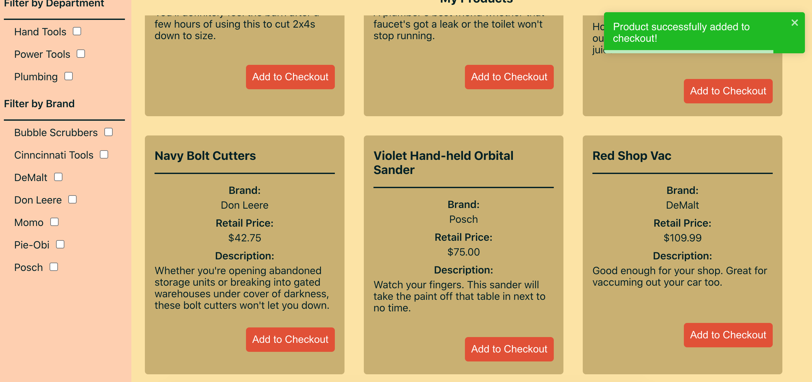

# Context can be employed at all different levels of a React app, not just the root level

Our last lesson was a big one: we made a big context Provider to wrap the entire application, and not only did we do that, but we also ended up moving some state in a child into the parent because they shared data from the same custom hook.

Now, we're about to dive deeper into Hardware Handler, and I'll demonstrate a couple of instances where we can employ smaller contexts to make our code cleaner and clearer.

**Context doesn't just have to live high up in our React apps, though. It can also be small and nimble and very focused in its purpose, which is how we'll use it in this lesson.**

### Checkout API functions take center stage once more

In our app, there are two instances where checkout API calls are passed from parent components: in the `<ProductList>` component, where we display all the individual products that can be added to the checkout, and in the `<Checkout>` component where each item rendered can be removed.

Now both of these components have a different checkout API call they contain and pass on to their own children.

We're going to take these components one at a time, create contexts for them so that we no longer need to pass the functions as props, and see how contexts can be employed all up and down an application in large and small ways.

Let's focus on the `<Checkout>` component first.

### Create a new `CheckoutFunctionContext.js` file

Inside of the `<Checkout>` component is a function named `removeItemFromCheckout`. This function is passed to the individual `<CheckoutItem>` components that are rendered for each item present.

This is the function I want to make a context for.

{lang=javascript,crop-start-line=26,crop-end-line=39}
<<[src/containers/Checkout/Checkout.js](../lesson_06.01/protected/source_code/hardware-handler-6-begin/client/src/containers/Checkout/Checkout.js)

As with our previous context, inside of the `context/` folder, create a new file named `CheckoutFunctionContext.js`.

And create a context code shell in there.

```javascript
import { createContext } from 'react';

const CheckoutFunctionContext = createContext({});

export default CheckoutFunctionContext;
```

T> **Be specific in naming your contexts**
T>
T> I know the name for this new context file is long, but bear with me.
T>
T> Since we've already got one context that's about checkout, we have to be specific in naming another one responsible for another piece of checkout. This is not an uncommon occurrence in large apps.
T>
T> One of the hardest things about programming is naming variables, but don't be afraid to have long, specific names for files — your IDE will help with the autocompletion to make sure things stay spelled right after initial declaration.

Now, since we've already identified the function that we want this context to handle, we can add it as a default value inside of this new context file.

{lang=javascript}
<<[src/context/CheckoutFunctionContext.js](../lesson_06.01/protected/source_code/hardware-handler-6-ending/client/src/context/CheckoutFunctionContext.js)

After this, we're ready to add this context to our `<Checkout>` component.

#### Add the new context to `Checkout.js`

Back over in our `Checkout.js` file, we'll import the new `CheckoutFunctionContext` object and wrap it as a `Provider` around part of the JSX.

First, import the function at the top of the file:

{lang=javascript,crop-start-line=12,crop-end-line=14}
<<[src/containers/Checkout/Checkout.js](../lesson_06.01/protected/source_code/hardware-handler-6-ending/client/src/containers/Checkout/Checkout.js)

Then, establish it as a `Provider` in the file, and assign the local function of `removeItemFromCheckout` as its value to replace our default value.

I> **Contexts can work inside of specific pieces of JSX, not only the whole thing**
I>
I> Notice that I'm only wrapping the context provider around where we loop over the checkout items to render them.
I>
I> This is one of the cool things about React's Context API — you don't need to wrap the whole JSX inside context for it to work, only the child components that will need to access the context object for those values.

{lang=javascript,crop-start-line=61,crop-end-line=65}
<<[src/containers/Checkout/Checkout.js](../lesson_06.01/protected/source_code/hardware-handler-6-ending/client/src/containers/Checkout/Checkout.js)

#### Delete the `removeItemFromCheckout` prop

Right after wrapping the JSX with the `<CheckoutItem>` component, delete the `removeItemFromCheckout` prop being passed to the component — it's no longer needed now that we'll be using context instead.

{lang=javascript,crop-start-line=61,crop-end-line=69}
<<[src/containers/Checkout/Checkout.js](../lesson_06.01/protected/source_code/hardware-handler-6-ending/client/src/containers/Checkout/Checkout.js)

Now we're ready to open up our `<CheckoutItem>` component.

### Update the `CheckoutItem.js` file to access the `useContext` Hook

After adding the context Provider to the parent `<Checkout>` component, it's time to add the consumer to the child `<CheckoutItem>` component.

Inside of the `CheckoutItem.js` file, we'll import the `useContext` Hook and the `CheckoutFunctionContext.js` context file.

```javascript
import { useContext } from 'react';
import { formatPrice } from '../../helpers/formatPrice';
import CheckoutFunctionContext from '../../context/CheckoutFunctionContext';
import './CheckoutItem.css';
```

Then, remove the destructured prop of `removeItemFromCheckout` from the component declaration, and declare a local variable of `checkoutFunctionContext` set equal to the context we imported above wrapped in our `useContext` Hook.

{lang=javascript,crop-start-line=7,crop-end-line=8}
<<[src/components/CheckoutItem/CheckoutItem.js](../lesson_06.01/protected/source_code/hardware-handler-6-ending/client/src/components/CheckoutItem/CheckoutItem.js)

And in the JSX below, in the `<button>` element, update the `onClick` function.

```javascript
<button
  className="primary"
  onClick={() => checkoutFunctionContext.removeItemFromCheckout(item.id)}
>
  Remove Product from Checkout
</button>
```

Great, we're making really good progress. Before we leave this component, though, your ESLint plugin should be going crazy.

#### Fix `<CheckoutItem>`'s ESLint errors

At first glance, this `CheckoutItem.js` file sets off all sorts of ESLint alarm bells, but it's really not all that bad — we can handle these issues.


The first issue is that our `<button>` element in our JSX is [missing an explicit type](https://github.com/yannickcr/eslint-plugin-react/blob/master/docs/rules/button-has-type.md). This error is happening because the default value of type attribute for the button HTML element is "submit" which is often not the desired behavior and may lead to unexpected page reloads.

Since our `<button>` is actually making an API request to the server and removing an item previously in the checkout, we should add the type of submit to it. So add this line to the element.

{lang=javascript,crop-start-line=27,crop-end-line=33}
<<[src/components/CheckoutItem/CheckoutItem.js](../lesson_06.01/protected/source_code/hardware-handler-6-ending/client/src/components/CheckoutItem/CheckoutItem.js)

One ESLint error fixed, six to go. These errors we've seen before: it's our old friend the missing prop types. We know how to fix this one.

Import `PropTypes` at the top of the file.

{lang=javascript,crop-start-line=1,crop-end-line=3}
<<[src/components/CheckoutItem/CheckoutItem.js](../lesson_06.01/protected/source_code/hardware-handler-6-ending/client/src/components/CheckoutItem/CheckoutItem.js)

And at the bottom, define all the prop types for our `item` prop that is still passed in to this component.

{lang=javascript,crop-start-line=43,crop-end-line=51}
<<[src/components/CheckoutItem/CheckoutItem.js](../lesson_06.01/protected/source_code/hardware-handler-6-ending/client/src/components/CheckoutItem/CheckoutItem.js)

Because `item` is an object and not a simple JavaScript value like `string` or `number`, we use the `PropTypes.shape` option and define all the properties _inside_ of the `item` object.

That should resolve the rest of our errors, so let's call this refactor done and move on to our next context and component.

### Back to the `<ProductList>` component

Now it's time to look at our `<ProductList>` component again, which passes a function from the parent to the `<Product>` child that allows us to add items to the checkout.

In this component, the function I want to make a context for is: `addItemToCheckout`.

{lang=javascript,crop-start-line=65,crop-end-line=74}
<<[src/containers/ProductList/ProductList.js](../lesson_06.01/protected/source_code/hardware-handler-6-begin/client/src/containers/ProductList/ProductList.js)

To start, we need to make a new context.

### Create another Context file: `ProductFunctionContext.js`

Once again, inside of the `context/` folder, we will create another new file to hold this new instance of context. Since this one will be used inside of the `<ProductList>` component, a fitting name for the file seems like `ProductFunctionContext.js`.

Define the file, and then we'll add the following code within it, including a default value for the function `addItemToCheckout`.

{lang=javascript}
<<[src/context/ProductFunctionContext.js](../lesson_06.01/protected/source_code/hardware-handler-6-ending/client/src/context/ProductFunctionContext.js)

And with that defined, we can head back over to the `<ProductList>` component.

#### Bring in our `ProductFunctionContext.js` File to `<ProductList>`

Back in the `<ProductList>` component, let's import our newly defined context.

{lang=javascript,crop-start-line=14,crop-end-line=16}
<<[src/containers/ProductList/ProductList.js](../lesson_06.01/protected/source_code/hardware-handler-6-ending/client/src/containers/ProductList/ProductList.js)

This will be where the context `Provider` lives, so where the JSX is rendered further down the component, we'll declare our `ProductFunctionContext.Provider`.

Since the function that will live within our context is only being passed to the `<Product>` component inside of the JSX, again, we don't need to wrap the whole JSX with the context `Provider`.

Instead, we can just wrap the `Provider` around the that needs it and assign the local `addItemToCheckout` function as its value.

Here's where our `Provider` should live.

```javascript
<ProductFunctionContext.Provider value={{ addItemToCheckout }}>
  <div className="product-list-product-wrapper">
    {!loading && !error && filteredList.length
      ? filteredList.map((product) => (
          <Product
            key={product.id}
            product={product}
            addItemToCheckout={addItemToCheckout}
          />
        ))
      : null}
    {!loading && !error && !filteredList.length ? (
      <p className="product-list-message">
        There are no products that match your filters. Please clear some filters
        to see more producs.
      </p>
    ) : null}
  </div>
</ProductFunctionContext.Provider>
```

At this point, we can also delete the line inside of the `<Product>` component passing in the `addItemToCheckout` function as a prop.

{lang=javascript,crop-start-line=159,crop-end-line=164}
<<[src/containers/ProductList/ProductList.js](../lesson_06.01/protected/source_code/hardware-handler-6-ending/client/src/containers/ProductList/ProductList.js)

Then we can refactor the `Product.js` file after that to start taking advantage of `useContext`.

### Refactor the `<Product>` file to use the `useContext` Hook

Great, we're in the home stretch now. Open up the `<Product>` component that lives inside of our `components/Product/` folder.

We've got a bit of refactoring to do to make this component ready to use context.

First, import the `useContext` Hook at the top of the file and the `ProductFunctionContext`.

```javascript
import { useContext } from 'react';
import { formatPrice } from '../../helpers/formatPrice';
import ProductFunctionContext from '../../context/ProductFunctionContext';
```

Next, update this pure functional component without even a `return` statement, and make it ready to accept a local context variable.

Add some curly braces and a `return` before the JSX so that we can add a local `productFunctionContext` variable equal to the `useContext` Hook and delete the destructured `addItemToChecout` function being passed in as a prop.

{lang=javascript,crop-start-line=7,crop-end-line=10}
<<[src/components/Product/Product.js](../lesson_06.01/protected/source_code/hardware-handler-6-ending/client/src/components/Product/Product.js)

And last but not least, update the `<button>` element's `addItemToCheckout` function to be `productFunctionContext.addItemToCheckout` instead.

```javascript
<button
  className="primary"
  onClick={() => productFunctionContext.addItemToCheckout(product)}
>
  Add to Checkout
</button>
```

#### Address any remaining ESLint errors in `<Product>`

Now, before we can retest these changes and make sure context is preserving our component functionality, I want to address these ESLint errors cluttering up the "Problems" tab of my VSCode terminal.


These errors should look more familiar now — they're almost the same errors verbatim we saw while working with the `<CheckoutItem>` component.

So, the first error to fix is that the `<button>` is missing a `"type"`. Like our previous component, this component, too, is making an API request when the button is clicked (this time it's adding an item to the checkout, but it's an API request, nonetheless), so we should give this button a type of submit.

Now, the button's JSX code should look like this:

{lang=javascript,crop-start-line=24,crop-end-line=30}
<<[src/components/Product/Product.js](../lesson_06.01/protected/source_code/hardware-handler-6-ending/client/src/components/Product/Product.js)

And our other error is PropTypes rearing its ugly head again. If you don't know how to fix this one by now, I'm really not doing my job very well.

Import the library at the top of the `Product.js` file.

{lang=javascript,crop-start-line=1,crop-end-line=3}
<<[src/components/Product/Product.js](../lesson_06.01/protected/source_code/hardware-handler-6-ending/client/src/components/Product/Product.js)

Declare a `product` object at the bottom of the file, and use the `PropTypes.shape` type to define all the expected properties within the object.

{lang=javascript,crop-start-line=38,crop-end-line=46}
<<[src/components/Product/Product.js](../lesson_06.01/protected/source_code/hardware-handler-6-ending/client/src/components/Product/Product.js)

Yes! With those updates done, our ESLint errors should have disappeared out of this component, and we're ready to move on to a quick smoke test of Hardware Handler's functionality.

### Retest the app with our new contexts

As we have done countless times before with this application, let's fire it up and see how it works.

```shell
cd client/ && yarn start
```

The two components we're testing are the `<Product>` and `<CheckoutItem>` item components nested within the `<ProductList>` and `<Checkout>` components.

Once the app's running, navigate to the **My Products** page, and add a few items to the checkout. Do they successfully get added? Yep.



Then head over to the **Checkout**. Do the items appear in there?

They do? Super.

Now remove them from the checkout. The items should disappear just as they always have.


Great. After confirming these portions of the app still work, we can call this lesson done! Fantastic job.

I hope this gives you a better idea of the myriad ways context can be applied in a React application to great effect.

---
