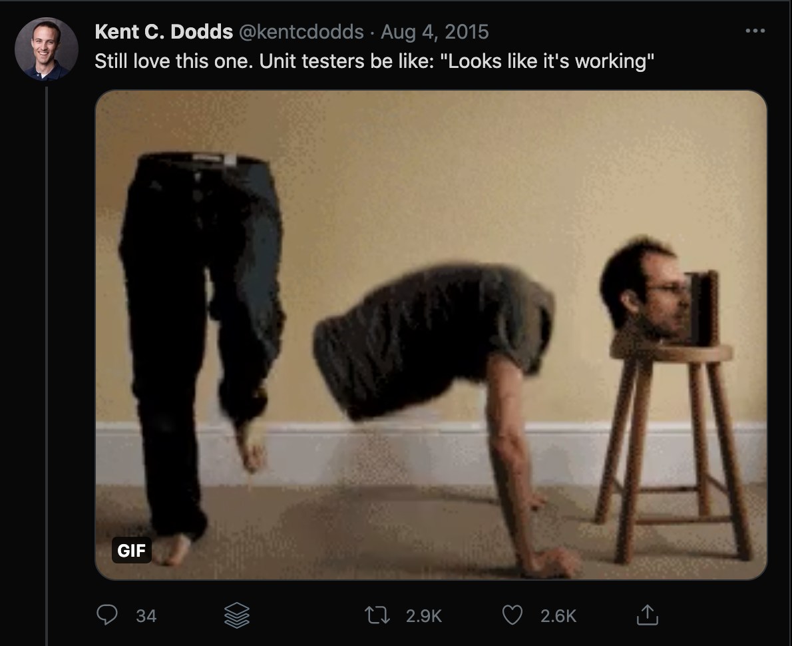

# An introduction to React Testing Library

Much like how the introduction of React Hooks changed how we develop modern React applications today, the release of Kent C. Dodds' [React Testing Library](https://testing-library.com/docs/react-testing-library) in 2018 forever altered how integration testing of modern JavaScript applications is approached.

**This lesson will explore why React Testing Library was created to help us better understand the testing problems it aims to solve while continuing to give devs confidence and quick feedback in the functionality of the apps they're building.**

### Unit and integration testing level

Before we get to the details of React Testing Library, let's take a minute to define automated unit testing and integration testing and the differences between the two. They're used interchangeably often enough in conversation, but there are subtle distinctions worth pointing out.

**Unit testing:**

Unit testing is a software testing method by which individual units of source code — sets of one or more computer program modules together with associated control data, usage procedures, and operating procedures — are tested to determine whether they are working as expected.

**Integration testing:**

Integration testing shows that the major subsystems that make up the project work and play well with each other. Some describe it as really just an extension of the unit testing described above — integration tests just test how entire subsystems honor their contracts instead of individual components.

The biggest difference between the two is the _scope_ of the tests: unit tests focus on isolated testing of individual pieces of an app, while integration testing focuses on two or more components working together as they were intended to.

As I said in the introduction, automated testing is no longer a nice-to-have, especially when it comes to large, long-lived enterprise applications; it's a requirement. But not all tests are created equal, and as we'll see shortly, some can inspire more confidence in our app than others.

### The downfall of Enzyme and the rise of React Testing Library

At the advent of React, a combination of [Jest](https://jestjs.io/) and [Enzyme](https://enzymejs.github.io/enzyme/) quickly became the standard testing library pair for automated unit and integration testing. And it worked well enough at that time.

When hooks were introduced to the world, Enzyme wasn't prepared to handle them, which frustrated developers used to relying on automated tests to give them confidence that as they added onto apps, they didn't break existing functionality.

This lapse in coverage gave an up-and-coming testing library a chance to step in and fill the void: React Testing Library.

### What makes RTL different

Kent C. Dodds built React Testing Library to solve a fundamental flaw he saw with the whole of automated unit testing in the JavaScript world.

Up until then, unit testing frameworks (like Enzyme) relied heavily on the implementation details present in individual components. This reliance on underlying details made the tests brittle, prone to requiring rewrites when components were refactored, and generally, a pain to maintain.

And here's the biggest kicker: **even with these unit tests guaranteeing functions fired or events were triggered, it didn't guarantee that the components _working together_ were doing what they should when a user interacted with the app.**

This meme Kent posted on Twitter back in 2015 still makes me smile every time I see it. And it very accurately shows the problem with relying on unit tests.

Kent saw things a little differently, and the React Testing Library site itself sums up his views very succinctly:

I> "You want to write maintainable tests for your React components. As a part of this goal, you want your tests to avoid including implementation details of your components and rather focus on making your tests give you the confidence for which they are intended. As part of this, you want your test base to be maintainable in the long run so refactors of your components (changes to implementation but not functionality) don't break your tests and slow you and your team down."
I>
I> [- Testing Library](https://testing-library.com/docs/react-testing-library/intro/#the-problem)

And so, React Testing Library was born, with an aim to encourage better testing practices by following this guiding principle:

I> "The more your tests resemble the way your software is used, the more confidence they can give you."
I>
I> [- Testing Library](https://testing-library.com/docs/react-testing-library/intro/#this-solution)

What this means in practice is:

- **Less** dealing with rendered instances of components,
- **More** working with actual DOM nodes,
- **Less** worrying about if a function was fired or a Redux subscription was called,
- **More** focus on if a button click in the DOM made something happen,
- **Less** time spent thinking about underlying implementation details the end user is completely unaware of (and frankly doesn't care about anyway),
- **More** time spent refactoring and writing code without having to update old tests because functionality remained intact.

RTL's style of integration testing is much more akin to how end-to-end (e2e) tests tend to work — just within a smaller scope.

Instead of running through a whole user flow from start to finish like a traditional e2e test, RTL encourages mostly writing integration tests to test components closer to the way a user will interact with them, which allows the tests to give more confidence the application will work as expected when a real user uses it.

T> **More React Testing Library facts:**
T>
T> React Testing Library is _not_ a test runner or testing framework: it is light utility functions on top of the `react-dom` and `react-dom/test-utils` libraries.
T>
T> It is also not specific to a testing framework (although Jest is recommended), nor is it restricted to just testing React applications.
T>
T> There's actually Testing Library implementations for many JS frameworks, including Vue, Angular, Native, Svelte, and more.
T>
T> Just check out [the documentation](https://testing-library.com/docs/react-testing-library/intro/#!) to get started with any of these other flavors.

### Bottom line: Using RTL means more time writing code and less time fixing tests

So let me get this straight: with Jest and Enzyme, if a component's code is refactored — say a function was added or renamed — _even though_ overall functionality remained the same, the associated test file will most likely break and need fixing because Enzyme is concerned with testing the implementation details.

If, however, Jest and React Testing Library are used, and that same component's underlying functions are changed, but the functionality remains intact, the tests would, most likely, not break or need more minor fixes to work again.

Hmm... less time spent fixing tests and more time spent writing code... as a developer who enjoys building new things, that sounds pretty good to me.

Ready to get Hardware Handler set up to use RTL and Jest to write our tests? Me too.

---
