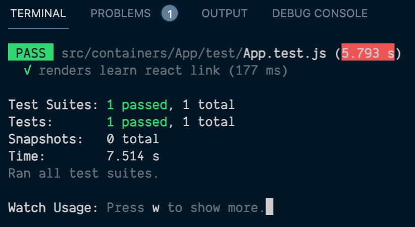
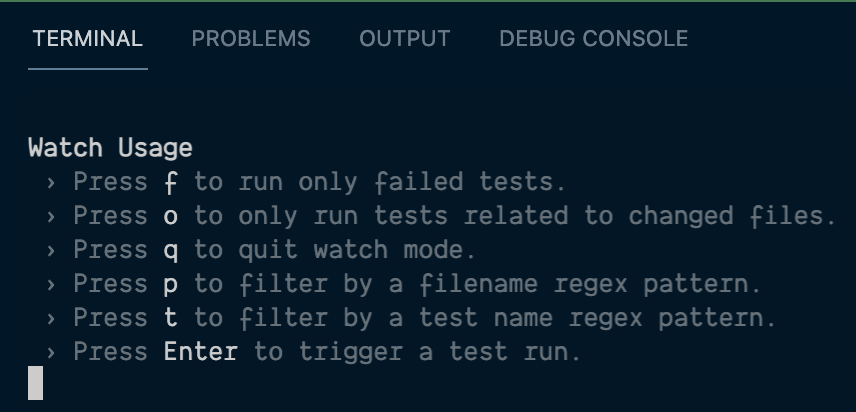
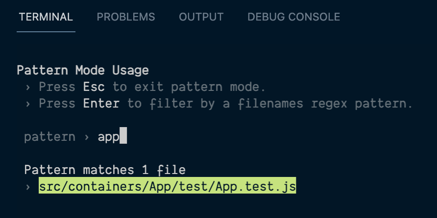
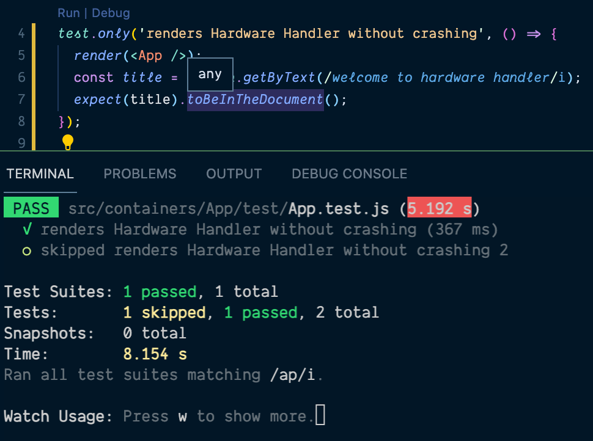
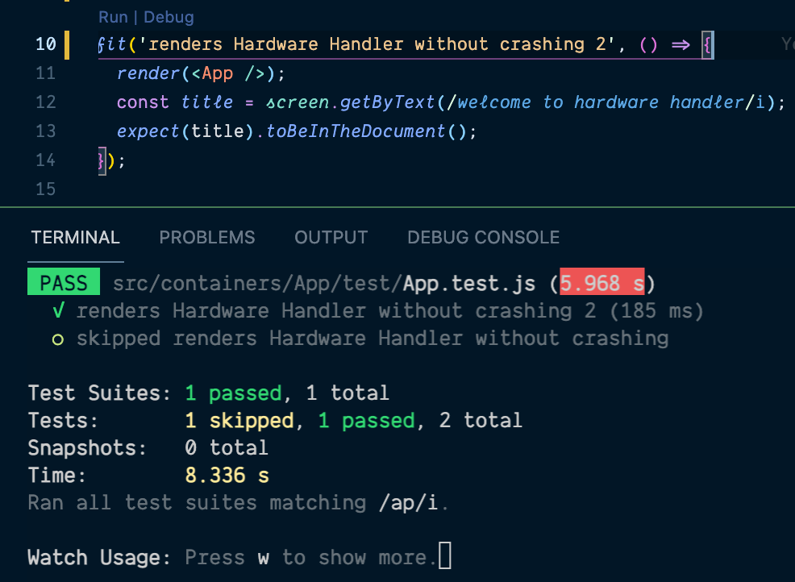
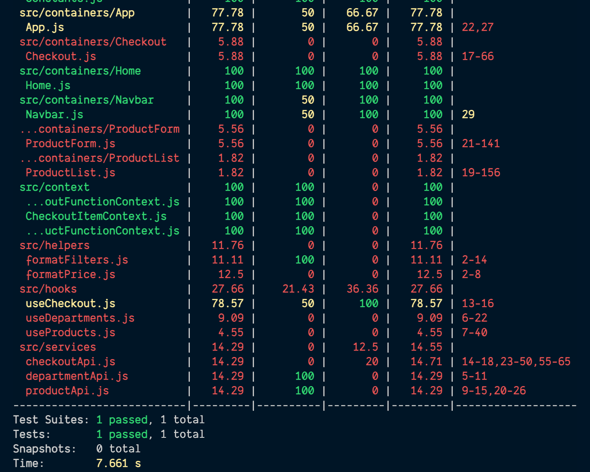
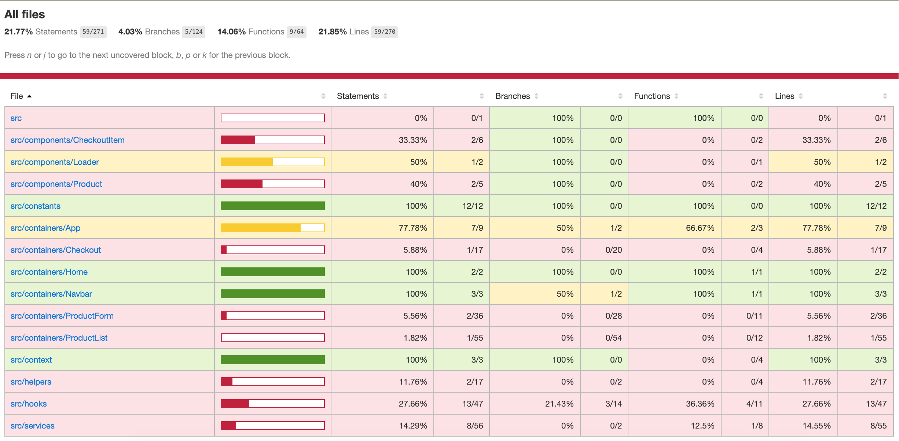

# Automate our integration tests in Hardware Handler

Before we can get to writing our first tests in our app, we have to do a little configuration and tooling setup. Never fear, though. This is nothing like the early lessons where we set up Volta or ESLint or anything like that — this will be much quicker.

**In this lesson, we'll discuss strategies for integration testing and add some new npm scripts to Hardware Handler to make running our integration tests _and_ generating interactive code coverage files a breeze.**

I> **Sample code zip file**
I>
I> As always, if you need a copy of the sample app _before_ we start setting up our automated testing, it can be downloaded **[here](protected/source_code/hardware-handler-7.zip)**.

### Integration testing strategies: Smaller to larger

While there's no one way to do anything in React, it's an accepted best practice to write integration tests using RTL and Jest starting with the smaller components and working up to the larger, more complex ones.

I want to stress this, though: **this is just one way to do it. It is by no means the only way to do it.**

Think about it: it's simpler to test a component with a few functions and API calls by itself, then to try to test it after it's injected into a larger component with three or four other sibling components.

Sounds better than starting with the parent component and having to test that parent's functionality plus all the child components' functionality in one giant test file, right?

While this won't always apply, test smaller to larger when possible to avoid duplicating effort and testing more than necessary in the bigger, more complex components.

Don't worry. You'll start to get a feel for it soon enough and find your own best way of testing.

### Modify our project setup

Since we're using Create React App as the basis for our Hardware Handler application, we have some test tooling set up for us in the project, in addition to many of the testing libraries we'll be working with already being installed.

But let's go through both aspects of it in case you run across a React project that doesn't take care of these things for you ahead of time.

#### npm testing libraries

First, let's take a look at the libraries we'll be utilizing to write all of our integration tests.

If you open up your app's `client/` folder in your IDE and navigate to the `package.json` file, you should see the following libraries under your `"dependencies`".

{lang=json,crop-start-line=10,crop-end-line=12}
<<[client/package.json](protected/source_code/hardware-handler-7-begin/client/package.json)

These three libraries, `"@testing-library/jest-dom"`, `"@testing-library/react"`, and `"@testing-library/user-event"`, are going to be critical to our tests and will make up the bulk of what we'll lean on to write them.

There are a couple of things here we should probably do before we move on, though.

#### Move the testing libraries to devDependencies

For some reason, these test libraries, which are not central to our app's functionality when it's running in production, are listed under its `"dependencies"` instead of its `"devDependencies"`, which is where all libraries not essential to the prod app should go so they don't get bundled into the final production build.

Move those three libraries to be at the beginning of our list of `"devDependencies"` in our `package.json` file. This won't affect our local development at all because the libraries are already installed locally, but if we bundled up this app for deployment into a cloud environment production or otherwise, it would impact the final bundle size.

Here's where our libraries should reside now.

```javascript
  "devDependencies": {
    "@testing-library/jest-dom": "^5.11.6",
    "@testing-library/react": "^11.2.2",
    "@testing-library/user-event": "^12.2.2",
    "babel-eslint": "10.1.0",
    "eslint": "^7.24.0",
    "eslint-config-airbnb": "18.2.1",
    "eslint-config-prettier": "^8.2.0",
    "eslint-plugin-import": "^2.22.1",
    "eslint-plugin-jsx-a11y": "^6.4.1",
    "eslint-plugin-react": "^7.23.2",
    "eslint-plugin-react-hooks": "^2.5.0"
  },
```

T> **Why does this matter?**
T>
T> For us, it doesn't really matter that much. But for our users, who don't have Internet connections as reliable or machines as powerful as the ones developers typically work on, it can matter a great deal.
T>
T> The smaller the final bundle size, the quicker our site will load and be interactive for users, which is always a good thing.

Okay. That looks better already.

#### Add the React Hooks Testing Library

One more thing I want to do is add another testing library that we're going to need when we write tests for our custom hook components. It's aptly named [`"@testing-library/react-hooks"`](https://github.com/testing-library/react-hooks-testing-library).

For now, let's go ahead and install this library in our app.

Open up a terminal, and inside of the `client/` folder, run:

```shell
yarn add @testing-library/react-hooks --dev
```

With that dependency added, we can turn our attention elsewhere in this file.

#### npm scripts

With our testing libraries installed, we've still got a few scripts to add so we don't have to manually type all the flags into the command line every time we want to check our automated tests.

Thanks to CRA, we already have one `"test"` command in the `"scripts"` section of our `package.json` file already.

{lang=json,crop-start-line=23,crop-end-line=27}
<<[client/package.json](protected/source_code/hardware-handler-7-begin/client/package.json)

There's more we can do here, though. We're going to add two more scripts right underneath the standard `"test"`.

{lang=json,crop-start-line=23,crop-end-line=26}
<<[client/package.json](protected/source_code/hardware-handler-7-ending/client/package.json)

**ci-test**

The first script `"ci-test"` will run the same test scripts as the original `"test"` command. However, the `"CI=true"` part stands for continuous integration is true (and would typically be used in an instance where a CI/CD pipeline was in place for builds).

By default, `yarn test` runs a test watcher with an interactive [Jest CLI](https://jestjs.io/docs/cli) (basically, the tests will re-run every time something changes). However, you can force it to run tests once and finish the process by setting the flag `"CI=true"` in the command.

The [`"--verbose"`](https://jestjs.io/docs/cli#--verbose) command is one that works with the Jest CLI (our test runner) and will print out individual test results with the test suite hierarchy displayed — which doesn't happen by default. With this command, all the descriptions in the `describe`, `it`, or `test` blocks will be printed out into the terminal, which can make debugging failing tests easier.

**coverage**

The second script `"coverage"` is very similar to the first _except_ it removes the `"CI=true"`, and it includes this [`"--coverage"`](https://jestjs.io/docs/cli#--coverageboolean) flag. I removed the `"CI=true"` because I like how Jest formats and color codes file code coverage when this flag is not included in the script.

The `"--coverage"` flag indicates that test coverage information should be collected and reported in the output and generates a pretty decent code coverage printout. I'm more partial to the interactive report we can open up and view in a browser, but I'll show you how to access either later in this lesson.

The inclusion of the `"--watchAll=false"` flag is required for code coverage for the whole report to generate correctly (it's a [known issue in Create React App](https://github.com/facebook/create-react-app/issues/7838) dating back to 2018).

Let's check how our new scripts work.

### Run our lone test

Lucky for us, there is already a single test in our application. It lives in the `containers/App/test/` folder.

T> This is my preferred method for writing tests, by the way.
T>
T> When it comes to React components, I like to keep their test files in the same folder as the component they're testing — just nested inside of a `test/` folder for that little bit of extra separation and organization.

For integration tests, Hardware Handler doesn't actually have to be running for Jest to be able to run its tests (though this can often be helpful when debugging tricky tests by testing actual application functionality), so we don't even need to start the app up to run them.

This is not the case for end-to-end tests, but that's for the module after this one.

Instead, just navigate into the `client/` folder in a terminal and run the following command:

```shell
yarn test
```

And you should see the following info print out to the terminal.



#### Modify the test description

Just so you know, I updated the text in this test so it would pass after the changes I made to the `App.js` file, but I neglected to update the test description. A slight oversight that's easily rectified.

Go ahead and open up the `App.test.js` file, and let's just change the `test` text to read `"renders Hardware Handler without crashing"`.

This is how the test should look now.

```javascript
test('renders Hardware Handler without crashing', () => {
  render(<App />);
  const title = screen.getByText(/welcome to hardware handler/i);
  expect(title).toBeInTheDocument();
});
```

It won't stay like this forever — we'll update all sorts of things about how we structure these test files in the next lesson, but it will do for now as an example. I want to show you a couple of cool things you can do while running tests before this lesson's over.

#### Target a single test or test file

One thing I'd like to demonstrate is how to run a single test file instead of all the files.

As I stated earlier, if we just run the default `yarn test` command in the npm scripts, the Jest CLI test watcher will be watching for any changes in the app (test files or otherwise) and will start running all of the tests over again every time a code change is made.

While this can be helpful, it can also be time-consuming when there are hundreds or thousands of unit tests to re-run (and believe me, they can get into the thousands easily as apps grow and evolve). If you're working on one particular set of test files, sometimes you just want to run those tests to see the effect your changes have.

But don't sweat it! Jest makes this easy to do.

**How to run a single test file**

If we want to run just a single test, we'll start off with the same `yarn test` command we used to run all our test files, but once the Jest test runner starts up in the terminal, tap a key to bring up the Jest CLI options (it doesn't really matter what key, you just need to get the CLI watcher's attention so it will display the common options menu).



Once this menu is displayed, you'll see a list of the most commons options people reach for, but the one I want to focus on is the pattern matcher that's invoked by typing the `P` key.

When pattern matcher is invoked, you can start typing in a particular test file that you want to run, and Jest will do its best to find any and all test files that match what you're typing in (it works with regex searching too, but I usually just rely on typing in a specific test file name I know I want to run).

Since we've only got one test file, there isn't much to do yet, but here's a screenshot of it in action: as soon as I start typing in `app` in the pattern matching input, Jest starts to search for all test files that meet the criteria.



Once your file pops up in the options, just use the arrow keys to navigate to it and hit the `ENTER` key to run that file.

Trust me — this comes in very handy very often in day-to-day development.

**How to run a single test**

Next up, let's run just one test within a suite of tests — extremely useful for debugging a broken test.

There are two ways we can do this, and what testing syntax you're using will determine which syntax you use.

**test.only**

If you've got tests written using the `test` keyword (like our current test), you can add the `.only` keyword behind `test`, and it will only run tests with that added to them. Check out this screenshot to see what I mean.



See how only one of the two tests I wrote runs in this test file, and it shows in the console printout that the other test was skipped.

**fdescribe or fit**

If you're using the test syntax that includes `describe` blocks for suites of tests within a file or the `it` keyword to write individual tests, you can place the letter F in front of your test like `fdescribe` or `fit`, and only tests that have that indicator will run.



Just like our prior example, only the second test I wrote in this test file was run (I changed the description slightly, but I just copied the original test for demo purposes).

T> You can also run more than one test in more than one file with either of these test syntaxes.
T>
T> If you've got two or more test files that need to run, you can drop a `.only` or `fit` on whatever tests you need to run in those files. Jest is totally fine with running certain tests in multiple files.

Once again, this sort of trick is really useful for me on a daily basis.

Now, let's move on to how to see code coverage for our application — another important and highly useful thing.

### Run code coverage for the app

So this is the time we'll run our second new npm script: the `"coverage"` script. This is a big one because it will run all the test files present in the app and show you the total code coverage for the app.

#### Check the terminal coverage output

Just like for the other npm script, we'll open up a terminal and run the following command.

```shell
cd client/ && yarn coverage
```

After this command, you should see a printout in the console similar to the image below.



This is so helpful to me — you can see from the console exactly which lines of code for the `App.js` file are already covered by tests, the percentage of lines covered, the exact lines that are still uncovered, and so on and so forth.

This is great, however, if there's still a great deal of code that needs to be covered, perhaps when you've written new code but haven't started the tests to match them yet, and you're still trying to ascertain what needs to be done — it could be helpful to have a more in-depth look at the code.

Well, I have a solution for this, and it's the next section of our lesson: the browser-related code coverage report.

#### Check the browser coverage report

The interactive browser-based code coverage report is my go-to when checking what my tests cover. I appreciate its detailed visual representation of which lines still need to be tested instead of having to put the line numbers together printed out in the console with a file I'm looking at in my IDE (plus, sometimes there are more lines uncovered than the console printout can handle, and when that happens, it just lists the maximum number of lines it can before trailing off with a `...`).

If you've already run all the tests (like we have in this lesson), you'll notice in your IDE's list of folders inside of the `client/` folder, there's a new, auto-generated one called `coverage/`. This is where our code coverage report that we'll open in the browser lives.


Open up the file inside of the `lcov-report/` folder named `index.html` inside of the browser.

> **Open a file in the VSCode IDE from the command line**
>
> If you're using VSCode as your IDE like I am, I'll show you a cool trick to open up this coverage report using your terminal's command line.
>
> Open a new terminal instance and inside of it type the following command:
>
> ```shell
> open client/coverage/lcov-report/index.html
> ```

Once it's open in the browser, you should see a view similar to the screenshot below. All the files in our project (and any that have tests like `App.js`) will be displayed here along with a high-level overview of their code coverage.



After the code coverage report is first generated, you can click into any of these files and see a more detailed view of the code and its coverage. Go ahead and click on the `App.js` file to see its contents.


And this is where the gold is: here we can see our actual production code and _exactly_ which lines are tested already and which are not.

In this particular instance, the majority of the lines are already showing as tested, but we can see that the `setCheckoutUpdated` boolean state is not. Not only that, but it looks like the `if` statement on line 21 has only one of its two possible scenarios tested — that's what the little black and yellow "I" icon next to the `if` stands for, and I can verify this by looking at the **Branches** percentage at the top of the file. It says "50%" and "1/2" for the branches, as of now.

One thing to note is if you already have an instance of the code coverage open in the browser and you update your tests and run the `"coverage"` script again, then refresh your browser, you'll see any updated code coverage here — no need to reopen the report all over again.

And that's about all there is to this.

I> **Jest doesn't care if the project uses React Testing Library or Enzyme or both**
I>
I> Something I'd like to make clear in this lesson is if you're working on a project that already has some integration testing written using Enzyme or some other testing framework besides React Testing Library, it doesn't matter.
I>
I> Jest will run all the integration tests regardless of what they're written with, and it will combine the results for the coverage report.
I>
I> This is extra good news because it means that if you're adding new functionality to an existing application, you won't need to rewrite all the unit tests at once to use RTL.
I>
I> Instead, you can rewrite the tests as you revisit older components (or not at all, if it turns out you're not touching them again). You can leave the older tests in place, and they'll continue to run and be factored into the overall code coverage report with no issues.

In the next lesson, we'll begin writing our first few integration tests using Jest and React Testing Library for some of our container components.

---
