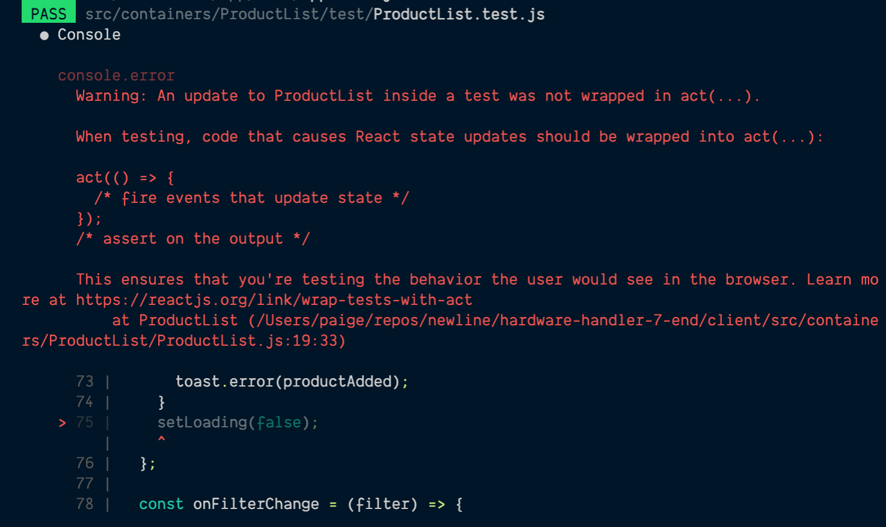

# Testing our functional components with React Hooks

Now that we've gotten our app ready to run integration tests, it's time to _write_ some integration tests.

Fair warning: this is going to be the longest lesson in this module, so get ready. If you can stick with it to the end, I think you'll feel a lot more confident about how to test these components.

**In this lesson, I intend to walk you through writing tests for a couple of our container components relying on React Hooks.**

### Start with App.js (since tests are already begun...)

Time to get to work on these tests. Since the `App.js` file already has a single test, let's start there. We're going to completely overhaul how this file looks because this course is not only about modernizing enterprise React apps — it's also about showing you best practices for bigger codebases (and that includes how we structure our tests).

#### Describe your test file's various functionality

The first thing I prefer to do when writing test files is to set up `describe` blocks around each set of functionality within a test file.

If it helps, you can think of `describe` as a wrapper in the test suite to divide up functionality — then each test _inside_ of that `describe` block will be a specific test for one particular piece of the functionality encompassed by the `describe`.

T> **Use `describe` to subdivide functionality**
T>
T> A good example of when `describe` comes in handy might be for a file like our `ProductList.js` file that has the ability to both display our products and also filter which products are displayed.
T>
T> These two things are pretty different, so I might choose to break up those two pieces of functionality: displaying and filtering into two separate `describe` blocks within my test file.

Our `App.js` file doesn't have that much functionality, but consistency within a codebase is also important, so to stay with the best practices, we'll give it a `describe` anyway.

If we look at the `App.test.js` file now, it's basic. Go ahead and wrap the one test that's currently there within a `describe`. Nothing fancy, either: just a barebones description of the file's purpose.

Since `App.js` is the root of our entire React project, I'll just put something like:

```javascript
describe('Hardware handler app', () => {
  test('renders Hardware Handler without crashing', () => {
    render(<App />);
    const title = screen.getByText(/welcome to hardware handler/i);
    expect(title).toBeInTheDocument();
  });
});
```

We're off to a good start.

#### Switch from `test` to `it` syntax

The next thing we're going to do is purely optional, but it's more familiar to me and the way I've been writing software and tests, so I'm going to do it (even if just to show you how it's done). We'll change the `test` syntax our first test started out with and switch it to use `it` instead.

`it` and `test` are pretty [interchangeable, according to the Jest documentation](https://jestjs.io/docs/api#testname-fn-timeout), but I prefer the syntax of `it`, which looks like: `it('should do this thing')`.

If you prefer `test('did not do other thing')`, that's cool. You do you. Or whatever your team's already established as their preference: remember, consistency is important.

But since I'm writing this course, this is what I choose. So, our original test string goes from:

```javascript
test('renders Hardware Handler without crashing', () => {
```

to:

{lang=javascript,crop-start-line=5,crop-end-line=6}
<<[src/containers/App/test/App.test.js](../lesson_07.02/protected/source_code/hardware-handler-7-ending/client/src/containers/App/test/App.test.js)

I> **When to use `describe` versus `it` in tests**
I>
I> `describe` is best for breaking your test suite into smaller groups of tests. Depending on your test strategy, you might have a `describe` for each function in your class, each module of your plugin, or each user-facing piece of functionality.
I>
I> You can also nest `describe`s inside of one another to further subdivide the suite (I rarely do this myself, but it's possible).
I>
I> `it` is for when we're writing the individual tests. We should be able to write each test like a little sentence, such as: `it('should show a product price when the item is rendered')`.

#### Make this test cover more

Now it's time to beef up this test; it's a little skimpy on the details.

When we look at the homepage of Hardware Handler, we see a lot more than just the welcome message. We see links, we see buttons, and we see a checkout count of items if there are items present. Let's put those into this test to make sure they are visible when the app starts up.

As you can see from the beginning of this test, we declare a local variable called `title` that is simply an element of text on the page. This is not required for the test to work, but it does make it easier to understand the element in the DOM we're targeting — especially if that element will come into play in more than one test assertion.

Just like `title`, I'll declare a few new variables for the other elements I'm looking for on the page: the links to the products page, the add a new product page, and the checkout page.

Underneath the `title` variable in the test, we'll add the following variables:

{lang=javascript,crop-start-line=8,crop-end-line=11}
<<[src/containers/App/test/App.test.js](../lesson_07.02/protected/source_code/hardware-handler-7-ending/client/src/containers/App/test/App.test.js)

These three variables will now search the rendered page for these pieces of text.

T> Note that surrounding the particular strings you're looking for like `/some text onscreen/i` makes the text search case insensitive (it will find all combinations of upper and lowercase versions of that text).
T>
T> If you _want_ it to be case sensitive, just wrap the text in quotes with whatever capitalization is expected: "Some other TEXT").

After defining these variables, we'll need to search for their presence on the page. These are a little different than our `title` variable, though, because each text string is on the page twice: once in the nav bar and once on the main page.

Instead of searching for each text string to be in the document, we'll need to check that each text string has a length of two, indicating it's visible twice in the rendered components.

Here's the syntax we can use for that check:

{lang=javascript,crop-start-line=11,crop-end-line=16}
<<[src/containers/App/test/App.test.js](../lesson_07.02/protected/source_code/hardware-handler-7-ending/client/src/containers/App/test/App.test.js)

Okay, now run the tests and let's see what happens.

In a terminal type:

```shell
cd client/ && yarn test
```

And this is what we should see in the terminal after.


Nice! Our first test continues to pass, meaning all the text we expect to see is rendering when the app loads.

#### Write a second test to check on checkout count

If we look at the code coverage for this `App.test.js` file currently, it's decent, with an overall line coverage rating of almost 78%. As a rule of thumb, I want my integration test overall code coverage to be 80% or above to feel confident in my code.

Looking at the coverage report in the browser we can see the two functions bringing down our coverage percentage are the `useEffect` and `updateCheckoutCount`


We should be able to cover that `useEffect` function that displays a number next to the **Checkout** link in the nav bar. Let's write a test for it.

Underneath our original test, create a new `it` statement to check if there's a count present in the browser.

{lang=javascript,crop-start-line=18,crop-end-line=18}
<<[src/containers/App/test/App.test.js](../lesson_07.02/protected/source_code/hardware-handler-7-ending/client/src/containers/App/test/App.test.js)

In order to display a count in the nav bar, we're going to need to mock our `useCheckout` custom hook because that's what supplies any item counts to this component.

We can do that.

**Import `useCheckout`**

First, we'll import the `useCheckout` Hook into this test component.

{lang=javascript,crop-start-line=2,crop-end-line=2}
<<[src/containers/App/test/App.test.js](../lesson_07.02/protected/source_code/hardware-handler-7-ending/client/src/containers/App/test/App.test.js)

**Spy on the hook and mock the results**

Then, we'll use Jest's [`spyOn`](https://jestjs.io/docs/jest-object#jestspyonobject-methodname) function to spy on the the actual function we're calling (also named `useCheckout` inside the hook) inside of our newly written test (this is why I imported the hook using the wildcard syntax `import * as useCheckout`).

{lang=javascript,crop-start-line=18,crop-end-line=19}
<<[src/containers/App/test/App.test.js](../lesson_07.02/protected/source_code/hardware-handler-7-ending/client/src/containers/App/test/App.test.js)

For mocks, I tend to use the name of the function I'm mocking and just stick the word `mock` in front of it to indicate that whenever this function is called by the code being tested, this mock will be take over that function and return the data we'll define.

T> **Where to set up mocks in test files**
T>
T> If this was a hook supplying essential data to make our component render, we'd need to declare this spy and mocked data in a `beforeEach` block before all the tests.
T>
T> But since the app won't crash without any of that data (it just won't show a number next to the checkout icon in the nav bar), we'll just add the mock for the single test that really needs it in this file.

If we look at the data the real `useCheckout` Hook returns, it gives us back an object of destructured properties: a `checkoutCount` number, a `checkoutItems` array of objects, a `setCheckoutItems` function, and an `error` boolean. We'll need to mock all those values within an item for this test to have the data it needs — with no items in the checkout, no number is rendered, and the test isn't doing its job.

With our `useCheckout` function already being spied upon, we can now define what it should return when the mock is called. Here's the test data I'll tell the mocked hook to return. This is also inside of our second test right after the declaration of the `mockUseCheckout` variable.

{lang=javascript,crop-start-line=19,crop-end-line=37}
<<[src/containers/App/test/App.test.js](../lesson_07.02/protected/source_code/hardware-handler-7-ending/client/src/containers/App/test/App.test.js)

Good. When our `<App />` component gets rendered now in the test that we're about to write, it should have all the data it needs to think there's a checkout item and display a count in the nav bar.

**Write the test to check for a count in the DOM**

Because we're mocking our `useCheckout` Hook, which provides the state to our `<App />` component, we don't have to pass any props or set any other state before we render the component in the test.

Then, after rendering it, we'll look in the DOM for the number 1, which is what should be present now, provided our mocked hook is working. And that should be it.

So, here's what my new test code looks like:

{lang=javascript,crop-start-line=39,crop-end-line=42}
<<[src/containers/App/test/App.test.js](../lesson_07.02/protected/source_code/hardware-handler-7-ending/client/src/containers/App/test/App.test.js)

#### Run our tests and recheck code coverage for `App.js`

At this point, if you're not already running tests using the Jest CLI in watch mode (`yarn test`) which tries to rerun them after every change to the files it's watching, let's go ahead and do that and check our new code coverage.

```shell
cd client/ && yarn coverage
```

After our two tests run (and hopefully pass), our code coverage report in the terminal should now look like this.


With the addition of that second test, our `App.js` file's code coverage has jumped up from 78% to just under 89%.

I'll take 89% code coverage for this file — the only bit of code still not covered now is when the `updateCheckoutCount` function is called, but I think it will be easier to test that works in another file, so let's move on and test another component now.

### Test our ProductList.js component

That was a good warmup file to get our feet wet testing React components using hooks, and it's time to try out a component with some serious functionality in it. I'm thinking the `<ProductList>` component would be a good one because of its ability to display and add products to the checkout, as well as its filtering capabilities.

#### Set up tests for the component

Just like how the `<App>` component had a `test/` folder inside of its `App/` folder in our project, we're going to do the same for this component.

In your IDE, open up the `ProductList/` folder and create a new folder inside of it called `test/`. Inside of this folder, create a new test file named `ProductList.test.js`, and we're ready to get started writing our next set of tests.

#### Describe the scenarios we want to test for ProductList

With our test file created, it's time to set up our first `describe` block for our tests, and we'll figure out what our actual `<ProductList>` component needs in the way of data for it to render.

As with the tests for `App.js`, we'll start off with the most basic `describe` and `it` statements here.

```javascript
describe('Product List component', () => {

    it('should render the component without crashing', () => {}
}
```

**Mock out our custom hooks**

When we examine the component we're testing, I see that it requires info from two of our custom hooks: the `useDepartments` Hook and the `useProducts` Hook. If either of those hooks' data is missing the component will throw errors, so we'll need to set the mocks for these hooks up before _every test_. Jest has just the thing for this: `beforeEach`.

Let's mock the `useDepartments` Hook first in our test file. It will be the easier of the two.

At the top of our file, import the `useDepartments` Hook (use the `*` wildcard import so we can target the `useDepartments` function within our mock), and right inside of our `describe` block, create a `mockUseDepartments` variable spying on the hook.

The code should look something like this:

```javascript
import * as useDepartments from '../../../hooks/useDepartments';

describe('Product List component', () => {
  const mockUseDepartments = jest.spyOn(useDepartments, 'useDepartments');
```

After the variable is declared, we can mock the data we want to be returned, and since we need this data available for every test, we'll set up the data being returned in a [Jest `beforeEach` method](https://jestjs.io/docs/api#beforeeachfn-timeout).

The `useDepartments` Hook returns a destructured object containing both an array of `departments` and an `error` boolean, so our mock should do the same. And to be crystal clear that it's mocked data we're using and not real data, I'm going to create some departments that don't exist in our real app to prevent any confusion.

Here's my `beforeEach` with some mocked department data inside of it.

```javascript
  beforeEach(() => {
    mockUseDepartments.mockReturnValue({
      departments: [
        {
          id: 45,
          name: 'Garden Tools',
        },
        {
          id: 56,
          name: 'Appliances',
        },
      ],
      error: false,
    });
```

That'll work for our `useDepartments` Hook. Now we just need to mock our `useProducts` Hook. This hook's got a bit more to it: it returns an array of `products`, an array of `filtersByBrand`, and an `error` boolean.

Once more, import the hook into our code for use, and declare it as a mocked variable.

```javascript
import * as useProducts from '../../../hooks/useProducts';

describe('Product List component', () => {
  const mockUseDepartments = jest.spyOn(useDepartments, 'useDepartments');
  const mockUseProducts = jest.spyOn(useProducts, 'useProducts');
```

Then, add the mocked data to return. Here's the data I'm going to create for that mock. Take note of how the products' department IDs align with the faux department IDs we set up in the first mock. Add this mock right under our first one (still inside the `beforeEach`), and then close the `beforeEach` after this. We're done with it.

```javascript
    mockUseProducts.mockReturnValue({
      products: [
        {
          brand: 'Gnome Gardening',
          departmentId: 45,
          description: 'A trowel above all others.',
          id: 1,
          name: 'Polka Dot Trowel',
          retailPrice: 999,
        },
        {
          brand: 'Gnome Gardening',
          departmentId: 45,
          description:
            'Protect yourself from sun burn while gardening with a wide brimmed, lightweight sun hat.',
          id: 2,
          name: 'Rose Sun Hat',
          retailPrice: 2495,
        },
        {
          brand: 'SL',
          departmentId: 56,
          description:
            'This fridge keeps your food at the perfect temperature guaranteed.',
          id: 3,
          name: 'Stainless Steel Refrigerator',
          retailPrice: 229900,
        },
        {
          brand: 'Swirl Pool',
          departmentId: 56,
          description:
            'Clothes have never been so clean, and a washer has never looked so stylish cleaning them.',
          id: 4,
          name: 'Matte Black Connected Washing Machine',
          retailPrice: 45050,
        },
      ],
      filtersByBrand: [
        { name: 'Gnome Gardening', value: 'Gnome Gardening' },
        { name: 'SL', value: 'SL' },
        { name: 'Swirl Pool', value: 'Swirl Pool' }
      ],
      error: false,
    });
  });
```

In addition to our data setup before each test runs, we also need these mocks to reset after each test runs. So, we need to use the [Jest `afterEach` method](https://jestjs.io/docs/api#aftereachfn-timeout) to reset our mock states.

Right after our `beforeEach` handler, add this new `afterEach` handler.

{lang=javascript,crop-start-line=30,crop-end-line=32}
<<[src/containers/ProductList/test/ProductList.test.js](../lesson_07.02/protected/source_code/hardware-handler-7-ending/client/src/containers/ProductList/test/ProductList.test.js)

As the name implies, this [`resetAllMocks` method](https://jestjs.io/docs/jest-object#jestresetallmocks) resets the state of all mocks before the next test runs. Jest's got a ton of handy functionality like this that makes integration testing easier.

T> **A tip for mocking data**
T>
T> Oftentimes, when I need to mock data that's complex, like the data coming back from our `useProducts` Hook, I like to let the actual app's functionality help me.
T>
T> Inside of the `ProductList.js` file, I added a `console.log` right after the `useProducts` Hook was called with all the values it returns to make sure I was including exactly the right values in my mock.
T>
T> `console.log({ products, filtersByBrand, error})`  
T>
T> No sense trying to remember it or work harder when I can just view what I know already works in the browser.

#### Write our first test checking the component renders

Right. Our two mocks are set — on to testing.

Inside of the first `it` where we check that our component loads, we'll render the page and check that some key pieces of info are there, like the page title and filters. In future tests, we'll get to the details like filtering and products.

Similar to our tests with the `App.js` file, we'll rely on React Testing Library's `getByText` method to find these elements in the component. Here's what our first test code should resemble to ensure it's loaded.

**Import RTL methods and write our first test**

We'll need to import a few items from React Testing Library into this file before we can write our tests. I think `render` and `screen` should do it for now.

```javascript
import { render, screen } from '@testing-library/react';
```

Then, here's our code for the actual test to check various items on screen.

{lang=javascript,crop-start-line=34,crop-end-line=42}
<<[src/containers/ProductList/test/ProductList.test.js](../lesson_07.02/protected/source_code/hardware-handler-7-ending/client/src/containers/ProductList/test/ProductList.test.js)

#### Break up our extra functionality into two more describes

Now we're going to go more in-depth on testing the component. In my mind, there are two distinct parts that need testing. First: the list of products is displayed and one of those products can be successfully added to the checkout; second: the filters by brand name and department display and narrow down the list of products displayed when checked.

So, we're going to make two more `describe` blocks inside of our original describe, right under the first test: one for products, one for filters. Sound good?

Okay, here's my first `describe` block that focuses on the list of products in particular.

{lang=javascript,crop-start-line=44,crop-end-line=44}
<<[src/containers/ProductList/test/ProductList.test.js](../lesson_07.02/protected/source_code/hardware-handler-7-ending/client/src/containers/ProductList/test/ProductList.test.js)

And the second `describe` should look something like this:

{lang=javascript,crop-start-line=84,crop-end-line=84}
<<[src/containers/ProductList/test/ProductList.test.js](../lesson_07.02/protected/source_code/hardware-handler-7-ending/client/src/containers/ProductList/test/ProductList.test.js)

Easy enough. And let's add some product-specific tests now.

#### Test products

**Test the list of products display correctly**

As before, a good first test is to check that when data is supplied from our mocked hooks, the list of products renders in the browser. Since each of our four products being rendered has a unique name, we can't necessarily check that something like the word "product" shows up on screen four times, but we can check that the word "Description" (included with each product) does.

That's how we'll count the number of items that should be visible. We could also throw in a couple of assertions to make sure all the product info we should be seeing onscreen shows up. Feel free to pull out whatever little data details you like.

{lang=javascript,crop-start-line=44,crop-end-line=52}
<<[src/containers/ProductList/test/ProductList.test.js](../lesson_07.02/protected/source_code/hardware-handler-7-ending/client/src/containers/ProductList/test/ProductList.test.js)

This should give us the confidence that all our intended product data is there when our hook gives us product info.

**Test that error scenarios are handled**

And since we're testing when the custom hook returns data, we should also test if the hook returns an error instead of data — to make sure our app correctly handles that scenario as well.

For this test, we'll need to override the mocks that run before each test in our `beforeEach` handler and give some data where the `error` state for one or more of our mocks.

This can be accomplished by simply redefining the mock inside of our test where we want an error to be thrown before we call the `render` method on the `<ProductList>` component. We'll also check that our error message displays when this error is present.

Here's the second test we should write.

{lang=javascript,crop-start-line=54,crop-end-line=65}
<<[src/containers/ProductList/test/ProductList.test.js](../lesson_07.02/protected/source_code/hardware-handler-7-ending/client/src/containers/ProductList/test/ProductList.test.js)

If you notice, this test has `async/await` syntax because it will take a second to return the error state after the component first renders, and the [React Testing Library `findByText`](https://testing-library.com/docs/example-findByText) syntax is async.

We also have to import the `FETCH_DEPARTMENT_DATA_ERROR` constant in our test file here.

Also take note that we're using [Jest's `mockReturnValueOnce`](https://jestjs.io/docs/mock-function-api#mockfnmockreturnvalueoncevalue) because we only need this particular mock to run once and then never again. This is a way to chain together successive mock calls with different values as well if that's required.

Pretty straightforward so far, right?

T> **React Testing Library cheatsheet**
T>
T> If you'd like a quick reference for which queries to use when writing tests with RTL, there's a handy table view you can check out [here](https://testing-library.com/docs/react-testing-library/cheatsheet/#queries).
T>
T> This chart still helps me out to this day.

**Test adding a product to the checkout**

Okay, let's write the last test for the products portion of our testing: adding a product to the checkout.

To make this test work, we're going to need to add an extra mocked API call for the `addItemToCheckout` function, and we're also going to bring in a library we haven't used up to this point: the [user-event library](https://testing-library.com/docs/ecosystem-user-event/).

It was installed when we upgraded our app to use the latest version of Create React App, but this is the first time we'll need its functionality.

I> **Why a separate DOM interaction library?**
I>
I> If you're familiar with RTL, you may already know that it provides built-in functionality to interact with the DOM via methods like [`fireEvent`](https://testing-library.com/docs/dom-testing-library/api-events#fireevent).
I>
I> And that's true, but `user-event` is a companion library for Testing Library that provides more advanced simulation of browser interactions.
I>
I> In addition to more advanced methods, the syntax for `user-event` lets us write more concise code than what we could write using `fireEvent`, and I'm always for cleaner syntax.
I>
I> There are some limitations to the extent of `user-event`'s current capabilities, but the library is constantly improving, so what once was an issue might no longer be one the next time you need to reach for it.

Down to the business of our test. As I said, we'll need to import both the `user-event` library and the `checkoutAPI` at the top of our test file, so let's bring those in.

```javascript
import userEvent from '@testing-library/user-event';
import * as checkoutApi from '../../../services/checkoutApi';
```

With these available, we're ready to set up our final test and our mock for the `checkoutApi`'s `addItemsToCheckout` function and its response.

This is how I'll start this test out:

{lang=javascript,crop-start-line=67,crop-end-line=73}
<<[src/containers/ProductList/test/ProductList.test.js](../lesson_07.02/protected/source_code/hardware-handler-7-ending/client/src/containers/ProductList/test/ProductList.test.js)

Now we're ready to render our component and add a product. Since all our products have the same **Add to Checkout** button on them, we're going to need to use the same `getAllByText` function and then have our test click the first element it finds with that text.

```javascript
render(<ProductList />);
const addBtn = screen.getAllByText(/add to checkout/i)[0];
await userEvent.click(addBtn);
```

Finally, we'll check that our mocked `addItemToCheckout` function was called with the product data we set up at the beginning of the test file.

```javascript
expect(mockAddItemToCheckout).toHaveBeenCalledWith({
  brand: 'Gnome Gardening',
  departmentId: 45,
  description: 'A trowel above all others.',
  id: 1,
  name: 'Polka Dot Trowel',
  retailPrice: 999,
});
```

Unfortunately, this is about the only thing we can test in this component to verify the item was added. I've worked with things like `react-toastify` before, and due to the fact that it only lasts on screen for a certain period of time, it's not the most reliable way to ensure something happened. This is why I'd recommend checking the function was called with expected data instead in this sort of situation.

And that should cover us for our product testing. If you'd like, you can run the tests and code coverage now, and then we'll move on to our second `describe` block for testing the filters.

#### Test filters

**Test the filter options display properly**

Okay! We're now testing the product filtering now for `<ProductList>` — stay with me. As with our other initial tests, let's check first that when our custom hooks provide data, the filter options are displayed.

You should feel pretty confident in writing this test: render our component, check that a few filter options for each type of filter are present, done, next test.

{lang=javascript,crop-start-line=84,crop-end-line=97}
<<[src/containers/ProductList/test/ProductList.test.js](../lesson_07.02/protected/source_code/hardware-handler-7-ending/client/src/containers/ProductList/test/ProductList.test.js)

What you might notice in the test above is the comment and extra line waiting for the text "appliances" to appear on screen.

When I first wrote the test, I wasn't waiting at all after the component rendered, and both mocked hooks didn't have a chance to return the data expected to render all the filter hooks. Originally, only three filter options were visible by the time the assertions started to run, but there should have been five filters.

"Appliances", however, is one of the two departments that should be a filter option, so we can be fairly confident that when that department option is visible, all of our filter options should be loaded, and we can successfully check for all of them.

Another thing to take note of is how we're accessing the various `filters` variables. React Testing Library doesn't offer a way to access elements on the page via classes or IDs (because that's not a way a user would normally be able to access them either), and while we could add something like [`data-testid`](https://testing-library.com/docs/queries/bytestid/) to the elements we need to access (which RTL considers as a last-resort, "escape hatch" option), we won't.

Instead, we'll use the [`document.getElementsByClassname`](https://developer.mozilla.org/en-US/docs/Web/API/Document/getElementsByClassName) built straight into the browser's [Document model](https://developer.mozilla.org/en-US/docs/Web/API/Document).

I'm showing you this because if you end up in situation where we can't add a `data-testid` to an element (say because we're using a component library like [Ant Design](https://ant.design/) where the component details are hidden from us when we're writing the code), this is what you'll have to do to interact with certain elements in tests.

Make sense? Cool. Let's keep going.

**Test error messages in the filters**

So, now that we've written our test with good data from our hooks, let's write a test when our hooks have an issue fetching data. Just like with our test in the products test block, we'll override our test suite's successful mocked hooks with failing mocks to ensure the error messages display for the filters section, too.

{lang=javascript,crop-start-line=99,crop-end-line=114}
<<[src/containers/ProductList/test/ProductList.test.js](../lesson_07.02/protected/source_code/hardware-handler-7-ending/client/src/containers/ProductList/test/ProductList.test.js)

I hope that you felt a little more comfortable writing this one since you've seen us writing our other tests. We've got one more test to go.

**Test filtering displays the right products**

The very last thing we'll test is if the filters correctly narrow down the list of visible products when only particular filters are selected.

For this test, we should check the count of products displayed on the page before filtering, select a checkbox, make sure the product count is lower, and then unselect that same option once more to ensure that all the products return to view.

Here's how I would approach this test:

{lang=javascript,crop-start-line=116,crop-end-line=124}
<<[src/containers/ProductList/test/ProductList.test.js](../lesson_07.02/protected/source_code/hardware-handler-7-ending/client/src/containers/ProductList/test/ProductList.test.js)

Some cool methods React Testing Library offers are the [`byRole` functions](https://testing-library.com/docs/queries/byrole/). Methods like `getByRole` make it easier for us to select elements like buttons, inputs, checkboxes, etc., on a page.

So, I just target the elements on this component with a `checkbox` role and then select and deselect the first checkbox element on the page to test the filtering.

Not too bad!

#### Run the tests and code coverage

All right, it's time to run all our tests and our code coverage again.

```shell
cd client/ && yarn coverage
```

If you've been following along up to this point, you should be seeing something like this in your terminal for coverage.


And if we open this coverage file up in the browser, it's really high (over 90% in all aspects) for our `<ProductList>` component.


I'm very satisfied with that result.

### Clean up our app a bit

Before we move on though, there are a few details I want to clean up a bit in regards to this test.

#### Move the test data to a separate file

The first thing I'd like to do is move our test data that we mocked at the top of this test suite into a separate file.

I want to do this for two main reasons:

1. To clean up our test file and make the code easier to read and understand for future devs.

2. To make this data reusable in other test files that might need it without having to copy/paste the data there as well.

**Make a `__mocksData__` folder**

To accomplish this, let's create a new folder at the root of our `src/` folder named `__mocksData__/` or something similar so it's easy to identify the purpose of this folder and its contents.

**Create a new mockDataSet.json file**

Inside of this folder, create a new file called `mockDataSet.json` — this is where our test data is going to live.

**Copy all of the mock data from ProductList.test.js into mockDataSet.json**

Take all of the data we're setting up in the `beforeEach` function in `ProductList.js` and add it to your JSON file.

When the file is done, it should resemble this:

{lang=json,crop-start-line=1,crop-end-line=51}
<<[src/**mocksData**/mockDataSet.json](../lesson_07.02/protected/source_code/hardware-handler-7-ending/client/src/__mocksData__/mockDataSet.json)

Remember to remove one of the `error` fields from either of the mocks, as both of them can now share the same JSON error data.

**Replace the hardcoded mocks with our JSON in ProductList.js**

Within the `<ProductList>` component, import our new JSON data at the top of the file.

{lang=javascript,crop-start-line=7,crop-end-line=12}
<<[src/containers/ProductList/test/ProductList.test.js](../lesson_07.02/protected/source_code/hardware-handler-7-ending/client/src/containers/ProductList/test/ProductList.test.js)

Then, replace all the data hardcoded in the mocks.

{lang=javascript,crop-start-line=18,crop-end-line=28}
<<[src/containers/ProductList/test/ProductList.test.js](../lesson_07.02/protected/source_code/hardware-handler-7-ending/client/src/containers/ProductList/test/ProductList.test.js)

And we can also replace our hardcoded values in the test where we're checking the `addItemToCheckout` API call happened.

{lang=javascript,crop-start-line=79,crop-end-line=81}
<<[src/containers/ProductList/test/ProductList.test.js](../lesson_07.02/protected/source_code/hardware-handler-7-ending/client/src/containers/ProductList/test/ProductList.test.js)

Yes. This is much better. Cleaner, clearer, more reusable. I'll admit this way of doing it slightly abstracts the data, but I think the benefits outweigh the drawbacks in this case.

#### Fix an odd console error message from adding item to checkout

One last issue to address. When you're running the tests as they are now, you may notice the following warning in your terminal.



For reasons even I'm not completely clear about, the test that adds a product to the checkout is not satisfied with our using the `user-event` library to click the **Add to Checkout** button to add an item.

Although the test still passes, I'd like my terminal not to be upset about this, so I fixed the error by switching this action from using the `user-event` library to using the traditional `fireEvent` action built into the main React Testing Library.

Using this also requires importing the `act` function from the `react-dom/test-utils` library.

Here's what your imports should look like:

{lang=javascript,crop-start-line=1,crop-end-line=3}
<<[src/containers/ProductList/test/ProductList.test.js](../lesson_07.02/protected/source_code/hardware-handler-7-ending/client/src/containers/ProductList/test/ProductList.test.js)

And here is the revised code using `fireEvent`.

{lang=javascript,crop-start-line=76,crop-end-line=80}
<<[src/containers/ProductList/test/ProductList.test.js](../lesson_07.02/protected/source_code/hardware-handler-7-ending/client/src/containers/ProductList/test/ProductList.test.js)

This simple code change fixes the error, and with that resolved, I feel good about this component and the functionality being tested.

T> **My rule of thumb for integration testing: 80% or more**
T>
T> As I mentioned earlier, I like to aim for code coverage that's 80% or above for the project as a whole.
T>
T> In my mind, that's enough to give me plenty of confidence that I've tested the mission-critical paths within an application, but it still allows some wiggle room so I'm not a slave to having 100% coverage of those really hard to reach edge cases.
T>
T> And when I'm looking at the generated code coverage report, I focus mostly on the first metric that's printed out: that's the overall percentage of code tested by file and for the total project.

### Next steps

The rest of our container components that you'll be integration testing should be relatively similar to what we've just worked on.

If you'd like to take a stab at testing some our other components as a challenge to check and solidify what you've just learned over the course of this lesson, please go ahead.

In our next lesson, we'll tackle testing custom hooks with React Testing Library — they're a little bit different than what we've covered up to this point.

---
