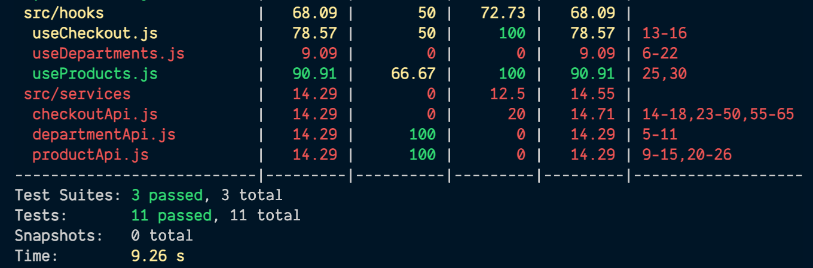
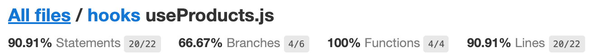
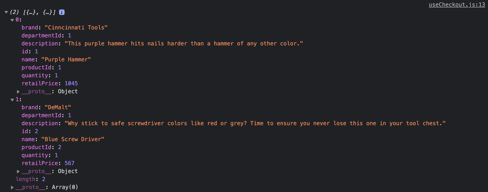
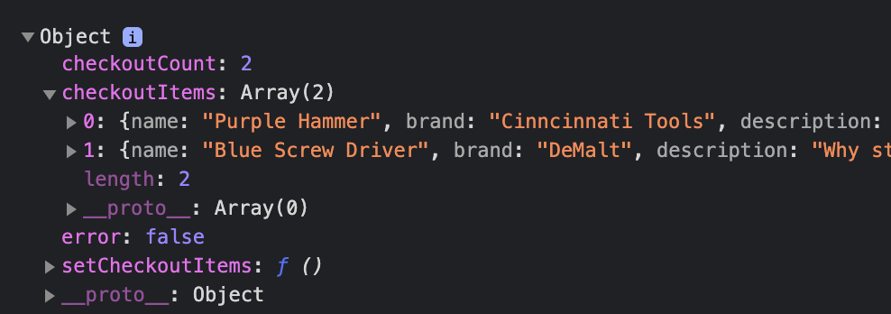
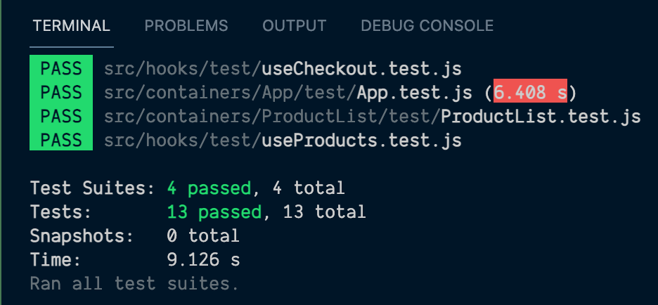
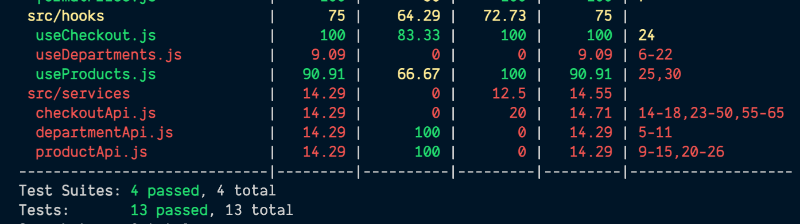
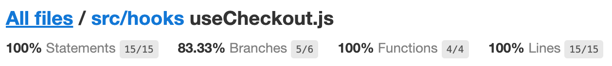

# Test Hardware Handler's custom hooks

Integration testing React Custom Hooks is a little bit different than testing functional components because these hooks don't have to be tied to a specific component. But not to worry, React Testing Library's `@testing-library/react-hooks` package will help us handle them.

**We'll go through the hows and whys of testing custom hooks in our React application in this lesson, so you'll be ready to tackle any hooks you may come across.**

### The useProducts.js Hook is a good hook to start with

Since our custom hooks aren't tied tightly to a particular component (the whole point of them is decoupled, reusable functionality), and they live in their own separate `hooks/` folder inside of our app, to test them, I like to create a `test/` folder to group all the hook tests together.

#### Make a new test folder and file for our custom hooks

To get us going, let's make a new `test/` folder inside of the `hooks/` folder and create our first test file.

Keep it explicit about exactly which custom hook is being tested by naming the new file something like: `useProducts.test.js`.

From here, we can get started on our tests for the `useProducts` Hook.

#### Set up our test file

Unlike our other test lesson, which used the `@testing-library/react` library for methods like `render` and `fireEvent`, this custom hook is going to use the [`@testing-library/react-hooks` library](https://github.com/testing-library/react-hooks-testing-library#the-problem).

Just like the first testing library, this hooks library aims to provide a testing experience as close as possible to natively using a custom hook from within a real component.

**Define a render hook helper function**

The key method we need from this hooks library is called [`renderHook`](https://react-hooks-testing-library.com/reference/api#renderhook).

To make use of it, we'll import it at the top of our file, then create a reusable helper function to render our hook without having to copy all the required boilerplate for each of our tests.

```javascript
import { renderHook } from '@testing-library/react-hooks';
import { useProducts } from '../useProducts';

const renderUseProductsHook = async () => {
  const { result, waitForNextUpdate } = renderHook(() => useProducts());
  await waitForNextUpdate();
  return { result, waitForNextUpdate };
};
```

Okay, let's talk about what's happening up above in this `renderUseProductsHook` function.

When we're rendering a function component with JSX, we can just pass any props and mock any data that component needs. For custom hooks, however, we have to create and render the hook to test and mock any variables or functions being passed into the hook (there are none in the case of the `useProducts` Hook).

Once that's done, we'll call the `renderHook` method we imported from the testing library and create an instance of the hook to test (`useProducts`) inside of that method. It's in here that we'd pass any previously defined mocks or variables required by the hook.

From the `renderHook` function, we destructure two objects: the `result` and the `waitForNextUpdate` function.

[`waitForNextUpdate`](https://react-hooks-testing-library.com/reference/api#waitfornextupdate) is a function that returns a Promise that resolves the next time the hook renders. We need this function to run after the first `renderHook` function to wait for React to update. This is because React Testing Library can't wait for the DOM to update because there is no DOM when testing custom hooks.

Finally, the `result` and the `waitForNextUpdate` variables are returned from the function because we need them for our actual tests.

By defining all of this within a helper function, we can call this function from all of our tests and save ourselves the duplicate code to make these hooks.

Time to move on: let's put this function into practice.

**Mock the product API**

Another piece of setup we need to do for this hook test is mocking the `productApi` function that the hook calls: the `getAllProducts` function.

Since our hook will call this function every time it's run, it makes sense to wrap our data in a `beforeEach` function.

First, we'll write our generic `describe` block for these tests to live within:

{lang=javascript,crop-start-line=13,crop-end-line=13}
<<[src/hooks/test/useProducts.test.js](../lesson_07.02/protected/source_code/hardware-handler-7-ending/client/src/hooks/test/useProducts.test.js)

Then we'll set up our mock where we spy on the `productApi` and the data we expect to be returned from the mock.

{lang=javascript,crop-start-line=14,crop-end-line=53}
<<[src/hooks/test/useProducts.test.js](../lesson_07.02/protected/source_code/hardware-handler-7-ending/client/src/hooks/test/useProducts.test.js)

And if we set up a `beforeEach`, we need to set up an `afterEach` to clean up and reset our mocks for each test.

{lang=javascript,crop-start-line=56,crop-end-line=58}
<<[src/hooks/test/useProducts.test.js](../lesson_07.02/protected/source_code/hardware-handler-7-ending/client/src/hooks/test/useProducts.test.js)

I think now we can get to testing our hook — finally!

**Test that products and brand filters return from the hook**

Our hook returns three separate pieces of info, but two of the pieces — the products and the filters by brand name — are tied together. As long as the product API returns data, both of those pieces of information can be determined from it. So it makes sense to me to test for both of those pieces of info together.

Here's how we'll approach these tests: we'll render our custom hook using the helper function we defined and destructure the `result` object from it.

From the `result` object, we'll look for the `products` and `filtersByBrand` properties and compare their values against our mocked data set that we composed in our previous lesson in the `mockDataSet.json` file.

Not only will we check the length of both variables to ensure they match our mocked data, but we'll also use the [Jest method `toStrictEqual`](https://jestjs.io/docs/expect#tostrictequalvalue) to test that the objects have the same values and structure.

If we want to, we can even check that the `error` still has the value of `false` in this test.

Here's what my test looks like.

{lang=javascript,crop-start-line=60,crop-end-line=68}
<<[src/hooks/test/useProducts.test.js](../lesson_07.02/protected/source_code/hardware-handler-7-ending/client/src/hooks/test/useProducts.test.js)

As you can see, once the `result` object is rendered from our custom hook, making checks against the data returned is pretty easy and similar to things we might check in a typical functional component.

Ready to move on to when our `productApi` call throws an error?

**Test if the product API fails, the hook returns an error**

For this test, we'll override our expected `getAllProductsMock` with a custom one that throws the error from the server instead of returning data.

Once more, we'll then render the hook, extract the objects from the `result.current` object, and check the values are what we expect when this `getAllProducts` API call fails.

Here's how I'd write this second test.

{lang=javascript,crop-start-line=70,crop-end-line=78}
<<[src/hooks/test/useProducts.test.js](../lesson_07.02/protected/source_code/hardware-handler-7-ending/client/src/hooks/test/useProducts.test.js)

That looks pretty sensible, right?

### Run code coverage for our new hook test

As a gut check, let's run our new test file and check the code coverage for this custom hook now.

```shell
cd client/ && yarn coverage
```

Here's the terminal's code coverage output.



And here's the more detailed coverage report in the browser. I like what I'm seeing — the new file we've tested continues to break the 90% mark for lines tested. Looking really good.



Time to move on and test another one of our custom hooks for practice. I'm thinking the `useCheckout` Hook this time.

### Test the useCheckout.js Hook

The `useCheckout` Hook is responsible for showing what (if any) items are in our checkout currently, the count of those items, and any errors that might happen when trying to fetch the data from the checkout API.

#### Make a new useCheckout.test.js

We've already created our `test/` folder for all our custom-hook-related tests, so the only thing we need to do this time around is to add a new test file for the `useCheckout` Hook.

Inside our `test/` folder create a new file named `useCheckout.test.js`.

**Create a new render hook helper function**

Our new test file is present, so now it's time to set up a new render hook helper function that we can use for all the tests we write for this `useCheckout` Hook.

As before, we'll import the `renderHook` method from our testing library and the `useCheckout` Hook at the top of this test file to start.

```javascript
import { renderHook } from '@testing-library/react-hooks';
import { useCheckout } from '../useCheckout';
```

Then we'll make the new `renderUseCheckoutHook` function. Just like our other custom hook test, we'll call the `renderHook` function inside of our function and pass our actual `useCheckout` Hook within it. We'll also extract the `result` and `waitForNextUpdate` functions.

{lang=javascript,crop-start-line=7,crop-end-line=14}
<<[src/hooks/test/useCheckout.test.js](../lesson_07.02/protected/source_code/hardware-handler-7-ending/client/src/hooks/test/useCheckout.test.js)

One key difference for this hook, though, is that the actual `useCheckout` Hook takes in an argument: a boolean we named `checkoutUpdated`. To make this work, we have to define a variable inside of the helper function and then pass it to the hook when we call it, hence, the `checkoutUpdated` variable on line 8.

> **Functions can be mocked in a hook helper function too**
>
> If we had a function being passed in to the hook, we could mock that just as easily as we can mock a variable. We just use [Jest's `fn` method](https://jestjs.io/docs/jest-object#jestfnimplementation) to mock the function and make it happen.
>
> ```javascript
> const setSomeFunction = jest.fn((v) => v + 42);
> ```

Great. Our helper function is composed; let's set up a little data in our first `describe` block.

**Describe the hook and mock our checkout API response**

When we look at our `useCheckout` Hook, we can see that it's making one API call inside the hook, so we need to mock that before we call the hook in our test.

But first things first: import our API into the test file and write our `describe` block to test this hook.

```javascript
import * as checkoutApi from '../../services/checkoutApi';
import { useCheckout } from '../useCheckout';

describe('the useCheckout Hook', () => {});
```

Next, we can write the mock for the checkout API's `getAllCheckoutItems` call.

Like I did before, I used the actual application to figure out exactly what needed to be in the mock (which happens to just be an array of products, but it never hurts to check).

In the `useCheckout.js` file, in between lines 12 and 13, I inserted a `console.log(allCheckoutItems)`, and here's what I saw in the DevTools in the browser.



From this info, we can create our mocks with accurate data.

We'll first define the spy for our actual API call inside of the `describe` block.

{lang=javascript,crop-start-line=16,crop-end-line=20}
<<[src/hooks/test/useCheckout.test.js](../lesson_07.02/protected/source_code/hardware-handler-7-ending/client/src/hooks/test/useCheckout.test.js)

And after that, wrap the actual mocked data inside of a `beforeEach` method.

{lang=javascript,crop-start-line=22,crop-end-line=45}
<<[src/hooks/test/useCheckout.test.js](../lesson_07.02/protected/source_code/hardware-handler-7-ending/client/src/hooks/test/useCheckout.test.js)

Don't forget the `afterEach` to clean up our mocks after each test runs, too.

{lang=javascript,crop-start-line=47,crop-end-line=49}
<<[src/hooks/test/useCheckout.test.js](../lesson_07.02/protected/source_code/hardware-handler-7-ending/client/src/hooks/test/useCheckout.test.js)

We should now have everything we need in this file to make our hook render correctly.

**Update our mocked data JSON file**

There's one more set of data we need to add to our `dataSet.json` file where we've been holding our reusable data for various tests.

We need to add some items we'd expect to see returned from the `useCheckout` Hook so we can verify that when the test runs, the same data will come back from the mocked data we're passing in.

To make sure I got the checkout info right, I added a `console.log` statement in our `App.js` file right after the line where we call the `useCheckout` Hook.

```javascript
const { checkoutCount, checkoutItems, setCheckoutItems, error } = useCheckout(
    checkoutUpdated
  );
  console.log({ checkoutCount, checkoutItems, setCheckoutItems, error });

  useEffect(() => {
```

And here's the response we should see in the browser's DevTools.



Knowing what the `useCheckout` Hook returns, we can add mocked data that will match what would be returned if our test hook works as we expect with the mocked data we're giving it.

So, add the following JSON data to the `mockDataSet.json` file:

{lang=json,crop-start-line=50,crop-end-line=73}
<<[src/__mocksData__/mockDataSet.json](../lesson_07.02/protected/source_code/hardware-handler-7-ending/client/src/__mocksData__/mockDataSet.json)

Finally, import this newly updated JSON file into our test so that we can verify results against it.

{lang=javascript,crop-start-line=3,crop-end-line=5}
<<[src/hooks/test/useCheckout.test.js](../lesson_07.02/protected/source_code/hardware-handler-7-ending/client/src/hooks/test/useCheckout.test.js)

Yes. We're ready now — data setup for our tests is complete!

**Test that checkout items and checkout count return from the hook**

After all that prep, I bet you're as ready as I am to actually write a test, so let's not waste any more time.

As with our other tests, the first thing we'll want to test is: if the `getAllCheckoutItems` API returns checkout data, do the results it produces match what we'd expect in the real application?

In this test, we want to verify that the `checkoutItems` and `checkoutCount` variables produced from the API call's returned data match what is in our mocked JSON data we just added to the test file.

Here's how we can write this test.

{lang=javascript,crop-start-line=51,crop-end-line=57}
<<[src/hooks/test/useCheckout.test.js](../lesson_07.02/protected/source_code/hardware-handler-7-ending/client/src/hooks/test/useCheckout.test.js)

Above, the three variables of `checkoutCount`, `checkoutItems`, and `error` are destructured from the `results` object, and their values are compared to the `mockData`, which is the same shape as production data, just with mocked data for clarity.

**Test an error is returned when the checkout API call fails in the hook**

Nice. Let's test what happens when our `checkoutApi` call fails to return data.

In the event that the API call fails, the `getAllCheckoutItems` call returns an error constant: `FETCH_CHECKOUT_PRODUCTS_ERROR`.

So we'll import the constant.

{lang=javascript,crop-start-line=1,crop-end-line=3}
<<[src/hooks/test/useCheckout.test.js](../lesson_07.02/protected/source_code/hardware-handler-7-ending/client/src/hooks/test/useCheckout.test.js)

And then, we can override our original API call mocked data with a new mock only for our new test that returns the error instead of data (just like the real API call would).

{lang=javascript,crop-start-line=59,crop-end-line=67}
<<[src/hooks/test/useCheckout.test.js](../lesson_07.02/protected/source_code/hardware-handler-7-ending/client/src/hooks/test/useCheckout.test.js)

For this test, after we destructure the `results` object from our rendered hook, we'll still check the same variables, but this time, `checkoutCount` will be 0, `checkoutItems` will be an empty array, and the `error` boolean should be `true`.

If you're not already running these tests with the Jest CLI test watcher to see how the tests are faring, fire it up now.

```shell
cd client/ && yarn test
```

Everything looking good on your end like it is on mine?



### Rerun code coverage

Final step for this lesson: let's rerun our code coverage report and make sure we've reached 80% or above for these hooks.

```shell
cd client/ && yarn coverage
```



The terminal code coverage report looks really good: 100% code coverage for our `useCheckout` Hook?!

And if we double-check the details in the browser:



Excellent! That's really awesome to see.

### What's next?

I hope you feel better about how to test custom hooks with React Testing Library.

It's a little different due to the new test library we're using and the fact that we can't wait for a virtual DOM to update, but once you see the pattern of creating a helper function that multiple tests can take advantage of, it's not so different from testing our functional components.

If you'd like to test your skills, go ahead and try writing tests for the `useDepartments` custom hook.

For us, it's time to move on and test the services layer of our apps. These tests will rely less on RTL and more on Jest to ensure that our API calls behave as expected when they succeed and fail.

Definitely an important piece of the enterprise app experience: very little of our data is hardcoded; it's most likely supplied by an API.

---
