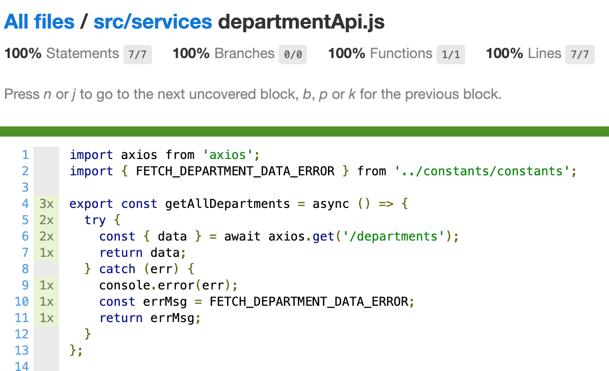
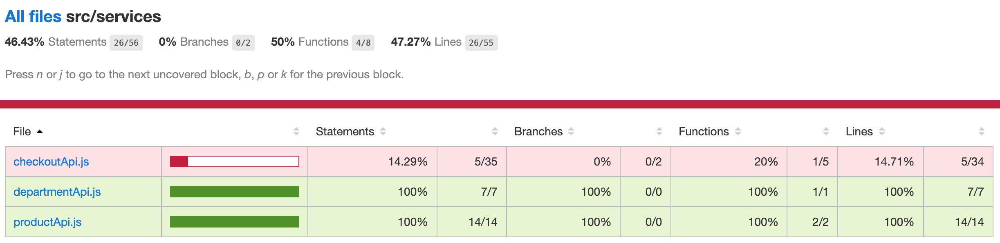

# The Jest Testing Framework will make testing our API service layer possible

As you can see by examining the structure of our app, I like to keep the API calls in a `services/` folder separate from the components relying on them to supply data.

The reasons for this are twofold:

- The first is to organize and centralize API calls in one place in our app.

  - No matter what component needs to make an API call, or if a developer on the team needs to add a new one, they'll know exactly where to go to find and extend all the calls.
  - At the same time that they're all together in a folder, I also like to keep the calls in separate files grouped together based on the API routes they're using to access data. For example, all API calls related to our checkout are together in one service file, and if we had a user service, all the calls related to that would be in a separate file inside of our `services/` folder.

- The second reason is that decoupling our API calls from particular components within the app makes everything easier to test.

  - This separation of concerns — components versus the implementation to get the data — makes integration testing (and refactoring, for that matter) easier and more straightforward.

**In this lesson, we'll learn how to test JavaScript files that don't directly interact with DOM and React components. Step aside React Testing Library — it's time for Jest to shine.**

### Set up a test file for our services folder

For consistency's sake, we'll set up the tests for our service calls similar to how we set up testing for our custom hooks: in a `test/` folder nested inside of our `services/` folder.

This way, we keep the precedent we've been setting for our app — tests not tied to a particular React component or container get grouped together inside of a `test/` folder for easy discovery and access.

In our IDE, let's go to the `services/` folder inside of our `client/`'s `src/` folder and create a new folder named `test/`.

### First, let's test the department API

Now that our `test/` folder is in place for the service layer of our React app, we can start writing tests for our various services.

As mentioned earlier in the lesson, the way that I like to divide up service files is based on related API call routes, hence the three services in our app for departments, products, and the checkout.

To start us off easy with API testing, let's tackle our simplest API: the `departmentApi.js` file.

Inside our new `test/` folder, create a new file named `departmentApi.test.js`.

**Import our Axios dependencies**

Our new test file is going to need a couple of imports before we can get started with the tests.

When we look at the actual service files, we can see the [`axios` library](https://axios-http.com/) is used to make API calls easier. Axios provides a whole host of additional benefits that the [browser's native `fetch` API](https://developer.mozilla.org/en-US/docs/Web/API/Fetch_API) does not, but that's beside the point of this lesson.

One thing that Axios does not make very easy on its own is mocking requests and responses for integration testing purposes. To simplify this process, we're going to add another npm library named [`axios-mock-adapter`](https://www.npmjs.com/package/axios-mock-adapter).

This library makes mocking Axios requests easy, and I'm excited to show you how we can make it work for us.

So, let's save this `axios-mock-adapter` library to our project's `devDependencies`.

```shell
cd client/ && yarn add axios-mock-adapter --dev
```

Double-check our `package.json` file has the library — it should be right after the testing libraries in our `devDependencies`.

{lang=json,crop-start-line=50,crop-end-line=57}
<<[client/package.json](../lesson_07.02/protected/source_code/hardware-handler-7-ending/client/package.json)

And once that's confirmed, we'll add the following imports to our `departmentApi.test.js`: `axios`, `axios-mock-adapter`, and the `departmentApi` (of course).

```javascript
import axios from 'axios';
import MockAdapter from 'axios-mock-adapter';
import * as departmentApi from '../departmentApi';
```

**Make our describe block**

We've got access to `axios` and our mock library now in our test file, so it's time to set up the `MockAdapter` object to make our mock calls simple.

We'll make a `describe` block to wrap around all our tests.

```javascript
describe('testing department API service', () => {}
```

Right inside of that, declare a variable called `mock`, and inside of a `beforeEach`, we'll instantiate a default instance. Then, any tests that call this instance inside of our tests will access this object instead of trying to call the real `axios` API, which might not have access to the right data to successfully complete the API call every time the tests run.

{lang=javascript,crop-start-line=7,crop-end-line=12}
<<[src/services/test/departmentApi.test.js](../lesson_07.02/protected/source_code/hardware-handler-7-ending/client/src/services/test/departmentApi.test.js)

**Check that when getAllDepartments succeeds, the department data is returned**

We're ready to test now.

In the actual `departmentApi` service, the `getAllDepartments` call is designed to return all the departments present in our app.

It just so happens we have this data mocked in our `mockDataSet.json` file, so we can use that as the mocked data our API call should return.

First, import the mocked data into the test file.

{lang=javascript,crop-start-line=4,crop-end-line=5}
<<[src/services/test/departmentApi.test.js](../lesson_07.02/protected/source_code/hardware-handler-7-ending/client/src/services/test/departmentApi.test.js)

And then, write a new test that if the Axios call returns department data successfully, this mocked department data is the data that will return. When the `/departments` endpoint is called by the mock, we'll tell it to reply with a 200 HTTP response and the `mockAllDepartments` variable we defined on the line above.

{lang=javascript,crop-start-line=13,crop-end-line=15}
<<[src/services/test/departmentApi.test.js](../lesson_07.02/protected/source_code/hardware-handler-7-ending/client/src/services/test/departmentApi.test.js)

Finally, call the `departmentApi.getAllDepartments` function and check the response that it gives back — the variable we define as `actualDepartments` — is the same as our `mockAllDepartments` variable.

{lang=javascript,crop-start-line=16,crop-end-line=18}
<<[src/services/test/departmentApi.test.js](../lesson_07.02/protected/source_code/hardware-handler-7-ending/client/src/services/test/departmentApi.test.js)

Not so bad, right?

I> Take note that all of these tests will contain `async/await` syntax because they're all making API calls, which are always asynchronous.

**Test when the API call fails an error message is returned**

Just like when we've tested our other components and hooks, we want to integration test the `getAllDepartments` call when it succeeds in fetching data and when it fails.

So we need to add a second test to this file when the latter scenario occurs and department data can't be fetched. For this API, when department data is unavailable, an error message is returned instead.

Write a new test describing this purpose:

{lang=javascript,crop-start-line=20,crop-end-line=20}
<<[src/services/test/departmentApi.test.js](../lesson_07.02/protected/source_code/hardware-handler-7-ending/client/src/services/test/departmentApi.test.js)

Where we previously mocked department data, we'll mock the `FETCH_DEPARTMENT_DATA_ERROR` constant instead (don't forget to import it at the top of this test file). When the endpoint is called this time, that error will be returned along with a 500 HTTP response.

{lang=javascript,crop-start-line=21,crop-end-line=22}
<<[src/services/test/departmentApi.test.js](../lesson_07.02/protected/source_code/hardware-handler-7-ending/client/src/services/test/departmentApi.test.js)

Call the `getAllDepartments` function once more, and compare the error messages.

{lang=javascript,crop-start-line=23,crop-end-line=25}
<<[src/services/test/departmentApi.test.js](../lesson_07.02/protected/source_code/hardware-handler-7-ending/client/src/services/test/departmentApi.test.js)

I> **Don't fear the red error message in the console**
I>
I> When you run this second test, you may notice a giant red error in the console after this test runs.
I>
I> It's actually nothing to worry about. It occurs because there's a `console.error()` in the actual API call, and it's just printing out to the terminal what happened when the call failed.
I>
I> If you comment out the `console.error()` line in the API and run the test once more, the error message that appears during the test should disappear.
I>
I> Either way, it's nothing to be concerned about, just a warning message. The test passes, which is what we care most about.

See how straightforward the `axios-mock-adapter` library can make our testing efforts? As long as we mock the same route our named API call uses, we can define exactly what it should return every time.

Not only that, but with the `axios-mock-adapter`, we can do things like chain multiple API calls together with different responses, define particular network errors as the desired response, use regex to match API routes, and more. I highly encourage you to check out the [documentation](https://www.npmjs.com/package/axios-mock-adapter#example) to see how full-featured it is.

If we run our code coverage now and check the `departmentApi.js` file's code coverage in the browser, you should be pretty pleased with our results. It's hard to beat 100%.



#### Let's test the product API next

Okay, let's tackle another service layer file. This one will be a little more challenging than the last. We'll target the `productApi.js` file.

**Set up our new product test file**

Our second set of service-level tests should feel more familiar after all the other integration tests we've written up to this point.

Start it off a new test file named `productApi.test.js`, and import the `axios` library, the `axios-mock-adapter` library, and the `productApi` file in our test file.

```javascript
import axios from 'axios';
import MockAdapter from 'axios-mock-adapter';
import * as productApi from '../productApi';
```

**Test the first API call to get all products successfully**

At this point, we can write our `describe` block to wrap all our tests and set up our local `mock` object that the tests can rely on for their API calls. Recall how to do this from earlier in this lesson?

Our first couple of tests should be quite similar to the tests we just wrote for the `departmentApi.js` file if you want to reference that as a guide now.

{lang=javascript,crop-start-line=11,crop-end-line=15}
<<[src/services/test/productApi.test.js](../lesson_07.02/protected/source_code/hardware-handler-7-ending/client/src/services/test/productApi.test.js)

With our mock created, we can write our first test. After checking the API calls present in our `productApi.js` file, the first call there is for `getAllProducts`.

When that endpoint is called, we'll use the mock data from our `mockDataSet.json` file to return product data.

Import the mock file.

{lang=javascript,crop-start-line=8,crop-end-line=9}
<<[src/services/test/productApi.test.js](../lesson_07.02/protected/source_code/hardware-handler-7-ending/client/src/services/test/productApi.test.js)

And set up the test and our mock inside of our `describe` block. Just like with our tests for the `getAllDepartments` API call, we just need to set the `mockAllProducts` variable equal to the array of mocked product data in our `mockDataSet.json` file. When the route is called, the mock will return that array of data.

{lang=javascript,crop-start-line=17,crop-end-line=19}
<<[src/services/test/productApi.test.js](../lesson_07.02/protected/source_code/hardware-handler-7-ending/client/src/services/test/productApi.test.js)

In the end, we'll finally have the test call the API function and check that its result is the same as our mocked result.

{lang=javascript,crop-start-line=20,crop-end-line=22}
<<[src/services/test/productApi.test.js](../lesson_07.02/protected/source_code/hardware-handler-7-ending/client/src/services/test/productApi.test.js)

Perfect.

**When the API call fails, test the error returned**

Just like how we tested the other file, we'll need to test this API call when an error is thrown from the server it's attempting to retrieve data from.

If you'd like to, now could be a good time to try writing this test on your own — it's very similar to the failing test we wrote for our `departmentApi` test.

Here's how I would approach this test: set up the test and mock the error that is returned when it fails (import this error constant into the test file).

{lang=javascript,crop-start-line=24,crop-end-line=26}
<<[src/services/test/productApi.test.js](../lesson_07.02/protected/source_code/hardware-handler-7-ending/client/src/services/test/productApi.test.js)

After the setup, call the API and confirm the responses match.

{lang=javascript,crop-start-line=27,crop-end-line=29}
<<[src/services/test/productApi.test.js](../lesson_07.02/protected/source_code/hardware-handler-7-ending/client/src/services/test/productApi.test.js)

**Test our POST call in the product API service when it succeeds**

The second set of tests we write for the POST that adds a new product to our list will require a slightly different setup to properly test.

We'll go through this step by step, though. Our first step will be to write a test wrapper statement.

{lang=javascript,crop-start-line=31,crop-end-line=31}
<<[src/services/test/productApi.test.js](../lesson_07.02/protected/source_code/hardware-handler-7-ending/client/src/services/test/productApi.test.js)

Looking at what this `addNewProduct` API call takes in, it requires a `productToAdd` argument in order to work.

So, next we'll mock that new product data. We don't already have an existing mock for this data in our JSON file, so we'll need to define it here.

There's no validation like checking department number or if the product already exists in the database or anything like that, so pretty much any data we mock here should work. The data I mocked just so happens to align with the mocked departments and some of the existing products in our JSON file (but it doesn't have to).

{lang=javascript,crop-start-line=32,crop-end-line=38}
<<[src/services/test/productApi.test.js](../lesson_07.02/protected/source_code/hardware-handler-7-ending/client/src/services/test/productApi.test.js)

Once that mock is defined, we'll make our mocked POST call where we pass the `mockNewProductData` object we just instantiated into the `mock.onPost` method call right after the products route is declared.

Our `.reply` method remains the same as all the others we've written: an HTTP call and a success message constant that we'll import at the top of this file.

{lang=javascript,crop-start-line=40,crop-end-line=42}
<<[src/services/test/productApi.test.js](../lesson_07.02/protected/source_code/hardware-handler-7-ending/client/src/services/test/productApi.test.js)

And we call the actual `addNewProduct` endpoint (while passing our mocked new product) and check it returns the same success message as a response.

{lang=javascript,crop-start-line=43,crop-end-line=45}
<<[src/services/test/productApi.test.js](../lesson_07.02/protected/source_code/hardware-handler-7-ending/client/src/services/test/productApi.test.js)

Following along still?

**If the new product can't be added, test the call fails**

Last test to write: what happens when adding a new product to the list fails.

Since it doesn't really matter this time what our `productToAdd` argument is when it's passed to the mocked function, we won't bother to make a mocked item for this test. We'll just write the test and the mocked POST failure right off the bat.

{lang=javascript,crop-start-line=47,crop-end-line=48}
<<[src/services/test/productApi.test.js](../lesson_07.02/protected/source_code/hardware-handler-7-ending/client/src/services/test/productApi.test.js)

This failing test should just return a 500 HTTP call and the `ADD_NEW_PRODUCT_ERROR` constant (which should also be imported at the top of the file).

With this mock in place, we can now call the actual function and compare the results to our mocked error.

{lang=javascript,crop-start-line=49,crop-end-line=51}
<<[src/services/test/productApi.test.js](../lesson_07.02/protected/source_code/hardware-handler-7-ending/client/src/services/test/productApi.test.js)

And upon completing this test, we should have covered all scenarios for all our API calls in the `productApi.js` file. Hurray!

### Run our tests and code coverage

Let's run all our tests and check our code coverage after testing these API files and see where we're at now.



Look at that code coverage for those two service files. That looks great!

I hope after writing tests for two of our three services, you feel more confident about how to use Jest to test the non-React-centric pieces of our app.

If you'd like, you can take a crack at testing the `checkoutApi.js` file to help solidify what we've just covered. It would be a good challenge to test your understanding.

Otherwise, I'd say we're done with this lesson and this module. Great job!

Let's recap what we've learned over the last five lessons about integration testing. Then, we'll move on to more testing: this time of the bigger picture, the end-to-end variety.

---
