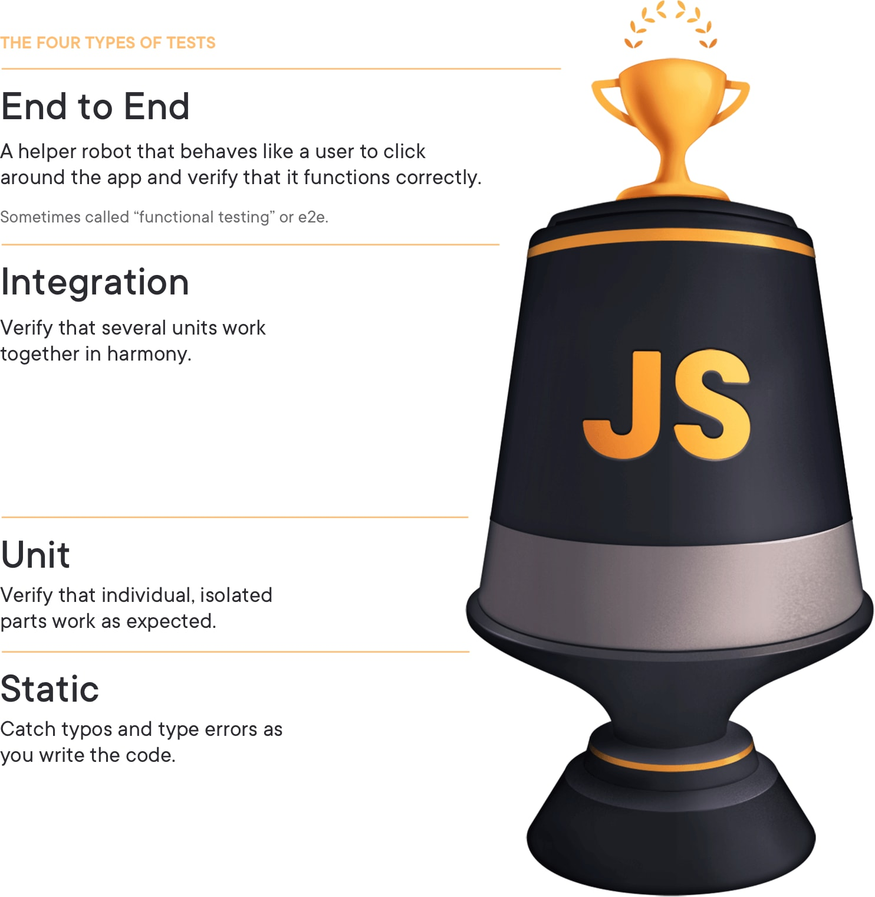

# Introducing end-to-end testing & Cypress.io

End-to-end testing is another tool in our tool belt as developers to confirm our app works for users the way it's intended to. And [Cypress.io](https://www.cypress.io/) is a simple, intuitive, incredibly powerful, and rapidly improving framework that makes the process of writing and running end-to-end tests much less of a pain than it used to be.

**In this lesson, we'll talk about the purpose of end-to-end testing and how Cypress is different (and better) than all the e2e testing libraries that have come before it.**

### End-to-end tests

In case you're less familiar with end-to-end testing and its purpose — especially when integration tests are already present in an application — let's talk a little about it.

**What are end-to-end tests? What unique problems do they solve?**

End-to-end testing is the process of testing software from start to finish as it will be used by the actual users.

While unit and integration tests can test small pieces of the app (often with mocked data), e2es can (sometimes) test against real databases, configurations, and external dependencies outside of the control of your application — things that could certainly influence an app's functionality but wouldn't necessarily be covered in other types of tests.

Additionally, e2es can test that everything in the UI is present and in the right place. They can determine if elements a user wants to interact with are visible or hidden, enabled or disabled, look and act the way they're supposed to, and give a pleasant user experience.

End-to-end tests serve as _another_ layer of protection for developers that the whole application works as expected.

As far as e2e testing goes, it's recommended that e2es test the mission-critical flows in an app — the flows that, if they don't work with an automated user, indicate they most likely won't work for a real user and need to be reviewed.

**The "testing trophy" strategy**

If you've been doing web development for a while, you may be familiar with the [**testing pyramid**](https://testing.googleblog.com/2015/04/just-say-no-to-more-end-to-end-tests.html), which has been in fashion since being displayed at the Google 2014 keynote.

The thinking with the test pyramid is like this: most tests should be unit tests, followed by a smaller set of integration tests, and finally topped off with a few end-to-end tests. A "pyramid" of tests.

Lately, however, there's a new shape that's catching on — especially when it comes to frontend framework testing: the [**testing trophy**](https://kentcdodds.com/blog/the-testing-trophy-and-testing-classifications), a term coined by Kent C. Dodds and inspired by Guillermo Rauch.

The trophy still has e2e tests as the smallest amount of tests, but it prioritizes more integration tests than unit tests and adds static tests to catch typos and type errors.

This sounds pretty good in theory, but let's talk about how we might put it into practice: concrete examples help some (myself included) understand things better.

**A test plan for e2es**

Let's take an example app (not ours — we'll get to that one in future lessons) and talk about an e2e testing strategy.

Imagine you've got an app for grocery shopping.

To use this app, a user might be able to:

- Log in to get coupons and see their shopping list
- Select their local store and see the items on sale there
- Add to a list of groceries they want to purchase
- Order groceries through the app for curbside pickup or delivery
- Select a date / time to pick up groceries ordered
- Add special instructions about the delivery
- Save a credit card in the system to pay for the groceries

That's a lot of functionality!

For all this functionality, though, we might only need a few end-to-end tests because we want our e2es to test the most important parts of an application in the way that a user might use it.

A test I might write could include:

- A user logs in
- Selects a store and checks for sale items
- Edits items on a shopping list
- Adds a credit card to be used for online payments
- Orders groceries for delivery and adds a delivery note
- Logs back out

The nice thing about e2es is that even though they're relatively few in number, there's a lot of functionality that can be packed into a single test because that's how they're _supposed_ to work. They're supposed to mimic what a real user would do.

A user wouldn't log in, edit a shopping list and log out, then log in again, add a credit card, and log out once more, and neither should end-to-end tests.

**When you're writing e2e tests, just focus on the most important things a user _must_ be able to do while in the app.**

And focus mostly on the happy path scenarios — e2es are too time-consuming to spend testing every possible edge case when things go wrong. That's better left to integration and unit testing.

Maybe filtering a grocery list isn't essential, but being able to store a form of payment is. Or adding a note or special delivery instructions doesn't need to work, but selecting a store does. That sort of thing.

You'll start to get a better feel for it as we write e2es in the next few lessons for Hardware Handler.

### The old e2e frameworks and their shortcomings

At this point, you may be wondering why there hasn't been more talk about end-to-end testing, and that's a great question. The answer is: because automated e2e testing has traditionally been very complicated and time-consuming.

The e2e testing frameworks of yesterday include [Selenium](https://www.selenium.dev/), [Protractor](https://www.protractortest.org/#/), and [Puppeteer](https://developers.google.com/web/tools/puppeteer), among others, and they were not very much fun to use (I speak from personal experience when I say this).

Here are some common complaints you might hear when discussing these automated end-to-end testing solutions:

- The initial setup to get the frameworks running isn't easy or straightforward.
- The syntax to write tests is often hard to parse and unintuitive.
- More than one library is needed to make the e2es work.
- Tests can be flaky and hard to debug exactly what's going wrong (because these tools can all run tests in [headless mode](https://www.telerik.com/blogs/what-is-headless-browser-testing-when-and-why-use-it), which makes them quicker to run and works with continuous integration build pipelines).
- Some e2e testing frameworks only work with particular JS frameworks (for instance, Protractor only works for Angular apps).

Even though the value of end-to-end testing is understood and agreed upon, the solutions available were less than enjoyable for development teams to use.

### How Cypress stands apart from the competition

Then in 2015, Cypress.io entered the fray of e2e solutions and began gaining ground quickly.

In addition to its [slick website](https://www.cypress.io/) and [very thorough documentation](https://docs.cypress.io/api/table-of-contents) and examples, there are some key differences Cypress can boast about that contributed to its massive popularity:

- **It does _not_ rely on Selenium under the hood like so many of its competitors.**

  Cypress was built from the ground up, so the issues plaguing Selenium don't apply.

- **It runs in the same run-loop as our applications, which reduces test flake.**

  By running the tests in the same event loop as the app itself, Cypress can retry its test commands synchronously while the application is waiting to continue. If a button is temporarily disabled while the app fetches more data, not a problem — Cypress will automatically try again. The button becomes enabled, and the test clicks it. The built-in retries are a big reason developers find Cypress tests more reliable than other frameworks because some of the testing flake is removed — not all, of course, but some.

- **The syntax for writing tests (which is completely done in JavaScript without language or driver bindings) is developer-friendly.**

  The way to write e2e tests is familiar, working with common testing syntaxes like `describe`, `test`, and `it`. The commands to actions and assertions like `click()` and `contains()` should feel quite familiar after our previous module working with React Testing Library.

- **Cypress is JavaScript framework-agnostic.**

  Got an app written in Next.js? Cypress can work with it. Have another one written in Hugo? Cypress can test that too. Vue, Angular, even older server-rendered applications can be tested with Cypress.

- **It comes bundled with everything you need to get started.**

  No extra libraries are required beyond Cypress itself to get tests up and running.

- **Debugging is much easier.**

  Because Cypress runs its tests in a browser, developers have access to the DevTools they know and love to debug what's going wrong. Errors and stack traces are readable and familiar, so you can see exactly what's happened, too.

- **It's much, much faster.**

  Cypress is built so that testing and development can happen simultaneously. Being able to see the app (for local test development), have access to DevTools, and see changes take effect in real time results in better, more well-tested code.

- **It works across multiple browsers and build pipelines.**

  Chrome, Firefox, Edge, and CI pipelines like GitHub Actions, CircleCI, Netlify Build, and more have Cypress-specific modules that allow for configuring Cypress installation, caching, and running on those providers with minimal configuration.

- **It allows for visual regression testing.**

  Cypress can perform various visual tests from screenshots, but it also integrates with other tools specifically made for visual testing at scale. Using these technologies together, teams can capture screenshots of the DOM and compare them with previous versions of the app to identify visual and functional defects in the app.

- **And it's getting better all the time.**

  In addition to Cypress's many free tools, there's also a paid [Dashboard Service](https://www.cypress.io/dashboard/) teams can take advantage of that brings in things like parallelization, automated load balancing, video recordings of any test run in full or at the point of failure, and more.

It's really remarkable what Cypress is capable of, and it's only improving. Between the open source community banding around Cypress Test Runner and contributing plugins to make it more useful and the core team providing ever more features for free and paid users, it seems the sky's the limit.

And I've barely scratched the surface of what Cypress can do — it's no wonder it's become the new favorite of the frontend e2e test world.

T> **Fun fact:**
T>
T> Some development teams have chosen to rely solely on end-to-end tests in Cypress. No unit tests, no integration tests.
T>
T> While I don't necessarily recommend you do the same, it should give you a pretty good indication of just how much web engineers trust Cypress as the tool to tell them their app is working as intended.

### Let's set up Cypress in Hardware Handler

In the next lesson, we'll get our app configured to run Cypress, and then I'll introduce you to how great the e2e testing experience can be.

---
