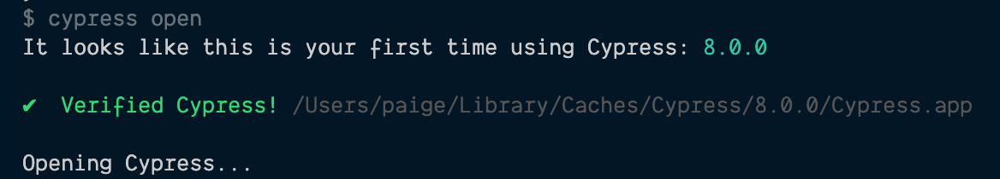
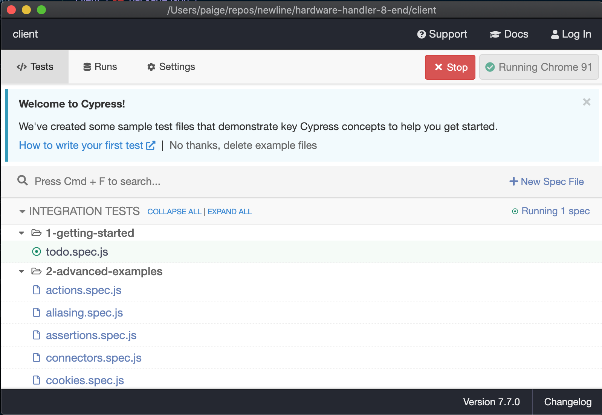
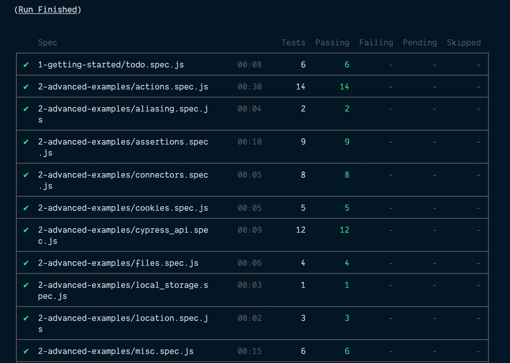

# Set up automated end-to-end testing in Hardware Handler

Like I was saying in the previous lesson, Cypress is really light years ahead of all the other end-to-end testing frameworks out there. And this even applies to its setup and integration into existing projects as well.

**This lesson will focus on adding Cypress.io to our React application and configuring it to run tests — both in headless and headed mode, depending on the need.**

I> **Sample code zip file**
I>
I> Need a fresh copy of the sample app _before_ we begin our end-to-end testing? You can download it **[here](./protected/source_code/hardware-handler-8.zip)**.

### Install Cypress in our app

We'll need to add Cypress as a dev dependency to Hardware Handler before we can start to take advantage of its capabilities.

So, open up a new terminal instance and run the following command to [install Cypress](https://docs.cypress.io/guides/getting-started/installing-cypress#Installing).

```shell
cd client/ && yarn add cypress --dev
```

The first time you install it, it will take a minute. There's a lot of good info, demos, and configuration that come along with the Cypress install, so be patient.

When it's done successfully, you'll see the new `"cypress"` library in your `package.json`.

{lang=json,crop-start-line=52,crop-end-line=60}
<<[client/package.json](./protected/source_code/hardware-handler-8-ending/client/package.json)

#### Verify Cypress works

After the initial install is done, we'll make sure it worked.

In your terminal, inside of the `client/` folder, type the following command:

```shell
yarn run cypress open
```

If everything goes according to plan, your terminal should recognize that this is the first time Cypress is fired up.



And after the welcome message, a new window containing the Cypress Test Runner should automatically open up and look something like this.



A nice, new inclusion in addition to the Cypress Test Runner itself is a whole suite of predefined tests showing how to do various different types of tests with Cypress.

T> **Don't discount the example files**
T>
T> This wasn't available when I first started using Cypress, but luckily, the documentation and examples have been good since the start.
T>
T> But if you were ever wondering how to do something and wanted a quick reference in actual tests you can modify, these samples are pretty helpful.

If you'd like to see the test runner in action, go ahead and click the **Run** button. This will kick off all the preconfigured tests and give you a taste of how Cypress operates.

A little later in this lesson, we'll go over all the various pieces of code that go into making these tests work and how they're organized.

#### npm scripts

With Cypress installed in our project, it's time to add a few scripts to our `package.json` to make it easier to run Cypress in a browser that's visible to us for active development and debugging and to run Cypress in "headless" mode — the same way it would run for in a CI build pipelines.

Inside of our `client/` folder's `package.json` file, add the following two commands to our `"scripts"` section.

{lang=json,crop-start-line=28,crop-end-line=31}
<<[client/package.json](./protected/source_code/hardware-handler-8-ending/client/package.json)

**cypress:open**

Our first new script: `"cypress:open"` does just what we did manually from the command line a section ago: it opens the Cypress test runner browser so that we can interact with our tests.

In addition to being able to debug and test code in the browser, this test runner lets us be very targeted and specific about which test suites we want to run.

For instance, if you're only adding tests to one particular suite (or know that the code you changed should only impact the functionality for one set of tests), you can select only those tests to run in the interactive test runner instead of waiting for them all to run (which is what happens by default in headless mode).

**cypress:run**

This script runs Cypress in headless mode. When it begins, all the tests will run, but we won't see anything on-screen besides what's being printed out in the terminal.

This is the command that would be run if we had it set up as a build step in a continuous integration (CI) pipeline.

Typically, there should be very little difference between a run in the visible test runner and a headless run here, but for debugging purposes, it's useful to have both commands within easy access.

If you'd like, we can test out our new scripts now.

Inside the `client/` folder in the terminal, run the following command:

```shell
yarn cypress:open
```

At this point, the test runner should open in a new browser window.

Go ahead and close this down. And in the terminal, once again, issue our other command:

```shell
yarn cypress:run
```

With this command, nothing much should change visually, but you should start to see e2e tests begin to print out in the console as tests run in headless mode.

Once all the tests have run, you'll see this nice, formatted printout in the terminal clearly showing what test suites passed and failed.



Good. Everything seems to be in order: Cypress is downloaded, our scripts to run it are set up and working, so let's take a few moments to look at the new folder structure that Cypress has added to our project for our e2e tests.

### The Cypress project structure

If you check out our `client/` folder now, you'll notice some new additions to it. You should see a new `cypress/` folder and a `cypress.json` file at the root of the folder.

Both of these were generated by Cypress when it was installed.

And if you expand the `cypress/` folder in your IDE, you'll see a bunch of folders nested inside of it, including `fixtures/`, `integrations/`, `plugins/`, and `support/`.


There's a couple of other folders in here also, but the contents of those are generated when the tests run. They contain video recordings of test runs and screenshots of failing tests or when the `cy.screenshot()` command is called. We'll add these folders to our `.gitignore` file shortly.

The folders to focus on, however, are the first four that I mentioned.

**Integrations**

The `integrations/` folder is where our test files will live — it's also the default folder Cypress will look in for test files unless we specify differently.

You can think of them as very similar to any of our integration test files, except instead of being named `xyz.test.js`, they'll have the naming convention of `xyz_spec.js`.

**Fixtures**

Test data goes inside of our `fixtures/` folder. It's where our mocked data to supply to tests — usually for responses from network requests — is stored.

The equivalent of this folder is our `__mocks__/` folder that supplies data for our integration tests.

**Plugins**

The `plugins/` folder contains a special file that executes in Node before the project is loaded, before the browser launches, and during your test execution.

While the Cypress tests execute in the browser, the `plugins/` file runs in the background Node process, giving tests the ability to access the file system and the rest of the operating system.

I have never used this folder in my own development, but it's worth noting.

**Support**

The file inside of the `support/` folder runs before every single spec file.

The `support/` folder is a great place to put reusable behavior such as custom commands or global overrides that we want applied and available to all of our spec files.

Examples of this might include a login sequence that's needed at the beginning of every test or mocked data the site needs to know from the beginning, like feature flags.

This is also the folder where I like to keep REST API mocks. You'll see what I mean when we get to writing tests for our own application.

Okay. We've talked about the most important folders. Let's move on and do a little more project config now.

### Update our .gitignore file

As I said earlier, there are a few generated folders when our Cypress tests run that we'll want to add to our `.gitignore` file — we don't need to commit them to our repo in GitHub.

The folders I'd recommend adding are the `screenshots/` and `videos/` folders.

So, go ahead and open up the `.gitignore` file and add the following two lines:

{lang=.gitignore,crop-start-line=14,crop-end-line=16}
<<[client/.gitignore](./protected/source_code/hardware-handler-8-ending/client/.gitignore)

That should take care of those files being added to our remote repo.

### Add ESLint to Cypress

Now, you didn't think we'd get through this lesson without adding at least one more linting file, did you? Of course not.

Naturally, Cypress has its own set of ESLint linters, and we're going to add them to our project.

First, we need to install two new libraries: the [**ESLint Plugin Cypress**](https://github.com/cypress-io/eslint-plugin-cypress) library and the [**ESLint Plugin Chai Friendly**](https://www.npmjs.com/package/eslint-plugin-chai-friendly) library.

**eslint-plugin-cypress**

This library has rules that enforce some of the recommended best practices for using Cypress — just like how the rest of our ESLint files enforce good React coding standards in our app code.

**eslint-plugin-chai-friendly**

The second library we're adding overrides the `no-unused-expressions` ESLint error to make it friendly towards chai `expect` and `should` statements.

It will eliminate our need to add inline ignore-statements in our tests like `// eslint-disable-line no-unused-expressions`.

Open up a terminal, `cd` into the `client/` folder, and run the following shell commands:

```shell
yarn add eslint-plugin-cypress --dev
yarn add eslint-plugin-chai-friendly --dev
```

Once they're added to our project as dependencies, we'll enable the plugins by adding them to a new `.eslintrc.json` file we'll create.

#### Create an .eslintrc.json file

Inside of the `cypress/` folder, create a new file and name it `.eslintrc.json`.

Lucky for us, both Cypress ESLint libraries have recommended configurations, so we don't even have to worry about individual rules or settings.

In the `.eslintrc.json` file, add the following lines:

{lang=json}
<<[cypress/.eslintrc.json](./protected/source_code/hardware-handler-8-ending/client/cypress/.eslintrc.json)

And we're done. Pretty simple, right?

### Delete the sample tests out of our Cypress folder

Last thing to do in this lesson: clean out our `cypress/` folder so that we've got a clean slate to write our tests on in the next lesson.

If you open up the Cypress test runner, there's an option to clear out all the tests. Go ahead and do so now.

After that, delete the three files in the `fixtures/` folder, and we'll be ready to roll.

In the next lesson, we'll talk through a couple of good e2e test flows for our application and then write them out just as we would for applications of any size.

---
