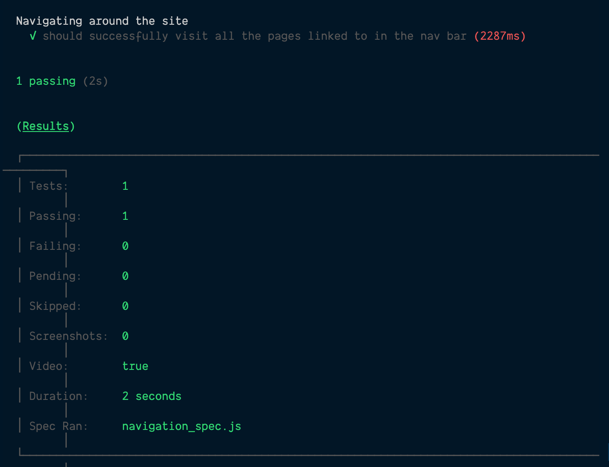
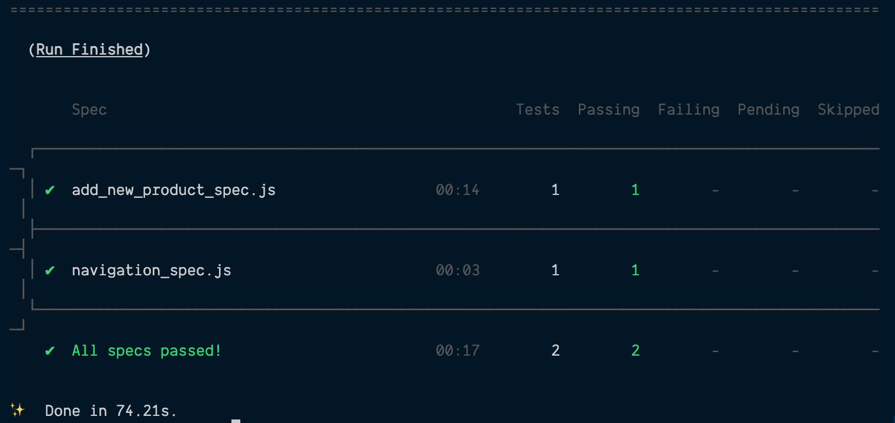

# Write end-to-end test flows

In the last lesson, we prepared Hardware Handler to use Cypress as its end-to-end testing framework and installed a few extra helper libraries to ensure that the tests we write are quality tests.

Now it's time to start writing those tests.

**In this lesson, we'll walk through adding a few end-to-end tests, getting into progressively more complex test setup and actions as we go.**

### Add a base URL for all Cypress tests

Cypress describes itself as a testing framework made to run during active development, and since that is its primary goal, it makes it easy to do some minor configurations, like setting a `baseUrl` property that automatically prefixes common Cypress commands like `cy.visit` and `cy.request` with this URL.

Open up the `cypress.json` file that was created at the root of our `client/` folder when we installed Cypress into the project. It should be an empty object right now, and go ahead and add the following property.

```json
{
  "baseUrl": "http://localhost:3000"
}
```

This simple line will prevent us from having to type `localhost:3000` over and over again as we add end-to-end tests that navigate around to different pages within the app.

Cool. With that little bit of setup done, let's write our first test.

### Create a new navigation_spec.js file

The first end-to-end test file I want to add — one that requires less pre-seeding of data and more generically tests our app's functionality — is to run the app and navigate to each page via the nav bar links and check each page loads.

So, let's make a new file inside of the Cypress folder's `integration/` folder named `navigation_spec.js`. This is where we'll write our first test using the very same `describe` and `it` test syntax we're already used to from the integration testing.

I> **For Cypress to work correctly, the app must already be running locally**
I>
I> Be aware that for Cypress to be able to run end-to-end tests locally, our app should already be running in a separate terminal window.
I>
I> Trying to start the server from a Cypress test is considered an [anti-pattern](https://docs.cypress.io/guides/getting-started/testing-your-app#Step-1-Start-your-server). You can read more about the reasoning behind this decision by Cypress [here](https://docs.cypress.io/guides/references/best-practices#Web-Servers).
I>
I> **Bottom line: just start the app locally before starting your e2e tests.**

#### Write a test for our site's nav links

Our first test isn't going to be fancy. It's also not going to be very complicated because we want to get a feel for how Cypress works and expects things to be structured. Let's just make a test to ensure that after our app loads, all of its links in the nav bar successfully move us between different pages in Hardware Handler, and those pages load. Should be simple enough.

Inside of our `navigation_spec.js` file, let's make a `describe` block and an `it` statement testing this functionality.

```javascript
describe('Navigating around the site', () => {
  it('should successfully visit all the pages linked to in the nav bar', () => {});
});
```

The first thing any of our tests will need to do is visit our locally running app, and from there, we can start clicking the nav links. Add two lines to our test to visit our app's home page, and we'll check that the page loads, and we can see the page title.

{lang=javascript,crop-start-line=2,crop-end-line=4}
<<[cypress/integration/navigation_spec.js](../lesson_08.02/protected/source_code/hardware-handler-8-ending/client/cypress/integration/navigation_spec.js)

Cypress's testing syntax feels pretty intuitive (to me, anyway). [`cy.visit`](https://docs.cypress.io/api/commands/visit) brings us to a particular URL in the app, and [`cy.get`](https://docs.cypress.io/api/commands/get) lets us target particular elements on the page (you can do it by HTML tag, element ID or class, `data` test attributes, and more), which we can then use in a variety of ways. In this first case, we'll check the text that's present in the DOM.

After we've confirmed the homepage has loaded, let's start targeting (and clicking) each nav link and making sure that each page loads. To do this, we'll use Cypress's `cy.get` to target each text link within the nav bar and click it, then check the `<h1>` element that's visible is the right one for that page.

Here's how I'd write this test to check that the **My Products** page loads.

```javascript
cy.get('.navbar-links-wrapper').within(() =>
  cy.contains('My Products').click(),
);
cy.get('h1').should('contain', 'My Products');
```

After this code takes us to the list of products page, we'll repeat the same process to check each of our other pages. So here's the rest of how that test would look, checking the **Add New Products** and **Checkout** pages.

```javascript
cy.get('.navbar-links-wrapper').within(() =>
  cy.contains('Add New Products').click(),
);
cy.get('h1').should('contain', 'Add A New Product');
cy.get('.navbar-links-wrapper').within(() => cy.contains('Checkout').click());
cy.get('h1').should('contain', 'Checkout');
```

And that's about all I want to do with this first test case. Now's the time to give our one test a try.

Start our app up locally in one terminal window if it's not already running:

```shell
cd client/ && yarn start
```

In a second terminal window, run the Cypress command:

```shell
cd client/ && yarn cypress:run
```

With any luck, the test to navigate around the site to various pages should pass.



#### Refactor our command to target nav bar links

After writing our first successful e2e, you might notice there's a bit of duplicate code here — the duplication I notice is how we're targeting each link in the nav bar.

This is a good opportunity to turn this bit of code into a reusable command that any Cypress test will be able to utilize.

**Make a `navigation_commands.js` support file**

To do this, let's head over into our `cypress/support/` folder and create a new `commands/` folder.

Inside of the new folder, make a new file named `navigation_commands.js`. In this file, we'll take the code we were using to target each nav link and make it into a reusable function in which we pass the link text to tell it which link to click.

Here's one way we could do that.

{lang=javascript}
<<[cypress/support/commands/navigation_commands.js](../lesson_08.02/protected/source_code/hardware-handler-8-ending/client/cypress/support/commands/navigation_commands.js)

**Add the new command to the `commands.js` file**

To make this function accessible in the whole testing suite, we also need to add this new file's exports to the `commands.js` file, also in the `support/` folder.

The `commands.js` file already has some sample commands commented out, but I'm just going to leave them for future reference and work around them.

First, import any and all navigation commands we've defined in our new `navigation_commands.js` file.

{lang=javascript,crop-start-line=10,crop-end-line=10}
<<[cypress/support/commands.js](../lesson_08.02/protected/source_code/hardware-handler-8-ending/client/cypress/support/commands.js)

Then, give that individual command a name that Cypress tests can use to reference it. Names similar to the function name itself are easiest to remember.

{lang=javascript,crop-start-line=27,crop-end-line=30}
<<[cypress/support/commands.js](../lesson_08.02/protected/source_code/hardware-handler-8-ending/client/cypress/support/commands.js)

With this completed, any Cypress test should be able to use this new custom command.

**Replace the test code with the custom command**

Back in our `navigation_spec.js`, we can replace each line targeting the nav bar links with our new `cy.goToPageFromNavBar` command. There are no extra imports required in the file to access this command — it works like any other built-in Cypress method.

Here is what the test will look like after all is said and done.

{lang=javascript}
<<[cypress/integration/navigation_spec.js](../lesson_08.02/protected/source_code/hardware-handler-8-ending/client/cypress/integration/navigation_spec.js)

Easier to read, right? And it's handy to know that any Cypress test file will be able to use this new method going forward.

Just to make sure things still run, give our e2e test another run, and we'll move on and write another one.

#### Test a user can add a new product

Another flow I'd consider critical to this application is the ability for users to add new products. So let's write a test that checks that this flow works correctly.

This is going to require some initial data seeding as well because when a user navigates to the **Add New Products** page, the `departmentApi` is called to get all the departments to display in the form's `Department` dropdown. Ready to set up some mock departments?

**Mock department data for the `getAllDepartments` API route**

Before we mock the API call to return departments, we need to make that department data.

Inside of our `fixtures/` folder, make a new file called `department_data.json`. This is where our mocked departments data will live.

Just like with the real department data, we'll return a list of departments with `id` and `name` properties. And since this app currently has no validations around the departments, I'll add two new departments that will only be present in our e2es: `Flooring` and `Patio Furniture`. Feel free to add whatever you'd like for these.

{lang=json }
<<[cypress/fixtures/department_data.json](../lesson_08.02/protected/source_code/hardware-handler-8-ending/client/cypress/fixtures/department_data.json)

Now with some mock department data, we can set up a mocked call to the department API to return this data.

**Set up a mock API call for the departments API**

Open up our `support/` folder, and make a new folder alongside the `commands/` folder named `service_mocks/`. In this folder, create a file named `department_mocks.js`. This is where all the mocks for our API calls will live.

Mocked API calls in Cypress tend to follow a similar pattern: use the [`cy.route`](https://docs.cypress.io/api/commands/route#Usage) method to define the route. Inside of the method, declare if it's a `GET`, a `POST`, etc., define the URL this mock should be matched to, define a `response` the function should return and an HTTP `status`, and then give the new `cy.route` object an alias to reference it (I tend to name it the same as the function name).

The `response` and `status` are optional — but if the function should return something after the mock is called, this is one way to do it. Likewise, if the real API call takes in an argument — like info for a form submission or query params for the URL — the additional function arguments get passed into the function before the arguments defining the `response` and `status`.

If it's still a little unclear, it should make more sense when we go through the code.

For our `getAllDepartments` API call, here is what the code for that mock will look like — just reference what the real `getAllDepartments` call is doing to inform you of how to construct this mock.

{lang=javascript}
<<[cypress/support/service_mocks/department_mocks.js](../lesson_08.02/protected/source_code/hardware-handler-8-ending/client/cypress/support/service_mocks/department_mocks.js)

Since `getAllDepartments` is a `GET` HTTP call, the only two arguments that can be passed to the mock function are the `response` from this call (the mocked department data we just defined and the `status`, which will default to 200 when not defined as otherwise).

The `url` property is pretty self-explanatory, and we'll pass the `response` and `status` in to the function ourselves.

Let's get to the actual test-writing part and see how this all comes together.

T> **Make mock files that match the real service API files**
T>
T> For mocking API calls, I prefer to make separate mock files to match the actual API files. In our project, which has three API files (`departmentApi.js`, `productApi.js`, and `checkoutApi.js`), I'd make three mock files to hold the different API call mocks.
T>
T> This is a simple way to keep the API calls organized within the Cypress tests.

**Create a new spec file and add seeded data**

Okay. Time to make this test.

We're going to create a new test file for this e2e, as it's concerned with different user interactions than our `navigation_spec.js`.

Back in the `integrations/` folder, create a new file named something like `add_new_product_spec.js` to denote what these tests will be all about.

Just as before, we'll make a `describe` block to begin our test suite. Unlike our previous e2e, we'll need to add a `beforeEach` code block to this test because in order for a user to be able to add a product, they're required to choose a department from the dropdown of potential departments.

Below is the code we'll set up to have our mocked department data available for our test to use.

{lang=javascript,crop-start-line=3,crop-end-line=14}
<<[cypress/integration/add_new_product_spec.js](../lesson_08.02/protected/source_code/hardware-handler-8-ending/client/cypress/integration/add_new_product_spec.js)

Let's talk about what's happening in this `beforeEach`. Right after our site is reached via the `cy.visit` method, [`cy.server`](https://docs.cypress.io/api/commands/server#Syntax) is called to start a server and begin routing responses to `cy.route` to change the behavior of the network requests.

`cy.server` is required for our mocked API calls to take effect. After that, we use the [`cy.fixture` method](https://docs.cypress.io/api/commands/fixture) to bring in the mocked `department_data.json` file we defined and reference its `departments` array to be returned in the callback when the function is called.

I> Make a note that we only have to import the mocked API call in this file. The mocked data in our `department_data.json` file is directly referenced within the `cy.fixture` method.

Now, that function is ready to be intercepted as soon as it's called, and it will return our mocked department data instead of the real department data. At this point, we'll use our new custom command `cy.goToPageFromNavBar` to get to the **Add New Products** page.

Finally, the [`cy.wait` method](https://docs.cypress.io/api/commands/wait) is passed the `@getAllDepartments` alias we defined in the `department_mocks.js` file. This function makes the Cypress test wait for the resource to be ready before moving on. It's probably unnecessary for the small amount of data we're passing, but if we were dealing with bigger, more complex objects, waiting for the data might be required.

I> **A quick way to tell if an XHR request is real or mocked**
I>
I> If you're not sure if an HTTP request you're attempting to stub is successfully being mocked or not, you can open the Cypress test runner and watch the test run.
I>
I> A successfully mocked request will have a tiny `XHR Stub` next to it when it's been intercepted and replaced with mocked data, whereas an HTTP request that is not mocked will just have `XHR` next to it in the test steps.

**Write the actual test**

With our pre-seeded data in place, we can now make our test that will fill in each input in our **Add a New Product** form and then submit that data.

We'll begin by describing what we're actually testing: filling out a form and successfully submitting it.

{lang=javascript,crop-start-line=16,crop-end-line=16}
<<[cypress/integration/add_new_product_spec.js](../lesson_08.02/protected/source_code/hardware-handler-8-ending/client/cypress/integration/add_new_product_spec.js)

Then, if we look at how the actual product API works that gets called when a new product is submitted, you'll notice it's a `product` object with a bunch of properties that match most of the inputs we'll need to fill in, so let's create an object that we can pass when we mock the API call and use it to fill in our form.

I declared a variable named `newToolInfo` to contain our mocked data. Notice that `departmentId` is included with this object, not a department name like what's selected in the dropdown (because this is what our API call requires).

{lang=javascript,crop-start-line=16,crop-end-line=24}
<<[cypress/integration/add_new_product_spec.js](../lesson_08.02/protected/source_code/hardware-handler-8-ending/client/cypress/integration/add_new_product_spec.js)

Okay, we need to mock our product API call of `addNewProduct` before we fill out the form in our test.

Head to the `service_mocks/` folder we made earlier in this lesson, and create a new file named `product_mocks.js`.

This mock for `addNewProduct` will look similar to the other mock we made for `getAllDepartments`. It still takes in a `response` and `status`, and we'll define a `method`, a `url`, and an alias by the same name as our function.

Contrary to our prior API call, this one is a `POST`, and it will accept a request body — the `newProductInfo` argument — although it won't actually do anything with it.

{lang=javascript,crop-start-line=1,crop-end-line=8}
<<[cypress/support/service_mocks/product_mocks.js](../lesson_08.02/protected/source_code/hardware-handler-8-ending/client/cypress/support/service_mocks/product_mocks.js)

With our mock in place, we can import it into our test file and pass the `newToolInfo` object we defined earlier. We'll also need to import our `ADD_NEW_PRODUCT_SUCCESS` constant because that's our `response` argument from this API.

Here are our imports at the top of the file.

{lang=javascript,crop-start-line=1,crop-end-line=2}
<<[cypress/integration/add_new_product_spec.js](../lesson_08.02/protected/source_code/hardware-handler-8-ending/client/cypress/integration/add_new_product_spec.js)

And below is the mock we define inside of our test right after `newToolInfo` is declared. This is definitely a call that we want to mock because otherwise, if we were running our e2es multiple times (or had many devs on the team all running them for their development branches), our local database of products could end up with hundreds or possibly thousands of the same test umbrella.

By intercepting the actual form request with a mock, we avoid that situation.

{lang=javascript,crop-start-line=22,crop-end-line=25}
<<[cypress/integration/add_new_product_spec.js](../lesson_08.02/protected/source_code/hardware-handler-8-ending/client/cypress/integration/add_new_product_spec.js)

At this point, we can begin to actually fill in our test form.

To pick one our mocked departments in the dropdown, we'll use the [`cy.select` method](https://docs.cypress.io/api/commands/select). To fill in each of the inputs requiring text, we'll use the [`cy.clear` method](https://docs.cypress.io/api/commands/clear) to clear any previous text in the input (just as a precaution), chained before [`cy.type` ](https://docs.cypress.io/api/commands/type), which will actually fill in the input. And we'll be able to use our `newToolInfo` object to provide most of the input values. After all the inputs are filled in, we'll click the button to add the product.

{lang=javascript,crop-start-line=27,crop-end-line=32}
<<[cypress/integration/add_new_product_spec.js](../lesson_08.02/protected/source_code/hardware-handler-8-ending/client/cypress/integration/add_new_product_spec.js)

When this button is clicked and the `POST` request to add a new product fires, our mock will take over and return us the `ADD_NEW_PRODUCT_SUCCESS` constant as the API response. We can then check that this response triggers our React Toastify success message in the browser.

{lang=javascript,crop-start-line=32,crop-end-line=33}
<<[cypress/integration/add_new_product_spec.js](../lesson_08.02/protected/source_code/hardware-handler-8-ending/client/cypress/integration/add_new_product_spec.js)

And that should be another e2e test done.

### Run all the end-to-end tests once more

This is the moment of truth. Run all our e2e tests and see how they do.

Restart your local development server, and in a separate terminal, fire up the Cypress tests.

```shell
cd client/ && yarn cypress:run
```

With any luck, your test run printed out to the terminal should look something like mine.



Congrats! That's how to write end-to-end tests with Cypress. It takes a little getting used to, but the syntax is easy to pick up (especially if you've used jQuery in the past), there are lots of handy methods, and the [documentation](https://docs.cypress.io/api/table-of-contents) really is well done and up-to-date.

Our next lesson will focus on Cypress Studio, an experimental feature that lets us generate tests within the Cypress Test Runner by recording interactions we make against the application.

Yes, you heard that right, you interact with the app, and Cypress writes tests mimicking your interactions. Have I piqued your interest?

---
