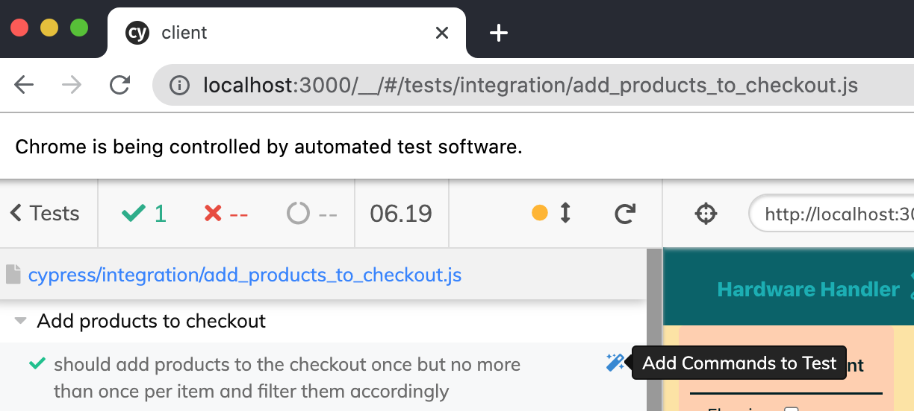
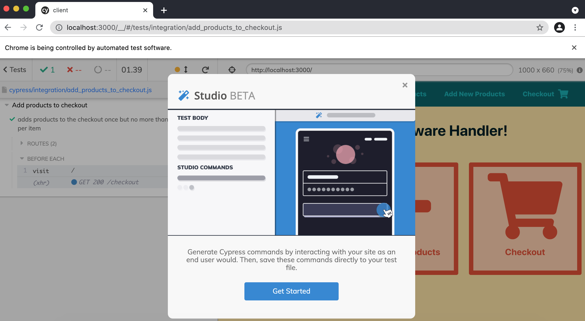
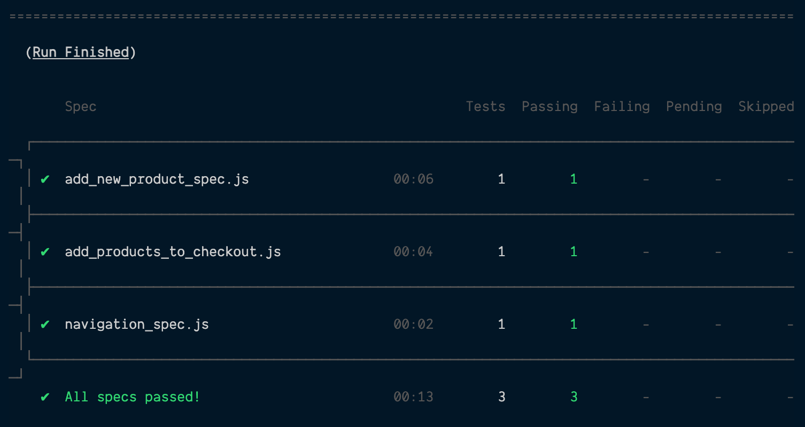

# Try out Cypress Studio

We've made it to the last lesson in this module — hurray! And I have a feeling you're really going to like this lesson because Cypress has gone and done what developers for years have wished was possible with testing: it's made it possible to _show_ an e2e how it should conduct a test.

This [Cypress Studio](https://docs.cypress.io/guides/core-concepts/cypress-studio) feature is still in experimental mode at the time I'm writing this, but hopefully, it will be out of experimental mode in the not too distant future.

**For this lesson, we'll enable Cypress Studio and learn how to _show_ Cypress what we'd like it to test instead of having to write all the test code ourselves. It's pretty cool and speeds up test writing time by leaps and bounds.**

### Enable the experimental Cypress Studio in our app

As I said, Cypress Studio is not fully out of beta mode yet, so in order to take advantage of it, we'll need to add a special flag in our app.

Open the `cypress.json` file where we added the `baseUrl` variable a few lessons ago, and add the following line to our file.

{lang=json }
<<[client/cypress.json](../lesson_08.02/protected/source_code/hardware-handler-8-ending/client/cypress.json)

With this line of `"experimentalStudio": true;`, we're ready to start using Cypress Studio. Easy enough to enable it, right?

#### Test a user can add products to checkout

The first step, just as it was for our other e2e tests, begins with determining what we want to test and making a test file for that particular flow.

For this test, another important functionality in Hardware Handler is that a user should be able to add products to the checkout when they go the **My Products** page. Let's get to it.

**Make a new `add_products_to_checkout_spec.js` file**

Inside of the `integrations/` folder, make a new file named `add_products_to_checkout_spec.js`. This is where we'll tell Cypress Studio to write our new test adding items to the checkout.

Right after creating this file, we'll set up a `describe` block to contain our test. Keep the initial `describe` simple. Our test will drill down into the details soon enough.

```javascript
describe('Add products to checkout', () => {});
```

**Mock our data and API calls for the department and product APIs**

Before we can show Cypress how we want it to test, we need to set up a few mocks and some data for it to use whenever the test runs.

If you look at our actual `<ProductList>` component, you'll see that when the component loads, it needs data from the `departmentApi` and from the `productApi` — so we'll need to mock data for both of those to serve up for this test.

We already have the mocked department data we need from our last lesson, so it's a matter of just importing that mock. Create a `beforeEach` where we'll set up these mocks.

Right inside of the `describe`, make a `beforeEach`, and we'll start it off very similar to the one we did in our last lesson for the `add_new_product_spec.js` file.

```javascript
import * as departmentMocks from '../support/service_mocks/department_mocks';

describe('Add products to checkout', () => {
  beforeEach(() => {
    cy.visit('/');
    cy.server();
    cy.fixture('department_data.json').then((rc) => {
      departmentMocks.getAllDepartments(rc.departments);
    });
  });
```

Just like before, `cy.visit` will bring us to the landing page of Hardware Handler, and then the combination of `cy.server` and `cy.fixture` will ensure that any HTTP calls made to the department API's `getAllDepartments` function will be intercepted and the mocked data in our `department_data.json` file will be returned in its stead.

Next, we must create data and a mock for the product API's `getAllProducts` HTTP call.

**Add a new mock to our `product_mocks.js` file**

Open the `product_mocks.js` file inside of the `support/service_mocks/` folder and add a new function named `getAllProducts`.

Since `getAllProducts` is a `GET` request, its setup is practically identical to the `addNewProduct` mock call we already defined above it, but it doesn't even need to accept any arguments beyond a `response` and a `status`.

Here's how that API call mock should look.

{lang=javascript,crop-start-line=10,crop-end-line=17}
<<[cypress/support/service_mocks/product_mocks.js](../lesson_08.02/protected/source_code/hardware-handler-8-ending/client/cypress/support/service_mocks/product_mocks.js)

**Create mocked product data**

Our new product mock needs some product data to supply when it's called, so once more, we'll open up our `fixtures/` folder where our `department_data.json` lives and create a new file named `product_data.json`.

This file will hold an array of mocked product data, and each `product` object will have the following properties: `id`, `name`, `brand`, `description`, `retailPrice`, `departmentId`.

Since our `department_data` mocks include departments for Patio Furniture and Flooring, I made product test data to match those two departments, but feel free to make your own substitutions for these products.

{lang=json }
<<[cypress/fixtures/product_data.json](../lesson_08.02/protected/source_code/hardware-handler-8-ending/client/cypress/fixtures/product_data.json)

All right. We've got a product mock and fake product data. Time to add it to the `beforeEach` block in our end-to-end test.

Back in the `add_products_to_checkout_spec.js` file, import our new `productMock` HTTP calls:

{lang=javascript,crop-start-line=2,crop-end-line=2}
<<[cypress/integration/add_products_to_checkout_spec.js](../lesson_08.02/protected/source_code/hardware-handler-8-ending/client/cypress/integration/add_products_to_checkout_spec.js)

Next, add the new fixture to our `beforeEach` function, referencing our `product_data.json` file for the `products` data the mock should return.

{lang=javascript,crop-start-line=12,crop-end-line=18}
<<[cypress/integration/add_products_to_checkout_spec.js](../lesson_08.02/protected/source_code/hardware-handler-8-ending/client/cypress/integration/add_products_to_checkout_spec.js)

This should be all the set up we need — let's get to using Cypress Studio.

**Write a first Cypress Studio test**

Cypress Studio requires an empty test in which to record the commands we give it, so we'll write one test shell and then fire it up.

This test should check that multiple products can be added to the checkout, but only once per item and that the filters work too. (Filtering isn't really essential to our app's functionality, but I figure it's a fairly quick and easy thing to check it's working.)

So here is the `it` statement I would write to describe what we're testing.

{lang=javascript,crop-start-line=20,crop-end-line=20}
<<[cypress/integration/add_products_to_checkout_spec.js](../lesson_08.02/protected/source_code/hardware-handler-8-ending/client/cypress/integration/add_products_to_checkout_spec.js)

Our test exists now, and we're ready to try Cypress Studio.

To use it, open up our Cypress Test Runner, so if your app isn't already running in a separate terminal window, go ahead and start it up. Then, in a new terminal, open up the Test Runner.

```shell
cd client/ && yarn cypress:open
```

Once the Test Runner has opened, click on the test suite for `add_products_to_checkout.js`, and the new test file we've written should open in a new Chrome browser window.

Here's where the magic happens: in that new browser, hover over our test description, and in the upper right-hand corner of the test, you should see a tiny, blue magic wand with a tooltip that says **Add Commands to Test**.



Click it, and you'll see a modal letting you know this feature is still in beta. It's okay; we accept this.



The browser will open at this point and wait for us to show it what we want to test. Click into the **My Products** page, and go to town.

For me, I added a few items to the checkout, I clicked a couple of filters, and then I tried to add one product that had already been added and checked it wouldn't be added more than once.

Once you feel good about what you've tested, hit the **Save Changes** button next to the test steps Cypress has recorded and see the results of what Cypress recorded in the test body.

This is how my test steps turned out.

```javascript
it('should add products to the checkout once but no more than once per item and filter them accordingly', () => {
  /* ==== Generated with Cypress Studio ==== */
  cy.get('.navbar-links-wrapper > [href="/my-products"]').click();
  cy.get(':nth-child(1) > .product-button-wrapper > .primary').click();
  cy.get(':nth-child(2) > .product-button-wrapper > .primary').click();
  cy.get('#\\32 2').check();
  cy.get('#Sandy\\ Furniture').check();
  cy.get("#Carpets\\ r\\'\\ Us").check();
  cy.get(':nth-child(4) > .product-button-wrapper > .primary').click();
  cy.get(':nth-child(3) > .product-button-wrapper > .primary').click();
  cy.get(':nth-child(1) > .product-button-wrapper > .primary').click();
  /* ==== End Cypress Studio ==== */
});
```

How amazing is that?

We didn't have to write _any_ of this code — we just showed Cypress what we wanted it to do by interacting with the DOM, and Cypress will try to do it from now on!

This is a really great start, but I want to add a few more assertions in between these interactions to make extra sure that what we expect to happen in the DOM is happening — things like checking the toast messages, checking the count of visible products in the browser, etc.

So that's what I'm going to add in between these clicks and checkmark selections.

For instance, as soon as a user reaches the **My Products** page, before any interaction even starts, we can check that there's a total of six products displayed in the browser (or however many mocked products should be returned from your `getAllProducts` mock).

After every product is added to the checkout, check that the React toast is displaying the correct message. The majority of the actions should succeed, but the last should fail because it's trying to add a product already in the checkout a second time.

My test is also filtering by department and brand name, so we can check that different numbers of products are shown when each filter is applied.

You know, just the little checks to help us as developers feel confident that when the actual application gets to users, it will work as we expect.

Here's what I added to the test to beef it up. For ease of seeing my new code additions, I included comments to inline so that you can see what Cypress added and what I then added afterwards.

{lang=javascript,crop-start-line=20,crop-end-line=56}
<<[cypress/integration/add_products_to_checkout_spec.js](../lesson_08.02/protected/source_code/hardware-handler-8-ending/client/cypress/integration/add_products_to_checkout_spec.js)

How about that? The hardest part — targeting the right elements in the DOM to interact with — is already done for us. We're just confirming extra details when these actions happen.

### Rerun the tests and wrap up

And just like that — a new e2e test is done.

As a gut check, let's rerun all our e2e tests in headless mode and make sure everything is working.

To be completely confident, I recommend restarting our running application server before doing a fresh run of the Cypress tests. In the end, this is what you should see print out in the terminal.



After the last two lessons, in particular, I hope you feel better about why and how to write end-to-end tests. They're another layer of testing we can use to give us more confidence when we go to production.

And Cypress makes it simpler and simpler to feel that confident all the time.

At this point, you could take a shot at writing an e2e to test when there are items in the checkout, they can be successfully removed, but I'll leave that up to your discretion.

We're going to move on and wrap up everything we've learned in the last four lessons.

---
