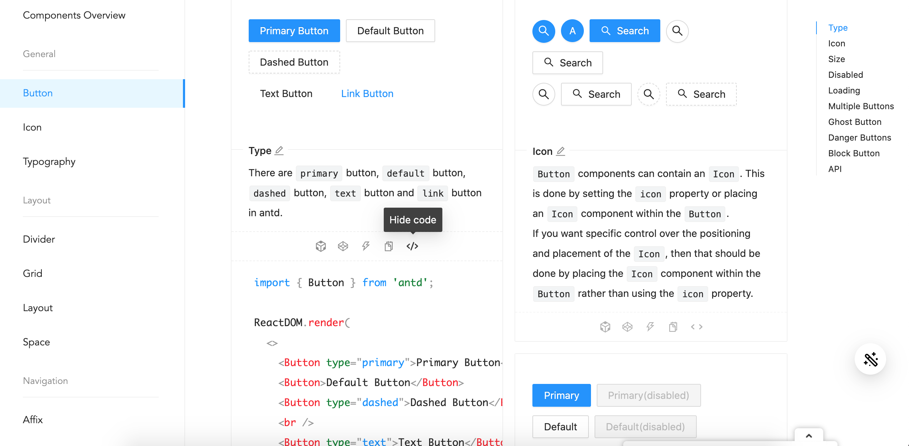
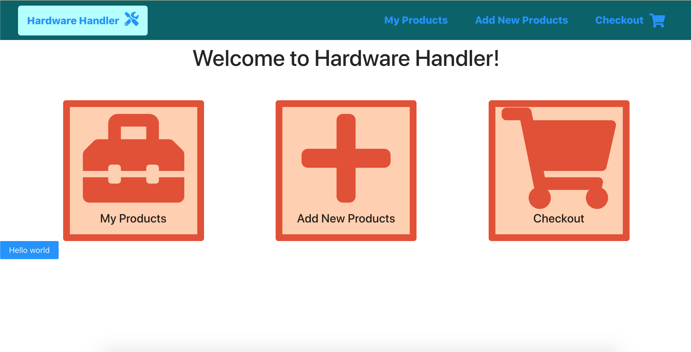
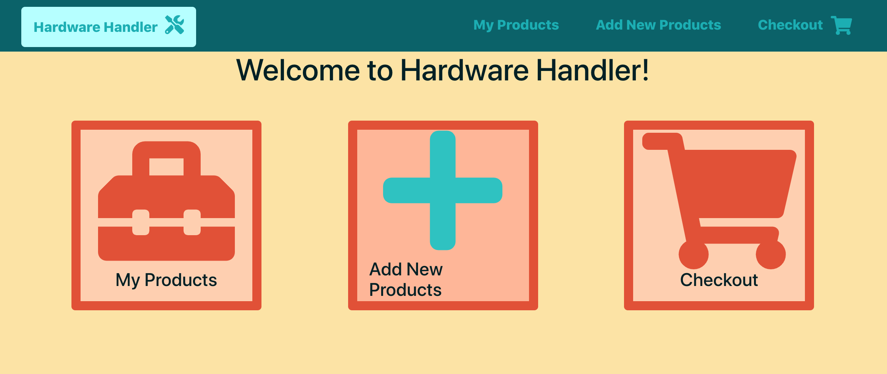
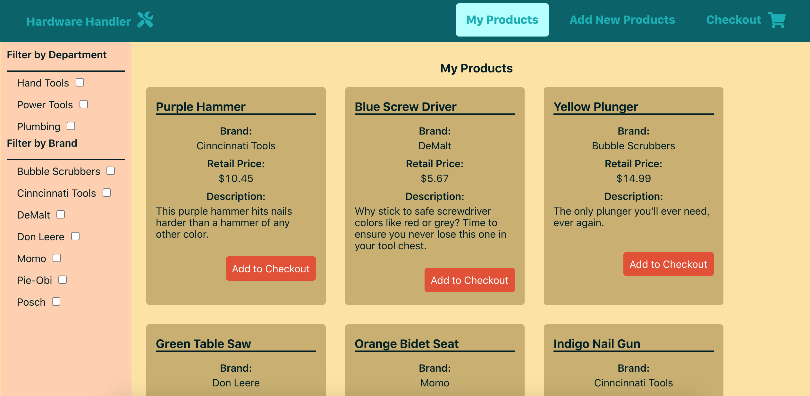
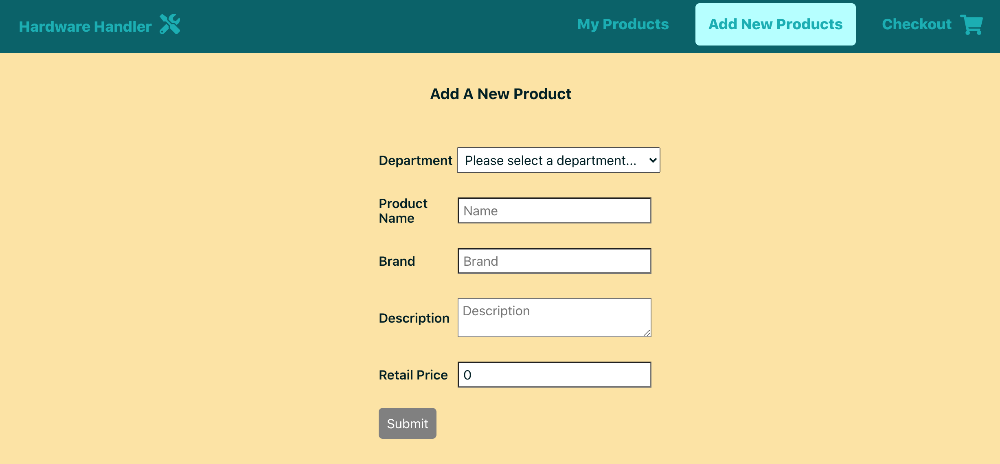

# Add Ant Design to Hardware Handler

There's a lot of good design system options to choose from, but for this application, we're going to add the [Ant Design System](https://ant.design/) to it and let it replace some of the components we created and styled from scratch.

**This lesson will focus on adding Ant Design to our already existing app, leveraging its documentation, and getting us back to a similar baseline look and feel before we begin swapping out our custom components for Ant's.**

I> **Sample code zip file**
I>
I> If you'd like a copy of the sample app _before_ we add the Ant Design System (AntD), it's available for download **[here](./protected/source_code/hardware-handler-9.zip)**.

### Setting up AntD for Create React App

I mentioned in the previous lesson that the Ant Design System itself proclaims its React component library as its "official" library, and as such, it supports all flavors of React-based applications well.

But part of this AntD [React integration](https://ant.design/docs/react/getting-started) typically relies upon modifying the Webpack config, which we don't have access to because Create React App (CRA) handles Webpack for us under the hood.

Ant has thought of that, though, and offers a well-documented way to make it work with a CRA app. That's where we'll start.

#### Install AntD and CRACO

Our first move to get Ant Design into our project will be to go [check the documentation](https://ant.design/docs/react/use-with-create-react-app) pertaining to Create React Apps in particular.

Just as with any other React app, we'll need to begin by installing the [`antd` npm package](https://www.npmjs.com/package/antd).

So open up your IDE and `cd` into our `client/` folder, then run the following command:

```shell
yarn add antd
```

We'll also need to add the AntD CSS files to our project to bring in all the styling the design system includes. To do that, add the following CSS import at the top of our `index.css` file in our project's `client/src/` folder.

```css
@import '~antd/dist/antd.css';
```

That's all we need for AntD itself, for the moment.

Now, here's where we diverge from other React apps. In order for AntD to work with the create-react-app scripts, we'll need to add another `npm` package called [`craco`](https://www.npmjs.com/package/@craco/craco).

CRACO stands for Create React App Configuration Override, and it's an easy configuration layer for create-react-apps. It allows us to add extra customization to a CRA app without having to eject the app and losing all the benefits that CRA bakes in.

The next steps we're going through are actually what the AntD docs themselves recommend to make this work, so we'll defer to their expertise here.

Run the following shell command to add CRACO to our project.

```shell
yarn add @craco/craco
```

#### Modify Hardware Handler to use CRACO

Once the installation of `craco` is complete, we'll need to modify the `"scripts"` in our `package.json` file to use `craco` instead of `react-scripts`.

So, replace the first five `"scripts"` in our code — basically, any scripts that reference `"react-scripts"` will be modified. They will go from:

{lang=json,crop-start-line=20,crop-end-line=26}
<<[client/package.json](./protected/source_code/hardware-handler-9-begin/client/package.json)

To:

{lang=json,crop-start-line=22,crop-end-line=28}
<<[client/package.json](./protected/source_code/hardware-handler-9-ending/client/package.json)

Okay, we're about ready to test out if Ant's working with Hardware Handler.

#### Add a test button and start up the app to test AntD

To verify that both the Ant components and their default styles are in effect, let's add an [Ant button](https://ant.design/components/button/) to our `App.js` file for now. We'll remove it again shortly.

T> **Read the docs (RTD)**
T>
T> The [Ant component documentation](https://ant.design/components/overview/) is really good — I find myself still turning to it today, and I strongly encourage you to get comfortable referring to it as well.

For a `<button>` component, we'll head to the [documentation](https://ant.design/components/button/) and scroll down the page to find the various examples that Ant offers. Underneath the actual components displayed in the browser are several different options to view the source code. It can be opened in CodeSandbox, CodePen, or StackBlitz if you'd like to modify the code and see what happens, and it can also be copied or viewed directly in the page if you click on the last icon — the `</>` icon.

Click that icon to expand the code in the page and see what's giving the various buttons their styles. In Ant's case, the buttons are styled by their `type` property.



We're going to go with a simple "primary" button for now to check things work.

Open up the `App.js` file inside of our `client/src/containers/App/` folder and up at the top, import an AntD button, like so:

```javascript
import { useEffect, useState } from 'react';
import { BrowserRouter as Router, Route } from 'react-router-dom';
import { ToastContainer } from 'react-toastify';
import { Button } from 'antd';
```

[Named imports](https://developer.mozilla.org/en-US/docs/Web/JavaScript/Reference/Statements/import#import_a_single_export_from_a_module) is how all AntD components are brought into the files that need them. It makes it pretty easy.

Next, scroll all the way down to the bottom of the component, and we'll throw this new `<Button>` into our code. Since this is just throwaway code, don't worry too much about its placement.

```javascript
        </section>
        <Button type="primary">Hello world</Button>
      </CheckoutItemContext.Provider>
```

One final step before we start the app back up, we need to create a new file at the root of our `client/` folder named `craco.config.js`. This file tells craco what styling and other configurations to abide by. Leave it completely empty for now, but it must be present for the app to start.

Good. Our Ant button is in our file, our installs and other files are created. Let's start up our app and see what we're working with - will the iconic Ant blue button appear?

```shell
cd client/ && yarn start
```

When Hardware Handler starts, you should see this thing of beauty.



This looks awesome, right? Maybe not so much, but not to worry, we'll fix this up soon. The main thing to focus on right now is the little blue button in the bottom left of the screen that says "Hello world".

The fact that this button is present and blue indicates to us that the Ant Design system is working within our app, which is great. That's one hurdle down. Just a few more to go.

Feel free to delete this button and its import from the `App.js` file now — we no longer need them now that we've confirmed Ant is working. On to our next step — customizing the Ant theme to use our chosen project colors and defaults.

#### Customize our AntD config styles

We've confirmed AntD is successfully added to Hardware Handler, so now it's time to set it up to use our own color scheme and font choices instead of the Ant defaults. AntD knows this is something teams will want to do, though, so it makes it a relatively straightforward process.

If you were following along with the AntD CRA docs, you'll see under the [Advanced Guide section](https://ant.design/docs/react/use-with-create-react-app#Customize-Theme) that in order to customize the theme, we'll need to modify variables using the `less-loader`. But with CRA, we'll be using the [`craco-less` loader](https://github.com/DocSpring/craco-less) — it's built for the same purpose, just for CRA-style React projects.

Before we install our new npm package, we're going to make a couple minor changes to our already-existing files.

Rename our `index.css` file to be `index.less` and change the AntD CSS import inside of our newly renamed file to have a `.less` ending too.

{lang=css,crop-start-line=1,crop-end-line=1}
<<[client/src/index.less](./protected/source_code/hardware-handler-9-ending/client/src/index.less)

And once this `index.less` file's ending has been updated, we'll need to update its import statement inside of the `index.js` file. Now it should look like:

{lang=javascript,crop-start-line=1,crop-end-line=4}
<<[client/src/index.js](./protected/source_code/hardware-handler-9-ending/client/src/index.js)

Okay. We can install the `craco-less` npm package now.

```shell
yarn add craco-less
```

With the `craco-less` package, we're going to edit the empty `craco.config.js` file we made just minutes ago. 

This file is where we'll override the original AntD defaults with our own project's defaults. You'll be pleased to know that AntD has default styles that can be overwritten for _nearly_ everything. The [documentation lists a bunch of popular defaults overrides](https://ant.design/docs/react/customize-theme), but it's just the tip of the iceberg.

I dug around in the actual [AntD default-style source code in GitHub](https://github.com/ant-design/ant-design/blob/master/components/style/themes/default.less) to locate the particular overrides I needed to change to get the app as close to how it looked prior to adding Ant Design.

I'd recommend you just copy and paste what I have below into your own `craco.config.js` to save yourself some time.

```javascript
const CracoLessPlugin = require('craco-less');

module.exports = {
  plugins: [
    {
      plugin: CracoLessPlugin,
      options: {
        lessLoaderOptions: {
          lessOptions: {
            modifyVars: {
              '@primary-color': '#e3502f',
              '@link-color': '#02aeb4',
              '@heading-color': '#012025',
              '@text-color': '#012025',
              '@success-color': '#1cce2b',
              '@error-color': '#e3502f',
              '@font-size-base': '16px',
              '@line-height-base': 1.15,
              '@body-background': '#fce4a1',
            },
            javascriptEnabled: true,
          },
        },
      },
    },
  ],
};
```

After adding this file, if you're still running the app, kill it and restart. The configs won't take effect until the server has reloaded.

And let's take another look at everything. It's getting closer at this point, but still not quite there.



Those main buttons look awfully cramped, don't they?

#### Fix our CSS files

Luckily, we only need to make a few minor custom CSS changes to get our app back to a good state before we start swapping out components in the next lesson.

The biggest issues we still have between our old app's CSS and our new CSS have to do with font-weight and box-sizing.

One thing I notice immediately is that none of the header elements are bold like they were before, and all the page headers are very close to the nav bar. They need more margin.

In order to make this apply to the whole application again, let's open up the `App.css` file and add a couple of new pieces of CSS. One to make all our headers bold, and the second to give all our `<h1>` headers on every page a top and bottom margin so that they're not right up on the `<Navbar>`.

{lang=css,crop-start-line=6,crop-end-line=17}
<<[client/src/containers/App/App.css](./protected/source_code/hardware-handler-9-ending/client/src/containers/App/App.css)

Just this change is a marked improvement, but we're not done yet.

There are still a couple of things off about the home page — these borders around the icons are still too tight, and when we hover over them, they turn aqua instead of staying red.

We can fix this. The issue of the boxes being tight is due to the fact that Ant sets elements to have a [`box-sizing` property](https://developer.mozilla.org/en-US/docs/Web/CSS/box-sizing) of `border-box` instead of the default CSS style of `content-box`.

Yes, `border-box` makes more sense, but unless you explicitly start a project and use a CSS reset to make everything `border-box` from the start, trying to flip to it midway through a project is going to cause a lot of headaches.

To get our icons back to their normal selves, we're going to manually fix them.

Open the `Home.css` file, find the `.home-link` class, and add the following line to the CSS nested under it.

{lang=css,crop-start-line=23,crop-end-line=27}
<<[client/src/containers/Home/Home.css](./protected/source_code/hardware-handler-9-ending/client/src/containers/Home/Home.css)

And right under that bit of CSS, add a line to the class of `.home-link:hover` so that the icon stays red even during the `:hover` state.

{lang=css,crop-start-line=29,crop-end-line=32}
<<[client/src/containers/Home/Home.css](./protected/source_code/hardware-handler-9-ending/client/src/containers/Home/Home.css)

That's much better. Let's check out our other pages and fix some of the same issues that are cropping up elsewhere.

On the **My Products** page, the list of products is plagued by `border-box` sizing as well.

See how the product boxes aren't filling all the space like they were before?



So we'll open up the `Product.css` form and add a line to the `.product` class setting the `box-sizing` back to what it was before AntD interfered.

{lang=css,crop-start-line=3,crop-end-line=6}
<<[client/src/components/Product/Product.css](./protected/source_code/hardware-handler-9-ending/client/src/components/Product/Product.css)

And then we'll do the same for the **Product Form** page because the form labels and inputs are colliding together.



To separate these two columns properly again, we'll open the `ProductForm.css` file and add one final line of CSS to the `.product-form-list` class.

```css
.product-form-list {
  width: 400px;
  box-sizing: initial;
}
```

The **Checkout** page looks okay, so we'll leave that one alone for now, and I think we can call this lesson done.

We've gotten the app back to a very solid baseline from which to begin incorporating AntD components. In our next lesson, we'll make our first swaps for some of our simpler components so that you can see how Ant can simplify our code.

---
