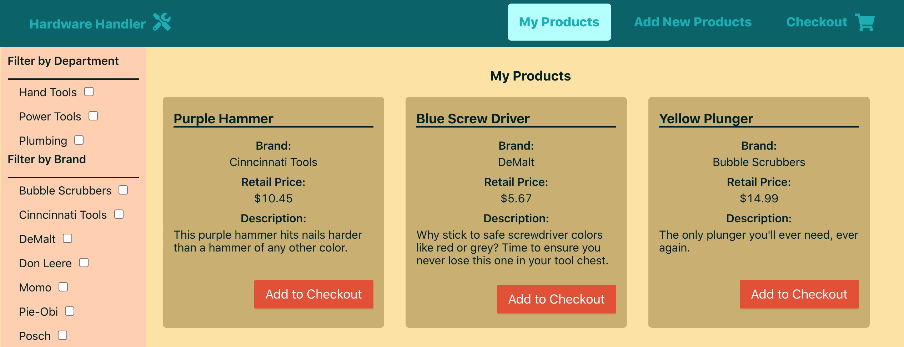

# Swap out some simple React components

Ant Design is part of Hardware Handler now. It's time to start taking advantage of all it affords us and simplifying the code our app is responsible for in the process.

**In this lesson, we'll replace some of our more elemental components with AntD versions and see how it can make our code simpler.**

### Let's start with our buttons

One of the most basic components we can start with swapping out is the few instances where we've got `<button>` elements in our app. A great thing about the Ant Design system is that it offers standardized versions of even the most basic elements, like buttons and checkboxes, all the way up to very complex components like tables, trees, and forms.

To get us going, we'll start with a small, relatively simple element. If you do a search in your code for buttons, you'll find three distinct instances of it in the `Product.js` file, the `CheckoutItem.js` file, and the `ProductForm.js` file.

#### Add a `<Button>` to `Product.js`

The `Product.js` file seems as good a place as any to begin replacing our components with AntD versions, so pop it open in your IDE.

If you scroll down in our app, there's a `<button>` element on line 24.

{lang=javascript,crop-start-line=24,crop-end-line=30}
<<[src/components/Product/Product.js](../lesson_09.02/protected/source_code/hardware-handler-9-begin/client/src/components/Product/Product.js)

To start the process of replacing this with an AntD component, we'll import the `<Button>` at the top of this file.

```javascript
import { useContext } from 'react';
import PropTypes from 'prop-types';
import { Button } from 'antd';
```

T> **Best practice: Keep library imports above custom components imports**
T>
T> One bit of advice I follow is keeping imports from outside libraries like AntD or React more towards the top of the imports list in my files.
T>
T> It's just another way to keep files organized in a manner that other developers can easily recognize and emulate, so if you see me doing this in our app's files, you know why.

With the Ant `<Button>` here, we'll scroll down to where the original button is declared and swap it out like so:

{lang=javascript,crop-start-line=27,crop-end-line=33}
<<[src/components/Product/Product.js](../lesson_09.02/protected/source_code/hardware-handler-9-ending/client/src/components/Product/Product.js)

You'll notice that in order to get our new button to take on the styling provided by Ant, we'll replace the `className="primary"` property with a `type="primary"` instead. We'll also make the button slightly larger than the default sizing by adding the `size="large"` property.

I got this info by reviewing the AntD [button documentation](https://ant.design/components/button/#components-button-demo-size) on the site. Believe me; it really is useful.


Now, if you notice, we completely removed a class from this file — the `primary` class — so let's check and see if we can clean up some CSS because of it (spoiler: we can).

Inside of the `Product.css` file, there's some CSS we can now delete completely. All this code beginning on line 37 for `.product .primary` — get rid of it.

{lang=css,crop-start-line=37,crop-end-line=44}
<<[src/components/Product/Product.css](../lesson_09.02/protected/source_code/hardware-handler-9-begin/client/src/components/Product/Product.css)

At this point, let's check that our products continue to look good. Go ahead and start up the app if it's not running, and navigate to the **My Products** page.

Here's what I'm seeing on screen — I think these buttons look pretty close to the originals, and look back at the code we just deleted in the process.



That wasn't so bad, now was it? We can do pretty much the same routine to replace the `<button>` in our `CheckoutItem.js` file.

#### Replace `CheckoutItem.js`'s button

In our `CheckoutItem.js` file, import the AntD `<Button>` at the top of our file.

{lang=javascript,crop-start-line=1,crop-end-line=4}
<<[src/components/CheckoutItem/CheckoutItem.js](../lesson_09.02/protected/source_code/hardware-handler-9-ending/client/src/components/CheckoutItem/CheckoutItem.js)

Then, replace our original `<button>` component with the following AntD component. Just like in our previous component, add the `type="primary"` and `size="large"` to the button.

{lang=javascript,crop-start-line=28,crop-end-line=36}
<<[src/components/CheckoutItem/CheckoutItem.js](../lesson_09.02/protected/source_code/hardware-handler-9-ending/client/src/components/CheckoutItem/CheckoutItem.js)

And now we can clean up our CSS a bit, too.

{lang=css,crop-start-line=36,crop-end-line=43}
<<[src/components/CheckoutItem/CheckoutItem.css](../lesson_09.02/protected/source_code/hardware-handler-9-begin/client/src/components/CheckoutItem/CheckoutItem.css)

Give it a quick visual check to make sure those buttons look good, and we'll turn our attention to the last `<button>` in our app — the one attached to the `<ProductForm>` component.

#### The button in ProductForm isn't so different after all

I was a little hesitant to tackle the `<button>` element in the `ProductForm.js` file because I wasn't sure if I'd need to do something special with an Ant Form to make it work, but when I checked the [form documentation](https://ant.design/components/form/#header), I saw that a simple `<Button>` component is just being used within the form, completely separate — fantastic!

How great is it that we can do upgrades as incremental as this?

So open the `ProductForm.js` file, and make the required import at the top of the file.

```javascript
import { useEffect, useState } from 'react';
import { Button } from 'antd';
```

Scroll all the way down the file to the `<button>` element on line 146. Just as with our other replacements, trade one button for another. We can keep the `data-testid` property and add our `type` and `size` properties to tell Ant how to style this button.

{lang=javascript,crop-start-line=149,crop-end-line=157}
<<[src/containers/ProductForm/ProductForm.js](../lesson_09.02/protected/source_code/hardware-handler-9-ending/client/src/containers/ProductForm/ProductForm.js)

With the class of `primary` gone, we can clean up the associated CSS a bit now. All of the CSS around the button, including the styling showing it's disabled, can now be deleted.

{lang=css,crop-start-line=46,crop-end-line=59}
<<[src/containers/ProductForm/ProductForm.css](../lesson_09.02/protected/source_code/hardware-handler-9-begin/client/src/containers/ProductForm/ProductForm.css)

One thing I wasn't sure would work the same for this button was the form validation we're using to disable and enable the submission button, but lo and behold, Ant uses the same [`disabled` property](https://ant.design/components/button/#components-button-demo-disabled) on its components, and our validation function `isValid()` continues to work. What a piece of good fortune.

Now, I'd recommend a quick smoke test that all of these buttons still work as expected, and let's move on and replace another of our custom components with its Ant equivalent.

### Swap out our product cards

In our app, we have custom-designed cards we use to display the list of products, but Ant has a handy `<Card>` component we can sub in there, too.

We won't be able to remove quite as much of the CSS here because the AntD card's default styling is not that close to our card, but we'll do what we can to simplify it.

#### Import the `<Card>` component into `Product.js`

So, let's re-open the `Product.js` file that we touched earlier, and we'll make a second AntD import along with our `<Button>` import up at the top.

{lang=javascript,crop-start-line=1,crop-end-line=3}
<<[src/components/Product/Product.js](../lesson_09.02/protected/source_code/hardware-handler-9-ending/client/src/components/Product/Product.js)

Now, let's focus on the very top of our current JSX — these `<div>`s with the classes of `product` and `product-name` are both going to disappear when we replace it with the `<Card>`.

{lang=javascript,crop-start-line=11,crop-end-line=15}
<<[src/components/Product/Product.js](../lesson_09.02/protected/source_code/hardware-handler-9-begin/client/src/components/Product/Product.js)

If you check the [Ant card documentation](https://ant.design/components/card/#header), there's actually a property it accepts called `title`, which will take the place of our `<h3>` where we've been displaying the product's name.

Here is what we'll replace our first couple of `<div>`s with. Our new Ant card will still need the `key` (React needs this to keep track of elements in lists), we'll supply the product name as the `title`, we'll keep the card borderless with the property `bordered={false}`, and we'll keep the `product` class for our extra styling above and beyond the Ant card's styling.

{lang=javascript,crop-start-line=12,crop-end-line=17}
<<[src/components/Product/Product.js](../lesson_09.02/protected/source_code/hardware-handler-9-ending/client/src/components/Product/Product.js)

Okay, with our JavaScript file updated, we can clean up our corresponding CSS too. Inside of the `Product.css` file, we can delete the following styling.

Delete the `border-radius: 5px;` line from under the `.product` class — the Ant card handles it now. We can delete all the CSS for the `.product-name` class — it no longer exists in our component. And we can remove the top two lines under the `<dl>` element — `border-top` and `padding-top` are no longer needed.

If you look at our cards right now, they have a white line separating the title from the body, so let's override that to be a dark line that matches our font color once more.

This particular element in the browser has the class of `ant-card-head`, so we'll use that to reset the color.

{lang=css,crop-start-line=8,crop-end-line=10}
<<[src/components/Product/Product.css](../lesson_09.02/protected/source_code/hardware-handler-9-ending/client/src/components/Product/Product.css)

And there's one more small change we can make. I checked the card options in the [Ant default less source code](https://github.com/ant-design/ant-design/blob/master/components/style/themes/default.less) just to see what was available to us, and one thing that caught my eye was the property of `@card-background`.

We can set this variable in the `craco.config.js` file instead of in our `product` styling. This way, any new cards that come along will automatically inherit the same golden color from the outset.

So, delete the `background-color: #c9b16e;` line from our `Product.css` file and add the following one to our `craco.config.js` file:

{lang=javascript,crop-start-line=19,crop-end-line=21}
<<[client/craco.config.js](../lesson_09.02/protected/source_code/hardware-handler-9-ending/client/craco.config.js)

### Replace our React Toasts with Ant notifications

The last "simpler" component we're going to swap out in this lesson has to do with the React Toastify alerts. We're going to replace them with [AntD notifications](https://ant.design/components/notification/) and eliminate an extra library that will no longer be relevant.


There are three files that currently employ the toasts in addition to the main import of the package in our `App.js` file. They are the `ProductForm.js`, the `ProductList.js`, and the `Checkout.js`.

#### Start with toasts in `ProductForm.js`

We'll begin with the `<ProductForm>` component, where we've already replaced the `<button>` element. We'll import the `notification` component at the top of our file.

```javascript
import { useEffect, useState } from 'react';
import { Button, notification } from 'antd';
```

Then, scroll down in the file to our two `toast` instances on lines 57 and 59.

According to the Ant notification documentation, the type of notification we'll be using — the [notification with icon](https://ant.design/components/notification/#components-notification-demo-with-icon) version with icons showing success and failure states — takes in a `message` and a `description` property. The `message` is a title (which we don't need, so we'll omit it), and the `description` is where we'll put our current messages we pass to our toast elements.

So here's what the code is going to look like that will replace our success toast:

{lang=javascript,crop-start-line=57,crop-end-line=60}
<<[src/containers/ProductForm/ProductForm.js](../lesson_09.02/protected/source_code/hardware-handler-9-ending/client/src/containers/ProductForm/ProductForm.js)

You may be wondering about the second property inside of this `notification` object — `closeIcon: <div />`. For all its customizations, for some reason, Ant doesn't allow hiding the `closeIcon` property in its notifications. But I found a helpful [StackOverflow post](https://stackoverflow.com/questions/57074789/remove-default-close-x-button-from-ant-design-notification/57075709) of someone else looking to hide it as well, and the simple, elegant solution of providing an empty `<div>` worked like a charm.

Here's what our new notification message looks like. It's a little simpler and less colorful than the original, but I'm okay with it.


And with one of our new notifications implemented, it's a simple matter of doing the same for the failure message.

{lang=javascript,crop-start-line=62,crop-end-line=65}
<<[src/containers/ProductForm/ProductForm.js](../lesson_09.02/protected/source_code/hardware-handler-9-ending/client/src/containers/ProductForm/ProductForm.js)

To finish up this file, let's go ahead and delete the now unused `react-toastify` import at the top of the file and continue on.

#### Update the `Checkout.js` and `ProductList.js` toasts

Our next two files where we're swapping toasts for notifications are very similar to what we just did, so let's move through them more quickly.

In the `<Checkout>` component file, import the `notification`, replace the two `toast` elements, and delete the `react-toastify` import.

Here's what our refactored notification code will look like:

{lang=javascript,crop-start-line=34,crop-end-line=42}
<<[src/containers/Checkout/Checkout.js](../lesson_09.02/protected/source_code/hardware-handler-9-ending/client/src/containers/Checkout/Checkout.js)

And once more in the `<ProductList>` component: bring in `notification`, trade the `toast`s in, and delete the toast import.

{lang=javascript,crop-start-line=80,crop-end-line=88}
<<[src/containers/ProductList/ProductList.js](../lesson_09.02/protected/source_code/hardware-handler-9-ending/client/src/containers/ProductList/ProductList.js)

That last toast replacement now gives us a unique opportunity to clean our code up a little bit more.

#### Take `react-toastify` out of Hardware Handler

Since there are no longer any toasts being used in our app, we can completely remove this `react-toastify` package now. That's a pretty nice bonus of bringing in the Ant library, right? We get to simplify the rest of the packages our app relies upon.

To completely get rid of this package, we'll need to clear it out of our `App.js` file. Now these two toast-related imports can be deleted.

{lang=javascript,crop-start-line=2,crop-end-line=12}
<<[src/containers/App/App.js](../lesson_09.02/protected/source_code/hardware-handler-9-begin/client/src/containers/App/App.js)

And the little bit of CSS we added to style all our toasts in `App.css` can also be deleted.

{lang=css,crop-start-line=1,crop-end-line=4}
<<[src/containers/App/App.css](../lesson_09.02/protected/source_code/hardware-handler-9-begin/client/src/containers/App/App.css)

Finally, with all this toast-related content removed, we can delete our `react-toastify` import from the `package.json`.

{lang=json,crop-start-line=20,crop-end-line=21}
<<[client/package.json](../lesson_09.02/protected/source_code/hardware-handler-9-begin/client/package.json)

Just to be completely sure we got everything correctly, I like to rerun my `yarn` install command and then restart the app to make sure everything loads and works the same.

So, reinstall your new project dependencies (and uninstall the `react-toastify` package).

```shell
yarn
```

Restart the app, and make sure it still works.

```shell
cd client/ && yarn start
```

Everything still looks good. The app starts up, products can be added to the app and the checkout. I think we're in the clear.

Great job!

Now that wasn't so bad, was it? Switching out our components for Ant's components with a little help from the documentation about what to rename certain properties was pretty straightforward.

In our next lesson, we'll take on replacing some of our more complex components.

I> **There will be broken tests, but not as many as you may think**
I>
I> There will undoubtedly be broken end-to-end tests because the selectors we used to check on certain elements in the browser are no longer present — like the classes for React Toasts, for instance.
I>
I> However, if you run the integration tests we wrote previously (the ones we wrote with React Testing Library's eye towards testing as a user would test by interacting with the DOM), you'll be pleasantly surprised to see that all of those tests still pass.
I>
I> This is because we successfully refactored this app to use Ant components but still maintained all the elements and functionality of our original code.
I>
I> And this is an excellent example of how RTL's testing strategy is superior. We changed out components, removed classes, even deleted an entire library, and yet not one integration test broke. Amazing.
I>
I> If you'd like to take the time to fix up the e2es, go for it. I'll leave that to you, though.

---
