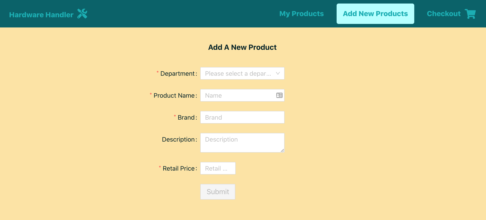
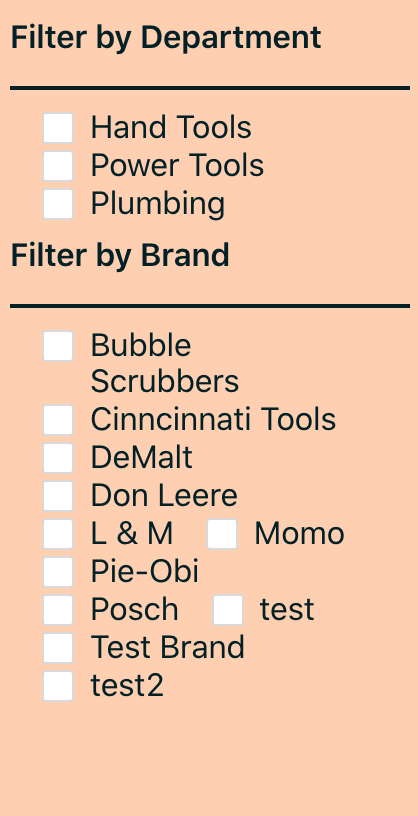

# Implement more complex components in Hardware Handler

We've got some practice bringing in basic components from the Ant Design System to replace our custom-styled components.

Now it's time to take it up a notch because Ant doesn't just do simple components — it also boasts robust, complicated ones, too, that drastically reduce the amount of code devs have to write themselves.

**We'll take some of the more complex components in our app and replace them with Ant's versions, and you'll be amazed how much less you'll need to make them work AND look good.**

### Forms are always needlessly complex

When I think about Hardware Handler's more complicated components, the first one that springs to mind is the `<ProductForm>` component. Forms are always complicated, whether they're written with React, Vue, or plain JavaScript, because there are so many requirements between input types, validations on the client and server-side, and more.

But AntD can really help simplify this situation. Let's get going.

#### Import all the Ant form components in `ProductForm.js`

Before we start replacing the `<form>` inside of our `ProductForm.js` file, take a good look at the [AntD form documentation](https://ant.design/components/form).

There's a lot to take in here, but they've got examples of all the pieces we'll need inside a form: the [form itself](https://ant.design/components/form/#components-form-demo-basic), the [inputs](https://ant.design/components/form/#components-form-demo-basic), the [selection dropdown](https://ant.design/components/form/#components-form-demo-control-hooks) — all of it.

So, the first thing we'll want to do with our `<ProductForm>` is import all the AntD pieces we'll need.

Add the following AntD components to our `ProductForm.js` file.

```javascript
import { useEffect, useState } from 'react';
import { Button, notification, Form, Input, Select } from 'antd';
```

#### Replace the JSX form elements with Ant components

Okay, this section is going to be a bit of a doozy, but we'll try to do this in an organized fashion.

Inside of our JSX, we'll want to begin replacing our components with Ant components, and we'll start with the `<form>` element.

The `<form>` element on line 80 will become `<Form>`, then underneath that, we can replace the `<ul>`, `<li>`, and `<label>` elements with `<Form.Item>`.

`<Form.Item>` is the wrapper Ant uses to define each separate section within a `<Form>`, and it's where we'll add properties like `label` and `name` and any other necessary options.

So for this first input, which is the wrapper for the `<select>` dropdown of departments, we'll give the `<Form.Item>` a `label` to show in the browser and a `name` that is like our previous `<label>` element's `htmlFor` property. Here's what it should look like.

```javascript
          <Form.Item
            name="department"
            label="Department"
          >
```

And now we come to our first form element to replace: the department `<select>`. Lucky for us, the [AntD `<Select>`](https://ant.design/components/select) is quite similar to our current `<select>`.

It accepts `placeholder` text, a `value`, and an `onChange` function — just like our original element. And the `<option>`s inside of the `<select>` become `<Select.Option>` elements.

Here's what the rest of the first form element will look like — don't forget the closing `<Form.Item>` tag at the end.

```javascript
            <Select
              placeholder="Please select a department..."
              value={newProduct.departmentId || ''}
              onChange={(e) => onChange('departmentId', Number(e.target.value))}
            >
              {departments.length > 0
                ? departments.map((dept) => (
                    <Select.Option key={dept.id} value={dept.id}>
                      {dept.name}
                    </Select.Option>
                  ))
                : null}
            </Select>
          </Form.Item>
```

Now we'll do the same replacement for the rest of our form inputs.

Our next form input, for the product name, should look like this when we're through:

```javascript
<Form.Item name="product name" label="Product Name">
  <Input
    placeholder="Name"
    value={newProduct.name}
    onChange={(e) => onChange('name', e.target.value)}
  />
</Form.Item>
```

This `<Form.Item>` should look similar to our first one, and the [AntD `<Input>`](https://ant.design/components/input/) also accepts `placeholder` text, a `value`, and an `onChange` function.

Our brand, description, and retail price inputs should look very much the same. You could take a shot at replacing them yourself and then check my code below if you get stuck.

Here is how I'd replace the next three inputs.

```javascript
          <Form.Item name="brand" label="Brand">
            <Input
              placeholder="Brand"
              value={newProduct.brand}
              onChange={(e) => onChange('brand', e.target.value)}
            />
          </Form.Item>
          <Form.Item name="description" label="Description">
            <Input.TextArea
              placeholder="Description"
              value={newProduct.description}
              onChange={(e) => onChange('description', e.target.value)}
            />
          </Form.Item>
          <Form.Item
            name="price"
            label="Retail Price"
          >
            <Input
              placeholder="Retail Price"
              value={newProduct.retailPrice}
              onChange={(e) => onChange('retailPrice', Number(e.target.value))}
            />
          </Form.Item>
```

Notice that there's a special `<Input.Textarea>` component to replace traditional `<textarea>` elements, but the rest should feel relatively familiar.

Finally, wrap our Ant submit button in a `<Form.Item>` tag as well — there's no point leaving it as the only `<li>` inside of our form.

```javascript
<Form.Item>
  <Button
    data-testid="submit"
    type="primary"
    size="large"
    onClick={onSubmit}
    disabled={!isValid()}
  >
    Submit
  </Button>
</Form.Item>
```

Okay, everything about this form has become an Ant component — we're off to a really good start. Let's add some small details to make sure this form continues to work the same way.

One thing we can do with Ant forms is indicate to users which elements are required. By adding the line `rules={[{ required: true }]}` to a `<Form.Item>` element, a little red asterisk appears next to a field to indicate it must be filled out.

It appears like this in the browser:


We need to add this line to our `department`, `product name`, `brand`, and `retail price` form elements. Go ahead and do so.

Now let's test our form and see if it still works. We'll take care of the styling after its functionality is confirmed.

When you try to select a department from the dropdown, you should see an error in the browser.


This error is happening because the Ant `<Select>` just accepts a `value`, not an `e.target.value`. Easy enough to fix in our code.

{lang=javascript,crop-start-line=93,crop-end-line=97}
<<[src/containers/ProductForm/ProductForm.js](../lesson_09.02/protected/source_code/hardware-handler-9-ending/client/src/containers/ProductForm/ProductForm.js)

Now let's test our product form again. This time, you should notice that our retail price element accepts a lot more than just numbers. It turns out Ant has a special input just for numbers: the [`<InputNumber>`](https://ant.design/components/input-number/) component.

Using this component will make our input only able to accept numeric inputs, and it, too, is simplified slightly because it only needs a `value` instead of `e.target.value`, as well.

So we'll import the `<InputNumber>` component and then replace it for the retail price input.

{lang=javascript,crop-start-line=1,crop-end-line=2}
<<[src/containers/ProductForm/ProductForm.js](../lesson_09.02/protected/source_code/hardware-handler-9-ending/client/src/containers/ProductForm/ProductForm.js)

The final element retail price will look like this:

{lang=javascript,crop-start-line=137,crop-end-line=142}
<<[src/containers/ProductForm/ProductForm.js](../lesson_09.02/protected/source_code/hardware-handler-9-ending/client/src/containers/ProductForm/ProductForm.js)

One more test. At this point, the product should be successfully added, but this form is not very good-looking.


#### Make the Ant form great again

Not to worry, though. Ant has some very handy form styling options that even its most basic forms can implement.

By default, Ant's forms have a [horizontal layout](https://ant.design/components/form/#components-form-demo-layout), but if you need vertical or inline styling, that's available, too. What we need to use is the `labelCol` and `wrapperCol` properties.

These properties follow the [24 column layout system](https://ant.design/components/grid/) that Ant makes use of, similar to Bootstrap's grid. To make these new Ant form elements look like our previous ones — nicely aligned near the center of the page — we'll apply the following styles to our outer `<Form>` element.

{lang=javascript,crop-start-line=80,crop-end-line=87}
<<[src/containers/ProductForm/ProductForm.js](../lesson_09.02/protected/source_code/hardware-handler-9-ending/client/src/containers/ProductForm/ProductForm.js)

This will filter down and style all the `<Form.Items>` _except_ the `<Button>`. I'm not entirely sure why the button doesn't get the same style applied, but we can fix that with an extra line of code on its own `<Form.Item>` as well.

{lang=javascript,crop-start-line=144,crop-end-line=158}
<<[src/containers/ProductForm/ProductForm.js](../lesson_09.02/protected/source_code/hardware-handler-9-ending/client/src/containers/ProductForm/ProductForm.js)

This offset will line up our button nicely with the rest of the form. And we can delete a whole bunch of what used to be needed CSS in the `ProductForm.css` file — the classes no longer exist.

Here's what we can now delete from the `ProductForm.css` file.

{lang=css,crop-start-line=13,crop-end-line=44}
<<[src/containers/ProductForm/ProductForm.css](../lesson_09.02/protected/source_code/hardware-handler-9-begin/client/src/containers/ProductForm/ProductForm.css)

In the end, our newly refactored form looks like this, even with all the deleted CSS. Pretty nice, right? Look how much less code we can get away with, courtesy of Ant.



### Let's see what we can do with our product filters

Another more complex piece of our app is the product filtering system in the `<ProductList>` component. It's a perfect candidate for a few [Ant checkboxes](https://ant.design/components/checkbox/).

#### Replace the department filters first

We'll begin our swap of checkboxes with the smaller of the two sets of checkboxes: the department filtering ones.

If you review the Ant Documentation for [groups of checkboxes](https://ant.design/components/checkbox/#components-checkbox-demo-group), you'll see that the `<Checkbox.Group>` element takes in an array of options to render — which is not too different from what we're currently doing with our homespun set of filters.

As always, we'll import the `Checkbox` component into our `ProductList.js` file.

{lang=javascript,crop-start-line=1,crop-end-line=3}
<<[src/containers/ProductList/ProductList.js](../lesson_09.02/protected/source_code/hardware-handler-9-ending/client/src/containers/ProductList/ProductList.js)

And then find the department filter in our JSX, right around line 116 or so. The Ant `<Checkbox>` dramatically simplifies what we have to do to make these filters render.

There's no mapping over items required, no separate `<label>` or `<input>` elements, even. All Ant's `<Checkbox.Group>` needs is our array of options and our `onChange` function.

Our code goes from this:

{lang=javascript,crop-start-line=110,crop-end-line=123}
<<[src/containers/ProductList/ProductList.js](../lesson_09.02/protected/source_code/hardware-handler-9-begin/client/src/containers/ProductList/ProductList.js)

To this:

```javascript
{
  error ? <p>Cannot load department filters.</p> : null;
}
{
  !error && filtersByDepartment.length ? (
    <Checkbox.Group
      options={filtersByDepartment}
      onChange={onFilterChange}
      className="filter-item"
    />
  ) : null;
}
```

Now, if you check the browser, you'll see that our page fails to load. I encountered this same error, and it took me a little bit of debugging to figure out what went wrong.

The issue turns out to be the fact that the Ant component expects an array with the properties of `label` and `value`. Our current `departments` array that we're passing in has the properties of `id` and `name`. And because this same array is used in other places in the app, I don't feel comfortable changing it at the base level. We'll change it before we set it into our local component's state instead.

So, inside of our `useEffect` on line 40 where we check if our `useDepartments` Hook has returned and set the local `filtersByDepartment` state, if it has, we'll add a small function to map over our department data and rename it into the object the Ant `<Checkbox>` is expecting.

{lang=javascript,crop-start-line=40,crop-end-line=52}
<<[src/containers/ProductList/ProductList.js](../lesson_09.02/protected/source_code/hardware-handler-9-ending/client/src/containers/ProductList/ProductList.js)

Check the page again, and our department checkboxes should be loaded. At this point, let's hold off on checking if the filtering works. Let's get the rest of our checkboxes based on brand name replaced first.

#### Swap out the brand name checkboxes next

After replacing the department checkboxes, replacing the brand name checkboxes should be very similar.

Our brand name checkbox code will end up looking like so:

```javascript
{
  error ? <p>Cannot load product brand filters.</p> : null;
}
{
  !error && filtersByBrand.length ? (
    <Checkbox.Group
      options={filtersByBrand}
      onChange={onFilterChange}
      className="filter-item"
    />
  ) : null;
}
```

This `filtersByBrand` array we pass in has the same issue as our first list of options. However, this object is _only_ being used in this particular component, so I feel more confident changing this object at its source to have the required object properties.

Follow the `filtersByBrand` object back through the `useProducts` Hook to the `formatFilters` function, which actually creates the object. We only need to do a one-line change here and in the `useProducts` file, and we'll be good to do.

So in `formatFilters.js`, make the following adjustment to the `itemToFilterBy` variable.

{lang=javascript,crop-start-line=4,crop-end-line=7}
<<[src/helpers/formatFilters.js](../lesson_09.02/protected/source_code/hardware-handler-9-ending/client/src/helpers/formatFilters.js)

Then in the `useProducts.js` file, swap out the property the filters are being sorted by: from `name` to `label`.

{lang=javascript,crop-start-line=21,crop-end-line=24}
<<[src/hooks/useProducts.js](../lesson_09.02/protected/source_code/hardware-handler-9-ending/client/src/hooks/useProducts.js)

With that small adjustment, our brand filter checkboxes should render correctly now. On to testing the filtering!

#### Fix the filtering by departments and brands

The filtering doesn't work worth a darn currently, and it took me quite a bit to figure out what exactly was going wrong and how to resolve it.

Here's what I eventually learned was going on: when a user checks one of the checkboxes in a `<Checkbox.Group>`, an array is populated with that value. So checking the checkbox next to the **Hand Tools** department would give you an array of `[1]`. When the next checkbox in that group is selected, the array is replaced with a new array of `[1, 2]`.

If the same checkbox is unchecked, a third new array is created with the value of `[2]`. Whatever is added or removed, Ant takes care of under the hood for us.

Same for the checkboxes grouped by brand name. However, there is no way to combine these two arrays to use the same `onFilterChange` function because we don't know what value was removed from the array of values to filter by, which was how we kept track before.

So here's the solution I came up with: split the `onFilterChange` function into two functions with two sets of filters that we combine together to do our actual product filtering.

A little confused? It'll make more sense when you see the code.

To start, let's create two arrays to hold our selected filter values. On line 23 of our file, we'll replace the `activeFilter` variable with two new variables: `activeBrandFilter` and `activeDeptFilter`.

{lang=javascript,crop-start-line=23,crop-end-line=24}
<<[src/containers/ProductList/ProductList.js](../lesson_09.02/protected/source_code/hardware-handler-9-ending/client/src/containers/ProductList/ProductList.js)

Next, we'll replace our `onFilterChange` function with two smaller functions: `onDeptFilterChange` and `onBrandFilterChange`. Observe how much simpler these two functions are.

{lang=javascript,crop-start-line=93,crop-end-line=99}
<<[src/containers/ProductList/ProductList.js](../lesson_09.02/protected/source_code/hardware-handler-9-ending/client/src/containers/ProductList/ProductList.js)

Don't forget to replace the `onChange` functions in each filter in the JSX too.

Finally, the filtering that we do right before we render our component will get a little more complex because we'll have to combine the results of our two filters and compare them to all of our results. The end code will look like this:

{lang=javascript,crop-start-line=103,crop-end-line=115}
<<[src/containers/ProductList/ProductList.js](../lesson_09.02/protected/source_code/hardware-handler-9-ending/client/src/containers/ProductList/ProductList.js)

And once more, our filtering should work.

#### Clean up our CSS

The current styling of the filter leaves a little to be desired.



We can do better. Let's get them back in a vertical column and give them some padding — they're looking very squished right now.

Our `filter-checkbox` class got removed completely, so we can delete that code out of `ProductList.css`. We'll remove our flex properties from the `filter-data` class and put them into the `filter-item` class instead, and we can get rid of the `grid` and `margin` properties in the `filter-wrapper` class.

Last but not least, we'll add two Ant-specific classes to add some padding and let these checkboxes breathe a bit.

Here's the ending CSS you'll want to replace — it's probably easiest to just copy/paste this into your own code.

{lang=css,crop-start-line=1,crop-end-line=30}
<<[src/containers/ProductList/ProductList.css](../lesson_09.02/protected/source_code/hardware-handler-9-ending/client/src/containers/ProductList/ProductList.css)

Doesn't that look a thousand times better now?


### Wrap it up

We're done with this lesson and with this module! Well done, well done.

I hope after these last couple of lessons, you feel better about navigating a design system and using the documentation to leverage the components it provides. It takes a little getting used to, but once you experience firsthand how component libraries can simplify your own code, you can see how worth it they can be.

We'll wrap up this module and then the whole course — you're home free now!

---
